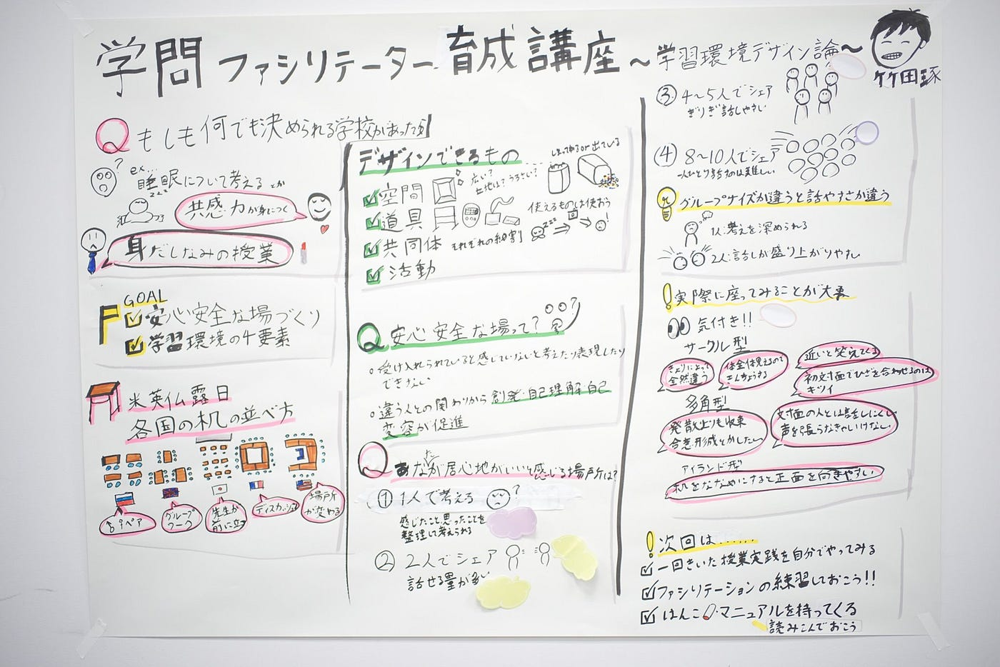
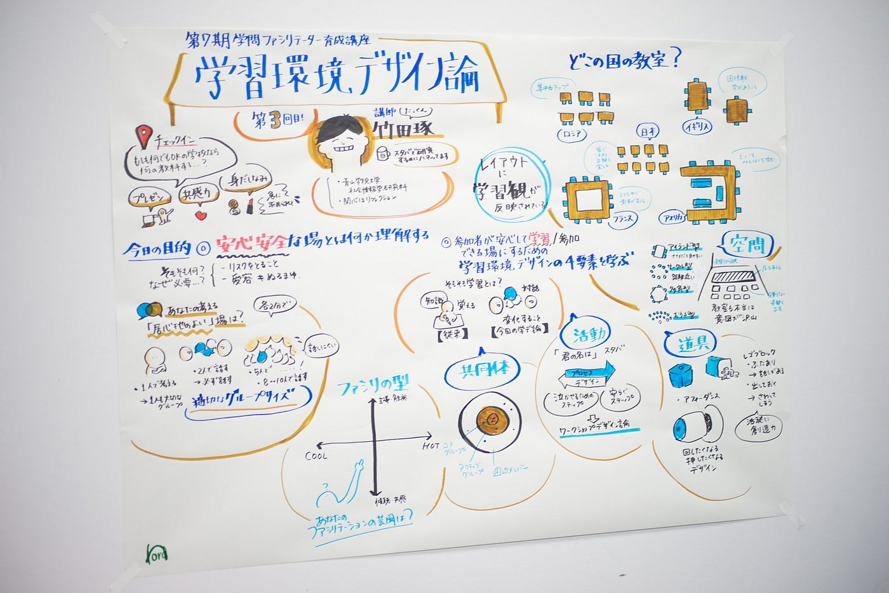

### グラレコ初心者が感じる障害を解決する

12/7㈯のアドベントカレンダー担当の安田遥です。

ゼミ論の進捗報告をします。私のゼミ論のテーマは**「グラフィックレコーディング（以下グラレコ）を初心者が習得する際に障害となることは何か」**についてです。

グラレコをできるようになりたいが、まだ経験の浅い小林君と一緒にどんな時に難しさを感じるのか、そしてどのようにそういった難しさを乗り越えていくのかに関して考えています。これのプロセスがアウトプットとして残すことができれば、**本当に誰でもできるグラレコ**にたどり着けるのではないかと考えています。

前回のブログはこちら

[グラレコ初心者の感じる障害
こんにちは、古橋ゼミ3年グラレコ部の安田です。古橋ゼミには4年生のための卒論、3年生のための卒論準備としてのゼミ論というものがあります。medium.com](https://medium.com/furuhashilab/%E3%82%B0%E3%83%A9%E3%83%AC%E3%82%B3%E5%88%9D%E5%BF%83%E8%80%85%E3%81%AE%E6%84%9F%E3%81%98%E3%82%8B%E9%9A%9C%E5%AE%B3-267fbdeebbae)

前回初めて模造紙にグラレコをしてみた小林君、第２回目の実践を迎えました。

#### **事前に話したこと**

今回は事前に講座内容のスライドを共有したうえで

・レイアウトをどうするか

・何色のペンを使うか（色の数、色の意味付け）

に関して決めました。

レイアウトの相談をしていたときに、彼自身から色の意味付けに関して提案してくれたので、今回はメインカラーが黒、ワークがピンク、論理のインプットを緑としました。

上記のように、レイアウトとしては３分割で縦に書き進めていくというようになりました。

#### 小林君からの感想

・実際のワークショップのときに自分のノートに書いていたんですが、後で見返すと何が何だがわからないものになっていて、必要な情報保存するのって難しい

・似顔絵は結構苦戦しました（今回の講師は比較的描きやすいと感じましたがそれでも…）

・ プライベートでやってみて情報を適切に取捨選択することの難しいです

・前回の講座で難しく感じたのは、線をきれいに描くことです 最初にも指摘されましたが、丸とかかたちを一発できれいに書くのは、もとから苦手なのでかなり苦戦してます

#### 今回出てきた課題

・情報の取捨選択

・線や円を描くこと

#### 情報の取捨選択

前回の実践に比べて、情報のサイズ感を均等にするようにできるようになり、具体例と本題を聞き分けられたりすることができるようになってきました。

この際に重要なのは、この**グラレコを見るのは誰なのか、どういった目的でグラレコするのかを意識する**ことだと考えています。

伝えること、残すこと、きっかけを作ることといったように目的によって描く用途が変わってくるのです。その点を明らかにして、書くことが最も重要と考えています。

#### 線や円を描くこと

手に線を慣らす際にお勧めのなのがこの本です。

[ラクガキで頭を柔らかく！「ラクガキノート術」はビジネスマン・ブロガー・親、全ての人に役立つ、内容濃い本だったぞ！
大人になるに従って、頭が固くなったと感じる人は多いんじゃ無いでしょうか。 私もデザイナーという仕事柄、他の人よりは柔らかいつもりではいますが、それでも凝り固まってるな...と思う事は多々あります。むねさだ(@mu_ne3)です。…munesada.com](https://munesada.com/2015/03/22/blog-4975)

#### 次回までにやってみたいこと

・誰が見るのか・目的・用途を考えてみる

・ひたすら書いてみる

2点目のひたすら描くはあらかじめ紙（大きめだとよい、A3くらい）を決めて、白い部分が見えなくなるまで線・三角・円を描いてみるのがおすすめです。ストレス発散になります。
