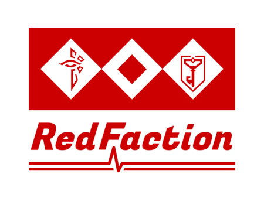
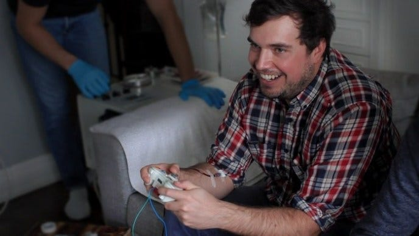

### 位置ゲー部 週報

青山学院大学古橋研究室 平澤彰悟です！

以前古橋先生からingressと日本赤十字社が連携して活動しているということをお聞きしたので、位置ゲー部としてこれは調べなきゃあかん！ってことで調べてみました！

活動詳細
[https://www.bs.jrc.or.jp/csk/okayama/2019/06/ingressredfaction-in-2.html](https://www.bs.jrc.or.jp/csk/okayama/2019/06/ingressredfaction-in-2.html)

この記事の最初にある、画像はこのイベント画像です！

このイベントを簡単に説明すると、

特定の献血場所に行く→そこで、献血または募金をする→ゲーム内で使えるアイテムorノベルティをもらえる

なるほどー！ゲーム利用者に積極的に献血に関わってもらう方法としては有効かと思います！

でも、これって別にイングレスである必要なくね？

って思ったが正直なところです。

ゲーム内のアイテムやノベルティだけじゃ、献血に対して魅力を感じてもらうのは限界があると思いました。

もっと、別のオプションがないと話題性っておこらなくない？と思ったので、僕なりにこのイベントをより活性化させるにはどうしたらいいか考えてみました！

僕の考えたアイデアは一言で言うと

【リアル×バーチャル】です！

まずはこの記事を見てもらいたいです！

[https://fpsjp.net/archives/94185](https://fpsjp.net/archives/94185)

FPSゲームで実際に血を流した分、リアルな世界で自分もちを抜かれるというものです笑

もちろん、安全を配慮してるので、死ぬことはありません笑

リアル×バーチャルによって、より献血というものに話題性を持たせ、かつ、献血をより身近に感じられると思いました！

これをIngressで行うなら、

自分の壊わされたポータル数や壊したポータル数から、実際に血を抜かれ、より血を奪った人を競うと言う感じですかねー？？

もちろんルールや安全配慮で考えるべき点は沢山あると思いますが、

献血×ingressを大きくする一つの手として

バーチャル×リアルというテーマ設定は有効だと思います！
