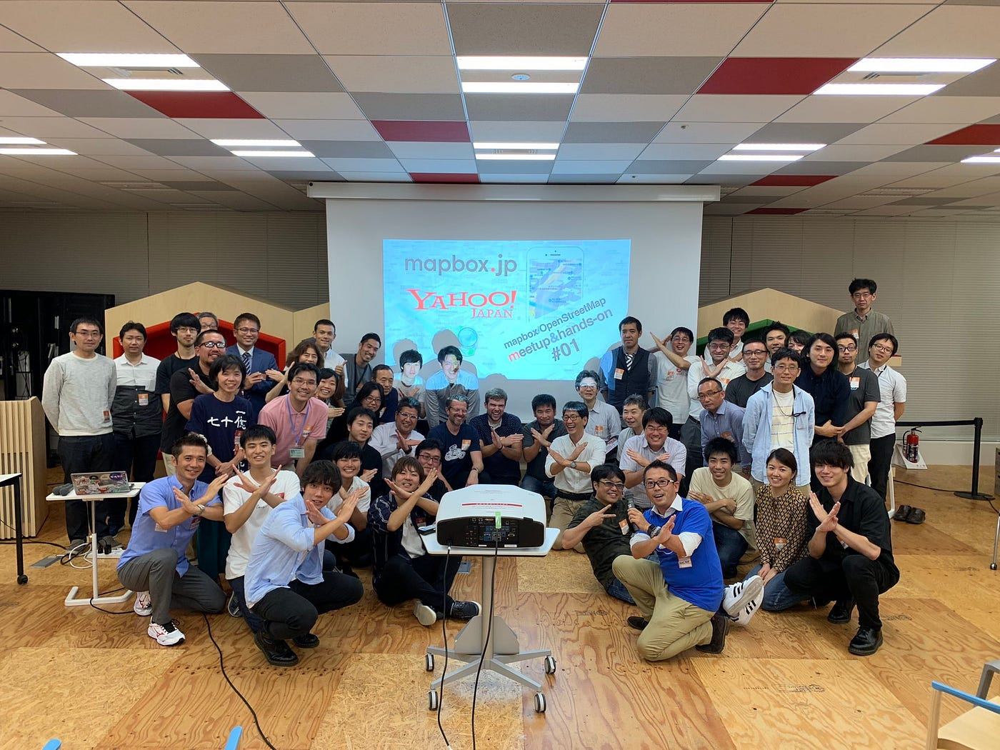
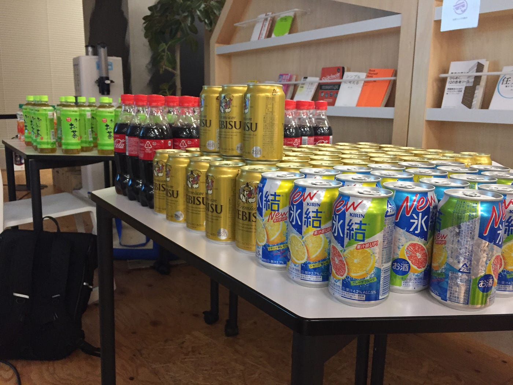
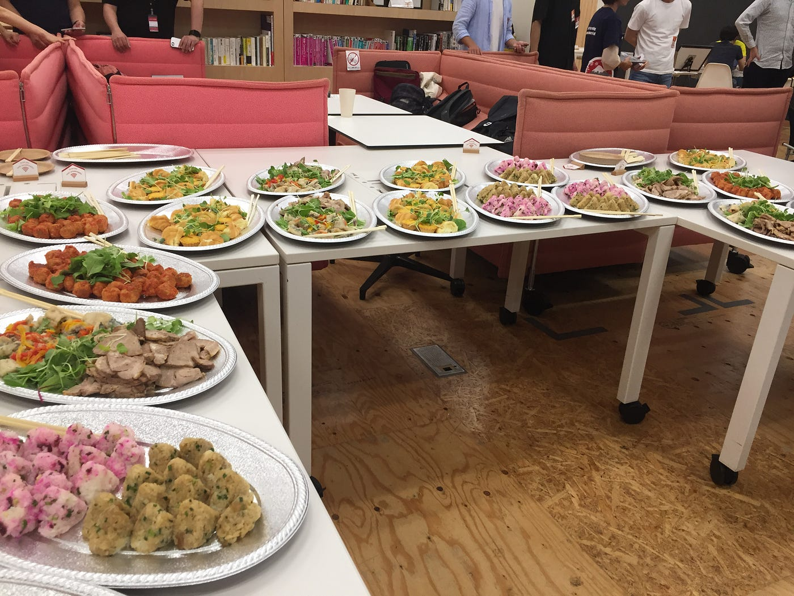

### 地図界の革命！Mapboxで修行開始だ！

10/4@LODGE (Yahoo! JAPAN)

#### おっす!オラ森田!!よろしくな！！！

みなさま、ご無沙汰しております！低体温症のなか寝起きが悪くなりつつある３年の森田です。
今回は10月4日にYahoo! LODGEで行われた、「_**Mapbox/OpenStreetMap meetup&hands-on #01_**」に参加して参りました。参加したと言いましてもずっと運営側であったため、講義などはそんなに拝聴することができませんでした。ちなみに**当meetupは月一ペース**で行っていく予定みたいです。従って今回は、今後のために運営側で気づいた点などを記述していきます。

#スケジュール
18:30 開場
19:00–19:20 オープニング・セッション
19:20–19:40 “State of the mapbox.jp” by mapbox team
19:40–20:40 ハンズオンセッション “Mapbox Studio” by 古橋大地
20:40–21:00 Q&A by mapbox team
21:00–21:30 Lightning Talks( 5 min x 5 talks ) 
21:30–22:00 懇親会
22:00 閉会

#内容

永田町から歩いてYahoo本社に到着すると、受付が目の前に見えます。その両サイドにあるゲートから中に入って行くのですが、Yahoo LODGEの利用者は右側のゲートから入り、専用エレベーターを利用して上がっていきます。18階につきそのまま廊下を進むと、LODGE利用者の専用受付があります。そこで事前登録したフォームを読み込み、入館証を貰えば登録は完了です！
**LODGE利用者は先に登録しておく必要があります、詳しくは[こちら](https://lodge.yahoo.co.jp/manuals/entry/index.html)！**

当日は打ち合わせから始まり会場設営に入りました。LODGEは誰もが使える施設のため、設営場所には複数人の方々が作業をしていました。そのため、まずはその方々に移動してもらうための声かけが必要でした。約半数が外国人のようでしたが、みなさま日本語が達者のようでした。

実際に会場設営に入る前に、LODGEの係員さんが軽く説明をしてくださいました。基本的には現状回復するのであれば、会場内のものは自由に使って良さそうでした。会場内には、音響設備や座席テーブル、スクリーンなど会議に必要なものは全て揃っています。**細かいことは演台上のマニュアルに記載**してあります。

会場設営の後は、ビル下のコンビニへ飲み物の買い出しに行きました。事前に買いものリストを予約してくださっていたので、その点はスムーズに行きました。半ダース単位で購入する場合は、箱での持ち運びが可能です。しかしバラ売りされているものを購入する場合は、**大きいバッグなどがあった方が効率的に持ち運びができる**と思います。

一通り準備が終わった後は参加者の受付に回りました。事前にPeatixのほうで予約してもらっていたため、名簿管理などはある程度まとまっていました。しかし**名簿が名前順ではなかった**ため、名前を探すのがとても大変でした。LODGEの受付も自分たちの方で処理する形になったため、受付の時点で入館証に名前などを書いてもらうことになりました。そのため今後は受付の効率をあげるために、**名簿の見やすさ**と名前書くための**ペンを複数個用意**することが大切であると感じました。

受付終了してから会場に移動すると、開始してから1時間ぐらいが立っていたため、mapboxについての内容がほとんど終わってしまっていました… 興味深い分野なのでしっかりと聞いてみたかった… と思いつつも、気がつけばケータリングの準備がどんどん進んでいました。ドリンクは会場の右前方にあったため、どうしたものかと思いつつ待っていると、先生からの指示が出てしまいました。今後はタイミング見つつ、**邪魔にならないように準備しても良さそう**でした！

その後は休憩がてら食事時間となりました。お皿と箸は少し余るぐらいでちょうどよかったですが、**おしぼりが足りなかった**ので今後はある程度の余分量が必要だと思います。ケータリングも満足度は高そうに感じましたが、想像以上に魚が減らなかったので、その分魚を減らしお肉を増やしてもいいのではないでしょか。

食事後は不必要なお皿などを回収し分別してゴミ袋へ。感覚的に今回はゴミ袋を左右1ヶ所ずつ設置しましたが、今後も2ヶ所ほどでちょうどいいのではないでしょうか。

撤収の際は会場にあるレイアウト図に沿ってテーブルと椅子を並べておけば大丈夫です。ゴミとかはLODGE Kitchen の横の入り口から裏の方へ抜けて行った場所に置き場がある感じになります。おそらく係員の方にお伺いすれば教えてくれると思います！

今回運営側で参加となりましたが、予期せぬハプニングなどの対応が一番難しかったのではないでしょうか。実際第一回目ということもあり、マニュアルも何もない状況での運営となりました。今回開催してみて見えてきた課題などを、今後のミートアップでは解決していくことのできるように準備していこうと思います！

Stravaの記録が取れなかったため、GeoJSONで記録してGitHubのGistとして保存しました。
