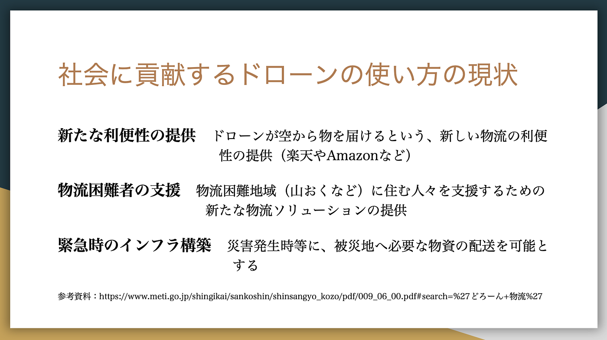

### 12/10ゼミ論「ドローンでタケコプター」

古橋ゼミ3年の上田泰三です。

私は、ゼミ論のテーマを「ドローンでタケコプター」に設定し、先日中間発表を行いました。

### この題材にした理由

・せっかくやるなら多少ユーモアある内容にして途中 で嫌にならないようにしたい

・自分のドローンを有効活用したい

・願わくば古橋先生の高級ドローンを操縦してみたい

という安易な考えで始めてしまいました。。。

### 先行研究

明治大学理工学部講師の柳田理科雄（やなぎた りかお）先生が『ドラえもん』のタケコプターがあれば、実際に空を飛ぶことができるのだろうか？を題材に空想科学読本という本を出版している。

### 社会貢献しているドローンの現状

主に物流と緊急時のインフラ構築が現在主にドローンが使われています。

### 中間発表での質問

・資金は大丈夫ですか？

・タケコプターを作りたいのか、タケコプターの利用方法を作りたいのかわからない

・ドローンとタケコプター似ているから将来できそうですね

・空想科学読本では不可能といわれていましたが？

資金面の心配、根本的に何をやりたいのかという疑問、応援、先行研究との矛盾と様々な質問・意見をいただきました。

### 今後の課題・展開

・より具体的に「人」「ドローン」「タケコプター」 を結びつけ構想を立てる

・自分のドローンでは何グラムまで持ち上げられるか の検証

・ドローン操縦の練習

・航空法のお勉強（基礎知識のインプット）

### 参考文献

**・『ドラえもん』のタケコプターがあれば、実際に空を飛ぶことができるのだろうか？**[http://web.kusokagaku.co.jp/articles/842](http://web.kusokagaku.co.jp/articles/842)

**・ドローン物流サービスの実例と 今後の展望ht**tps://www.meti.go.jp/shingikai/sankoshin/shinsangyo_kozo/pdf/009_06_00.pdf#search=%27どろーん+物流%27

これにて上田のゼミ論中間報告とさせていただきます。ありがとうございました。
