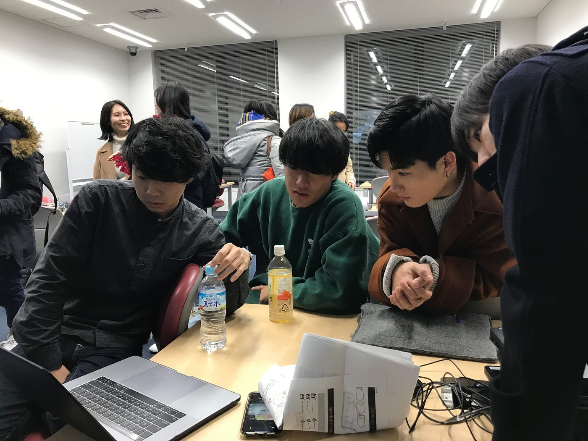

### 12月９日横瀬部週報

こんにちは古橋ゼミ横瀬部の浜田皐太です。

横瀬部での撮影が14日に決定し色々進めていたところ、

> このままで本当に面白いプロモーションビデオが作れるのか？

> たくさんの人に見てもらえるのか？

という疑問に戻ってしまい、突如方向転換しプロモーションビデオの構成を一から考え直すことに。どうしたら横瀬を面白い街と思ってもらえるのか。どうしたらたくさんの人に見てもらえるのか。色々意見を出し合っていたところ部長から他の市町村で注目されたPVの紹介があり、とりあえずみんなで見てみることに。

まず一つ目は宮崎県小林市のPRムービー。

フランス人っぽい人が小林市の説明をフランス語っぽい言葉でずっと話している映像ですが最後にこの男性が喋っていたのはフランス語ではなく西諸弁たったというオチ。この動画の再生回数は今日現在（2019年12月10日）２６０万再生という驚異的な数字を叩き出している。小林市の魅力をたくさんの人に見てもらうことになったのである。

二つ目のPRムービーは同じく宮崎県の日向市の魅力を伝えるもので都会に住む３人の見ず知らずのおじさんたちが日向市に集められそこで自然を感じるアクティビティをしだんだん三人が仲良くなっていくというもの。

この動画も今日現在７万８千再生され多くの人に日向市の魅力が伝わることとなった。

横瀬部として同じようなPRムービーを作ってもしょうがないのでこのような動画を参考にしつつ、横瀬の独自性を生かしたものを考えることに。

実際に出た案として

> 目隠しをされた４人が知らない街に連れてかれ、連れてかれた場所が秩父と説明され、秩父を思いっきり楽しむというもの。秩父は観光名所だしその４人は大喜びして楽しんだ。しかし実際にはそこは横瀬市で結果的に横瀬を思いっきり楽しんだというPR動画。

> 横瀬は秩父と勘違いされるのでそこを逆にいじって横瀬の魅力を引き出す。

> 横瀬のまちで男女二人がデートをしその工程を撮影し恋愛リアリティー動画を作ってPR。

しかし実際にはどれもイマイチ。。。

悩みぬいた結果、最終的にいい案が出て方向性が定まったところでミーティングは終了。

**その最終案というのは動画の制作上の都合のため公表せず、完成したものを披露する形でお知らせしたいと思います。**

14日の撮影に向けて部として資材の調整とスケジュール管理をし当日を迎えたいと思います。
