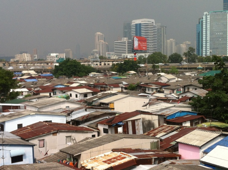
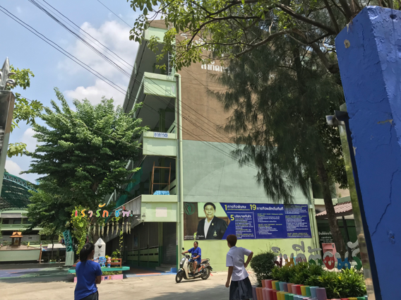

### クロントイ・スラムの位置情報共有

こんにちは。青山学院古橋ゼミ3年の浜田皐太です。

先日３年のゼミ論中間発表があったのですが発表の中で課題が見えてきたので自分なりに整理をしていきます。

### ゼミ論テーマ

> ・日本では馴染みのないスラムを調査することにより、スラムの実態を知りそこに住む人々の生活を知る。

> ・現地調査で見えてきたタイ社会の課題を把握しクロントイ・スラムの人々の生活の質（Quality Of Life、以下QOL）をあげる施策を探求する。

その方法としてシーカ・アジア財団の協力のもと東南アジア最大級のクロントイ・スラムへ現地調査へ行き、実態を知ることとなりました。

QOL向上の解決策としてスラムの人々に住民票を持たせるという発想になりました。住民票を持っていないと政府からの支援が受けられないという現状があります。それを実現するために現地調査で気づいたことがあり、それはスラムの人々でさえみなスマートフォンを持っているということでした。そこで仕事が忙しくて役所に行けない住民票を持っていない彼らのためにデジタル版の住民票を交付すればオンライン上で支援を受ける資格が与えられます。現状としてスラムの人々は１日ごとの収入が生死を分けるといっても過言ではなく、そのため仕事を理由にして役所に行かないことが多いです。つまりみなが持っているスマートフォンを多用するのも一つの手で、住民票を交付されれば最悪立ち退きを余儀なくされた場合も政府からの支援を受けられるということでしたが、自分の中でも下調べが足りず発表内ではかなり突っ込まれてしまいました。

住民票にいたってはタイ政府が動かないと厳しいところがあります。残念なことに現在タイ政府はスラムなどの貧困層に注視しておらず国の経済発展のため富裕層や中間層しか見ていません。つまり厳しい言い方をすると貧困層などの弱く、国益になりにくい人たちは切り捨てているのが現状です。住民票はいくら民間が動いても最終的には公的機関が承認しないと意味がないためかなり難しいのです。

**そこで現実的に可能性が高いのがスラム内の位置情報共有です。**

スラムの人々に現地支援財団や薬局、学校、商店などの位置をスラムの地図とともにすべての情報を一つの地図で共有できればいざ緊急のことがあった場合どこにいくべきかわかるので対応速度が早まります。

この地図を作ることで現地の人はもちろん、外部の支援団体がクロントイ・スラムに入った際も大いに役立ちます。例えばスラムの入り組んだ環境で一人のスラムの人が急病で倒れた際、自分の位置情報をその地図アプリに知らせることで救急隊も目印がないスラムの中で早く患者の元へ向かうことが出来るということです。

### 今度として

現状として下調べがまだ不十分な状況なので現地財団がどれほどの地図を利活用しているのか調べ、そこに古橋ゼミ生として率先していけるのが一番ベストな方法と考えています。

なので今後はまず徹底的にたりないところの下調べをし現地財団と協力できる部分を探していきゼミ論としての完成を目指していきます。
