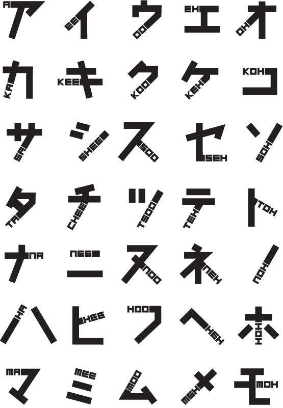

### ゼミ論中間報告12月23日

こんにちは！3年の古屋百々葉です。

私のゼミ論のテーマは、

**『災害時におけるデザイン』 **です。

今回のテーマに決めた理由としては、災害が最近多く起きて、被害にあわれている方がたくさんいることを知り、何か自分も力になることが出来ないかと思い、災害時におけるデザインについて理解を深め、最終的に自分自身で何かデザインを考えられたらいいなと思い、今回、このテーマに決めました！

災害時におけるデザインといっても幅がひろく発表の時にいろいろ皆さんから意見をいただいたので自分の中で、範囲を狭めようと思い、今は外国人も日本に多く住んでいるため、外国人の方が被災した時に日本人の人と同じぐらい現在の状況が分かるようにするデザインについて研究していきたいと思います！

古橋先生にアドバイスも頂いて、このようなデザインがあることもわかりました！

このような文字が文章に入ってれば確かに、外国人の方でも読めるかもしれません！

今後もこのような文字デザインについて調べていきます！
