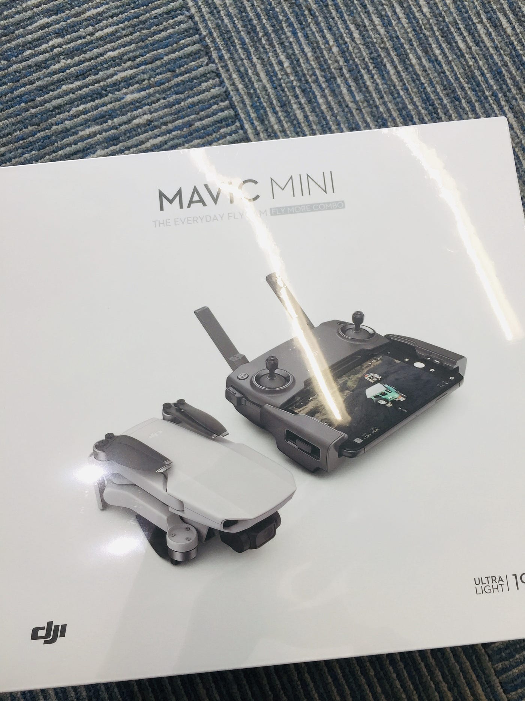
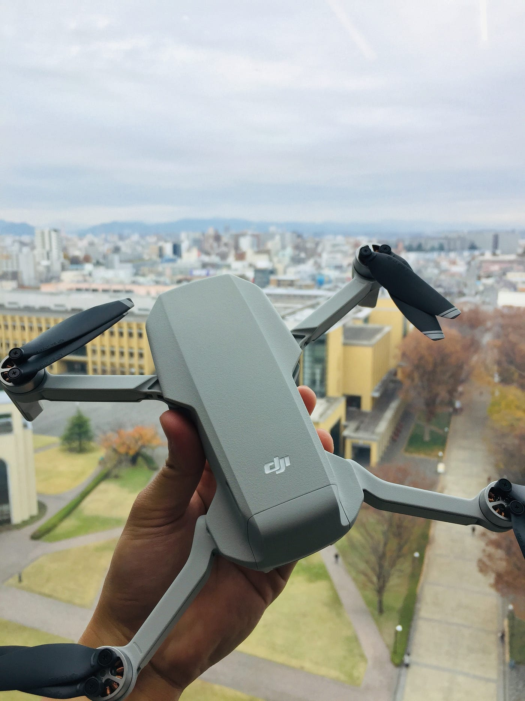
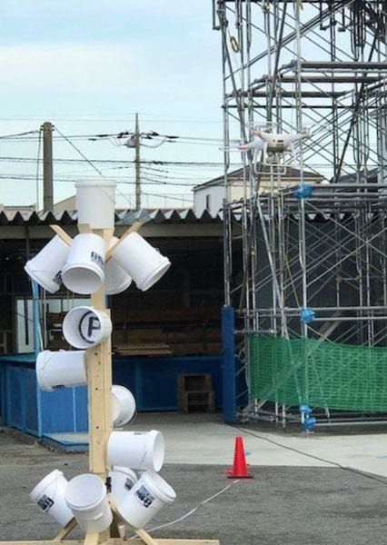
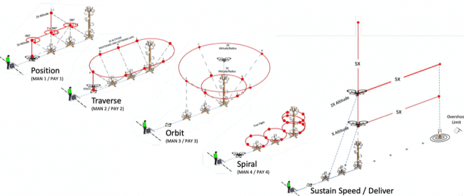

### ドローン部週報 第７週目

今週はドローン部リーダーに就任してから、ポップアップ広告がDJIだらけになってしまった3年の森田が担当いたします。今回は最近話題になりつつある、「**標準性能試験法 ”STM for sUAS”**」について書いていこうと思います。と、その前に、
2019年のドローン界隈 in JAPANのビッグニュースと言えばそう、”MAVIC MINI”の発売でした。そしてついに古橋研究室にもMAVIC MINIが到着いたしました！

早速開けて見ましたが、**とにかく軽い！！**プロポよりも本体の方が軽いっていうのも新鮮でした。軽量化に特化した割にはかなり精巧に作られており、細部にまでもがしっかりとしていた印象があります。また[MAVIC Air](https://www.dji.com/jp/mavic-air?site=brandsite&from=nav)、[MAVIC Pro](https://www.dji.com/jp/mavic?site=brandsite&from=nav)、[SPARK](https://www.dji.com/jp/spark?site=brandsite&from=nav)をはじめとする他のDJI社製品とは、バッテリーの差し込み方やジンバルカバーの装着の仕方などの違いがありました。

それでは本題に入っていきます。

ドローン技能評価方法 ”STM for sUAS”とは、”Standard Test Methods for SUAS”の略で、[アメリカ国立標準技術研究所](https://www.nist.gov/)（以下、NIST: National Institute of Standards and Technology）が提唱した「**ドローン操縦者の技能評価法**」になります。基本的に無人機のことをUAV（Unmanned aerial vehicle）、総重量が約25kg未満の場合はMiniature UAV（別名sUAS）と定義されています。

現在までドローンについての様々な評価がされてきました。しかし既存の評価は、ドローンの性能であったり、操作システムにのみされていました。今回のドローン技能評価法は、”ドローン操縦者の技量”を評価するための基準が規定されました。特に技量などを可視化させることは非常に困難なものでありましたが、今後はこの評価法を元に操縦者の技術を数値化していくことが可能になるのではないでしょうか。

今回NISTが提唱するSTM for SUASを利用して、自治体として日本で初めて川口市消防局で訓練を行いました。その際は[StratoBlue technology](https://stratoblue.jp/)代表の野口克也様による操縦となっています。

StratoBlue Technologyが公開したSTM for SUAS

使用する材料は木材とバケツとなっており、バケツの中にはアルファベットや数字が記載されています。実際の訓練ではドローンのカメラでそのアルファベットや数字を一文字ずつ確実に捉え、全ての文字を捉え切るまでのタイムから獲得した点数で測定していくシステムになっています。

この訓練の構造は、①位置、②横断、③旋回、④螺旋、⑤持続速度/移動の５つの方式から成り立っています。

①位置
目標物の上空で停止させ、機体を旋回させると練習。基本的要素の確認となっており、初級の練習となっている。

②横断
目標物を中心として、そこに視点を合わせながら横断をしていく。曲がる際には機体を中心に向けるように操作をしていくことになるため、横への移動と旋回をさせるという合わせ技が必要になっている。

③旋回
一番奥の目標物を中心に旋回をさせていくことになっており、半径が他の目標物に合わせてある。円を的確に捉える必要があり、横移動と旋回をし続けなければならないため、非常に難易度が増している。

④螺旋
全ての目標物で旋回を行うのだが、奥の目標物では螺旋状に機体を動かすことになる。旋回の要素に高さの移動が加わるため、結果的には横移動、縦移動、旋回の三要素を同時に行う必要がある。

⑤持続速度/移動
前後方移動、高さの移動を同じタイミングや距離で行うことになっており、距離感などの訓練になっている。ある程度機体の速度を掴むための訓練に適している。

STM for sUASは今までの訓練とは異なり、色々な要素が加わった訓練内容となっています。特に螺旋などは三要素の操縦法が重なる仕組みになっています。また操縦だけでなく、普段動かすことが滅多にないジンバルカメラの操作も加わってくるため、全ての要素を訓練できる仕組みとなっています。

今後ドローン部でもこの訓練法に基づいた練習を取り入れていき、タイムなどで可視化して、なんの技術が欠乏しているのかをはっきりとさせていきます！
