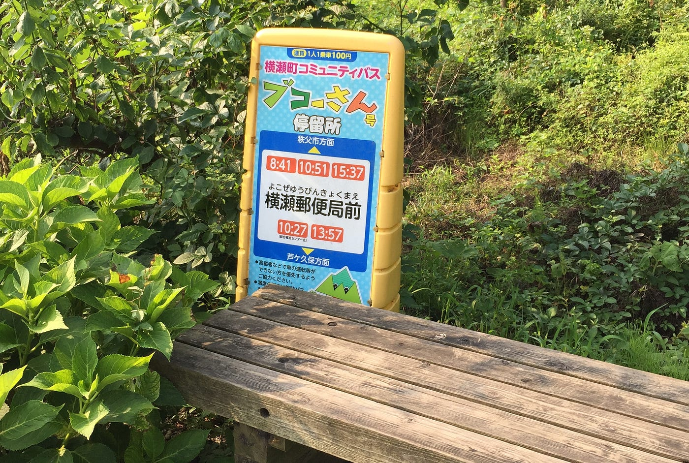
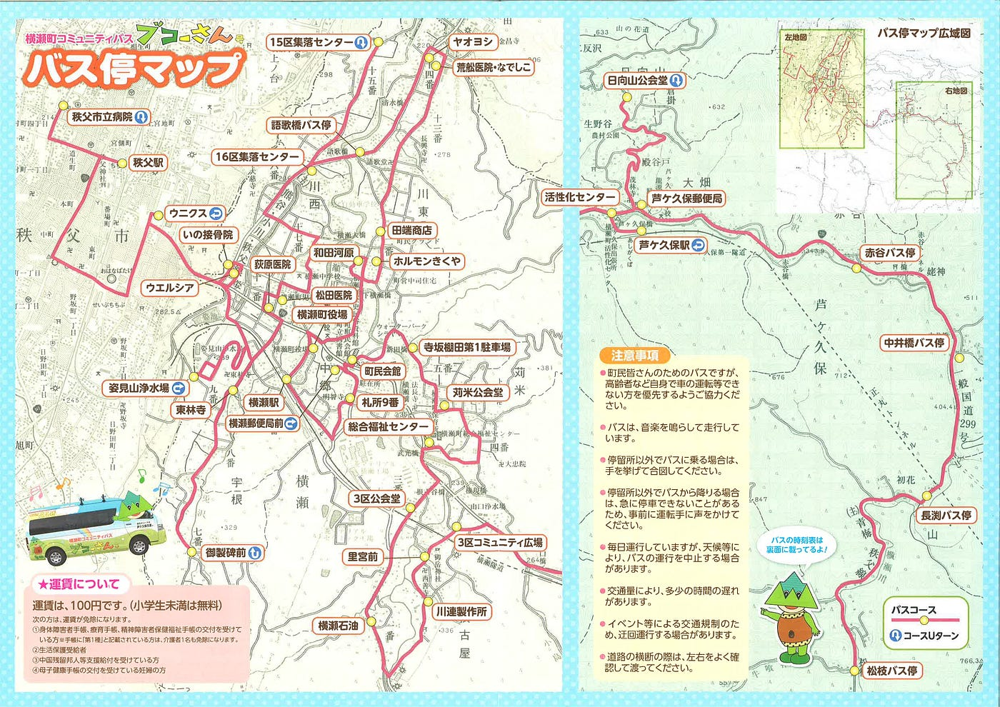
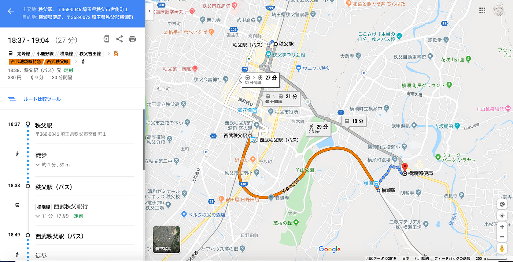
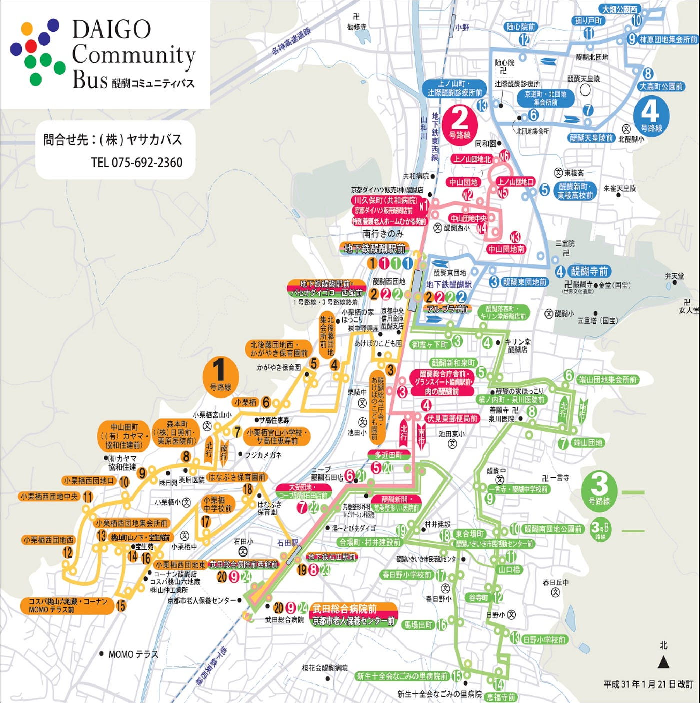
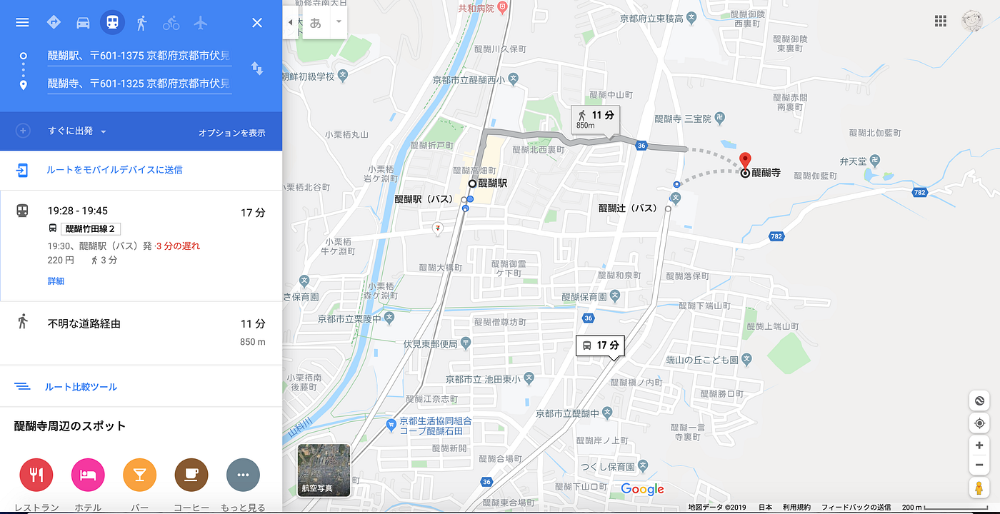
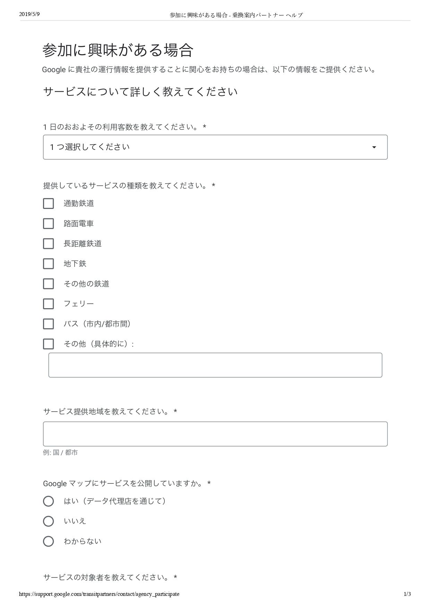
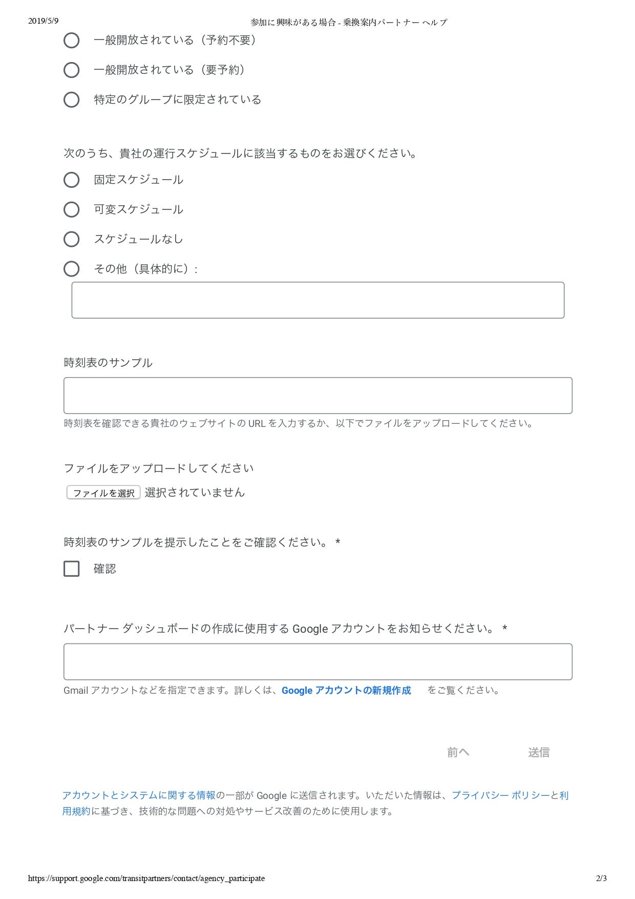
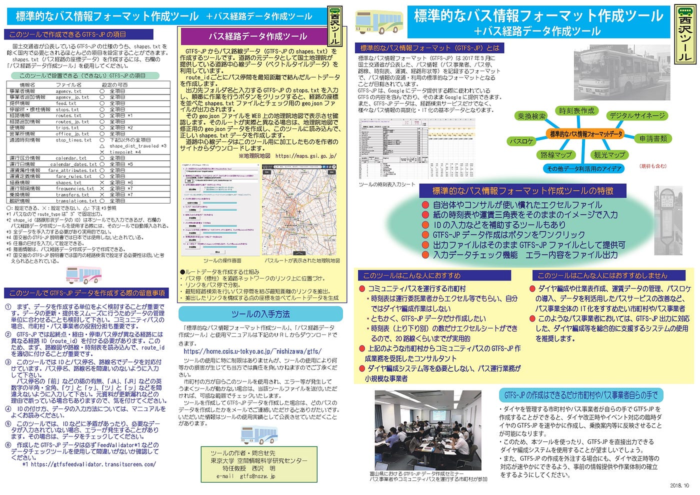
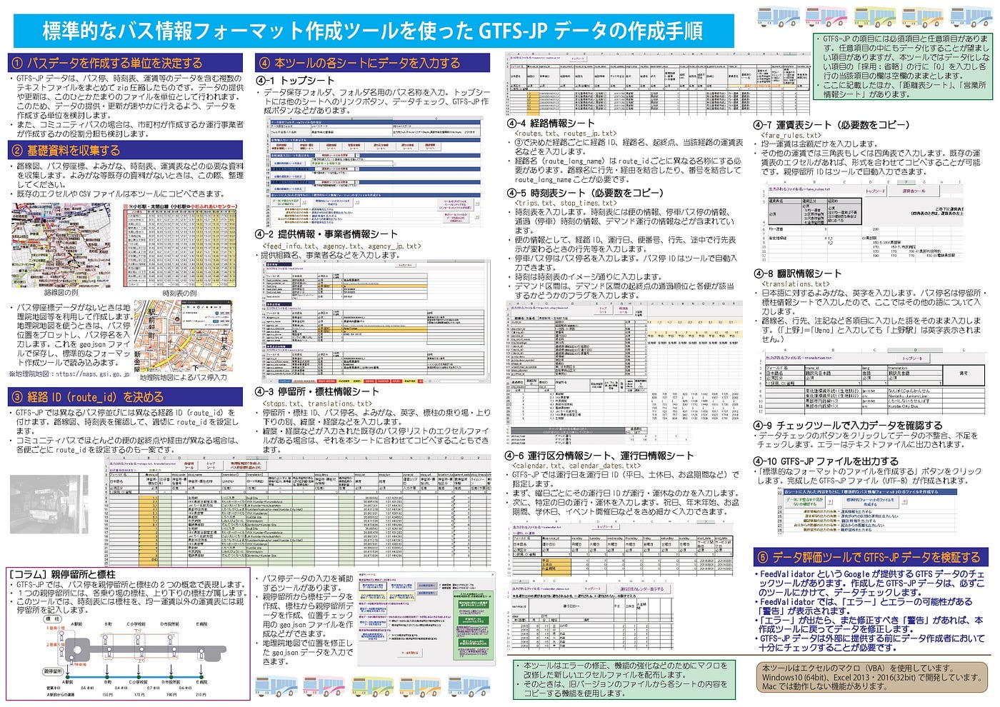

### GTFS化による生活のしやすい社会づくり

古橋研究室アドベントカレンダー12/18

お疲れ様です！年末でとにかく多忙な森田浩徳です。今回は僕のゼミ論は、**「GTFS化による生活のしやすい社会づくり」**というテーマで進めております。

そもそもGTFSとはなんぞやと思われている方、[Google Developers](https://developers.google.com/)が提供しているサービスの一つで、**”[General Transit Feed Specification](https://developers.google.com/transit/gtfs)”**の略になります。和訳すると「標準的なバス情報のフォーマット」となり、簡単にまとめると、Googleにバスの情報を登録していくというのが今回の課題となっております。

GTFSのより詳細な情報については以下の資料をご覧ください！

#### #背景

まずこのテーマにした理由は、タイへの留学を経てインフラの大切さを実感したからです。実際に僕が現地調査を行った対象はハードインフラで、主に道路や商業施設のバリアフリーでした。そこからインフラ面に興味を持ったのですが、古橋ゼミでの専攻分野である空間情報と組み合わせてみようと考えた際、ソフトインフラである情報インフラとも組み合わせることができるのではないかと思いました。そこで古橋教授に相談したところ、GTFSを提案していただいたことが始まりになります。

また先日マレーシアへ武者修行に行ってきたのですが、回線のないところで迷子になってしまったり散々な目にあいました。全く知らない土地での情報を調べていく際に、その情報が不完全であったり、更新されていなかったりすることが多々ありました。そこで「情報」の大切さを身にしみて感じたことも、情報インフラを構築していく必要性があると思った一つの理由になります。

#### #先行研究

先行研究として調べたことは、日本のコミュニティバスの情報登録の遅れです。まず[日本バス協会](http://www.bus.or.jp/index.html)によると、_2014年の日本におけるバス会社数は2,165社あり、その中でも乗合バスの事業者数はは1,991社（2012年）_と報告されています。また2018年の報告によると_年間39億5000万人を輸送_しており、_総旅客輸送人員の約15%_を占めています。したがって、私たちの生活とバスはかなりの密接関係であることがわかります。

日本バス協会「日本のバス事業と日本バス協会の概要（2015）」

日本バス協会「平成30年度事業報告書(2017)」

そんな私たちの生活に欠かせないバスですが、実際にそのバスの情報が登録されているのかをGoogle大先生にお伺いしてみることにします。
まずは私たち古橋研究室の拠点地でもあり、僕のGTFSの作業許可を頂いております埼玉県横瀬町の[横瀬ブコーさん号](http://www.town.yokoze.saitama.jp/soshiki/kenkou/koureisya/community_bus.html)です。ブコーさん号は松枝バス停から秩父駅までの39箇所のバス停で運行されています。乗車金額も1回100円ということで、なんと良心的な価格でしょうか。
ということで、今回は秩父駅から横瀬郵便局までの経路を調べて見たいと思います！まあもちろんブコーさん号で行けば、郵便局の目の前で降りることが可能なのですが…

「大先生、秩父駅から横瀬郵便局までの行き方を教えてください！！」

[秩父駅 から 横瀬郵便局
Google マップで地図を検索。乗換案内、路線図、ドライブルート、ストリートビューも。見やすい地図でお店やサービス、地域の情報を検索できます。世界地図も日本語で、旅のプランにも便利。www.google.co.jp](https://www.google.co.jp/maps/dir/%E5%9F%BC%E7%8E%89%E7%9C%8C%E7%A7%A9%E7%88%B6%E5%B8%82%E5%AE%AE%E5%81%B4%E7%94%BA%EF%BC%91+%E7%A7%A9%E7%88%B6%E9%A7%85/%E5%9F%BC%E7%8E%89%E7%9C%8C%E6%A8%AA%E7%80%AC%E7%94%BA%E5%A4%A7%E5%AD%97%E6%A8%AA%E7%80%AC%EF%BC%91%EF%BC%99%EF%BC%95%EF%BC%94%E2%88%92%EF%BC%92+%E6%A8%AA%E7%80%AC%E9%83%B5%E4%BE%BF%E5%B1%80/@35.9905869,139.0838433,15.03z/am=t/data=!4m14!4m13!1m5!1m1!1s0x601ec9794b57ee55:0xa1feb55e27a6463c!2m2!1d139.0860611!2d35.9988242!1m5!1m1!1s0x601ecbc1f067e4d7:0xf51af258752eec4f!2m2!1d139.1012186!2d35.9864633!3e3?hl=ja)

なるほど〜

秩父駅〜西武秩父駅（西武観光バス 横瀬線）
↓（徒歩２分）
西武秩父駅〜横瀬駅（西武秩父線）
↓（徒歩６分）
横瀬郵便局

という訳ですね。そして片道330円ということですね。承知いたしました！！ いつもありがとうございます！！

と言った流れになりますでしょうか。Google大先生の知識量はとにかく莫大なものなのは承知しておりますが、Google大先生でも教えてくれないことがあることがここで証明されました。実際にブコーさん号の存在を知っていれば、乗り換えなくそしてより安く行くことができます。

では観光地などはどうでしょうか？
例えば京都にある世界遺産の「醍醐寺」は非常に人気のある観光スポットですよね。実際に私も醍醐寺に行ったのですが、日本のみならずたくさんの外国人の観光客がいました。その醍醐寺の最寄駅は京都市営地下鉄東西線「醍醐駅」となっております。東西線では観光スポットの「錦市場」「八坂神社」「二条城」に行くことができるため、観光地を移動する手段としては最適な交通機関になっています。

その醍醐駅から醍醐寺までは、[醍醐コミュニティバス](http://daigobus.com/index.html)の４号路線を利用すれば３分ほどで着きます。

しかしGoogle先生にお伺いしてみると、

[Daigo Station to Daigoji
Find local businesses, view maps and get driving directions in Google Maps.www.google.com](https://www.google.com/maps/dir/%E4%BA%AC%E9%83%BD%E5%BA%9C%E4%BA%AC%E9%83%BD%E5%B8%82%E4%BC%8F%E8%A6%8B%E5%8C%BA%E9%86%8D%E9%86%90%E9%AB%98%E7%95%91%E7%94%BA+%E9%86%8D%E9%86%90%E9%A7%85/%E3%80%92601-1325+%E4%BA%AC%E9%83%BD%E5%BA%9C%E4%BA%AC%E9%83%BD%E5%B8%82%E4%BC%8F%E8%A6%8B%E5%8C%BA%E9%86%8D%E9%86%90%E6%9D%B1%E5%A4%A7%E8%B7%AF%E7%94%BA%EF%BC%92%EF%BC%92+%E9%86%8D%E9%86%90%E5%AF%BA/@34.9486854,135.8116622,16z/data=!4m14!4m13!1m5!1m1!1s0x60010e6ace58eea7:0x8644aeaaf67fdcc7!2m2!1d135.8106877!2d34.9507512!1m5!1m1!1s0x60010e0d9ddd76b9:0x90f274040b6cfb3a!2m2!1d135.8201804!2d34.9510512!3e3)

まず駅から醍醐寺まで歩いて行くと約11分かかることがわかります。
さらに京阪バス醍醐竹田線２を利用することをオススメされます。しかしよくよく見てみると、移動時間が17分と徒歩よりも遅くなってしまうことがわかります。バスの難点としてはルートが決まっているため、遠回りになってしまう可能性が大きいということです。

今回はその代表例として取り上げたのですが、直線距離で３分で行けてしまうルートを17分の乗車時間というのはなかなか不便さを感じてしまいますよね。特に外国人の観光客の方が日本語を読むことができるとは当然想像ができません。つまり外国人の方がこのコミュニティバスの存在を知ることはほぼないということがわかります。

以上のことから、 **GTFSを利用した情報の公開は非常に効果的であるということ**がわかります。さらにこれは生産者・消費者の双方にメリットがあり、生産者側にとっては「利用者が増える、利益が増える、存在を知ってもらえる」、消費者からは「移動手段が増える、時間短縮コスト削減が可能になるかもしれない」といったことが挙げられます。

実際にその情報を公開したことによって、どのような効果があったかは、その自治体が所有している利用者数や売上のデータを比較していけば、どのように影響したかがわかると思います。したがって最終的にはデータを分析していくところまで持っていこうと考えております。

#### **#申請手順**

GTFSの登録にあたり、まずはそのバス業者に許可をとる必要があります。今回は古橋教授と横瀬町に協力をしていただいて、横瀬ブコーさん号の登録許可を頂きました。

次に行うことは、Googleへの申請をすることになります。以下のリンクから情報を登録していきます。

[Interested in participating?
Edit descriptionsupport.google.com](https://support.google.com/transitpartners/contact/agency_participate)

Google側から許可がおりると、以下のファイルを登録して再送してくれとの連絡がきます。以下の登録情報は機密情報も含まれてくるため、事業者としっかりとコミュニケーションをとって情報をいただくことになります。

そしてGoogle Transit側からいくつかの連絡をこなせば、実際に登録の許可がおりることになります。

#### #登録手順

実際に申請が通れば、今度はデータの登録をしていくことになります。登録の方法はたくさんあるのですが、今回私は[東京大学空間情報科学研究センター](http://www.csis.u-tokyo.ac.jp/) 特任教授の西沢明先生が作成した「[西沢ツール](https://home.csis.u-tokyo.ac.jp/~nishizawa/gtfs/)」を利用しています。

作成手順を大きく分ければ、

_① 基礎資料を収集する 
・路線図、バス停座標、よみがな、時刻表、運賃表などの必要な資料 を収集します。 
・バス停座標データがないときは地理院地図等を利用して作成します。_

_② 路線の route_id を決める 
・異なるバス停並びには異なる route_id を付けます。_

_③ ツール（エクセルファイル）の各シートに入力する 
・事業者情報、バス停、路線、時刻表、運行日、運賃表など項目別に 用意されたエクセルシートにデータを入力します。時刻表、運賃表 は、必要な数だけシートをコピーします。 
・バス停リスト、時刻表などの既存のエクセルファイルがある場合は ツールのシートにコピーしてもかまいません。
 ・親バス停データの生成、ID のコピー、バス停座標確認のための geojson ファイルの出力などのツールを使用できます。_

_④ チェックツールで入力データを確認する 
・データチェックのボタンをクリックしてデータの不整合、不足を チェックします。エラーはテキストファイルに出力されます。_

_⑤ GTFS-JP ファイルを出力する 
・「標準的なフォーマットのファイルを作成する」ボタンをクリック します。完成した GTFS-JP ファイル（UTF-8）が作成されます。_

という流れになります。

実は今夏の横瀬合宿でデータ収集で格闘をした過去があります。その際の奮闘記を記載したブログも貼っておきます。

[帰ってきた森田！横瀬町で修行開始だ！
medium.com](https://medium.com/furuhashilab/%E5%B8%B0%E3%81%A3%E3%81%A6%E3%81%8D%E3%81%9F%E6%A3%AE%E7%94%B0-%E6%A8%AA%E7%80%AC%E7%94%BA%E3%81%A7%E4%BF%AE%E8%A1%8C%E9%96%8B%E5%A7%8B%E3%81%A0-1da9c0e18fe2)

現状としては、時刻表シートの作成までが終わっております。あとは残りの情報を記入して、データ出力をすれば登録が完了します。

#### #今後

予定では1月末までにはデータを出力できるようにしていきたいと思います。また今回は横瀬町に協力を頂いてやらせていただいておりますが、今後は他の自治体様と契約を結んで、より幅を広げたやり方にも挑戦できるようにしていきたいです！

今回のところはこんな感じの報告となります。また面白い報告ができるように精進してまいります！それではっ！
