### Ingress FS in Taipei

こんにちは３年の上田泰三です！

ブログ遅くなってしまいましたが、ゼミの課題である国際会議のためingressをやりに12/7台湾まで行ってきました〜！日本で一度Ingress FSを経験したこともあり、右手にタピオカ、左手にiPhoneと気軽に出来るかな〜と台湾へ行ってみましたが。。。

そんな感じで行った台湾をお届けしたいと思います！

### 出発前 成田！？

LCCの航空券をとったためもちろん成田空港の第3ターミナル。ここまでは想定内です。しかし、家の近くから成田空港までバスが出てるのは藤沢駅なんですが、なんと1日1本。えっ嘘！？！？

出発前から大変な旅が物語っています…

#### 台湾到着

台湾桃園国際空港に17時着到予定だったのですが、気流がなんちゃらかんちゃらで2時間遅れて19時着に…

初めての台湾でしたが、留学の時の飛行時間とほぼ同じに、、、

もうあたりは真っ暗だったのでとりあえず予約してたホステルへ

とおもいましたが、その前に両替だ！！

台湾ドルとタイバーツはほぼ同じく3.5倍すれば日本円だったのですぐに円換算してしまいました。タイを思い出しつつ市内へ行くために地下鉄へ

「台湾の電車は充電できる〜サイコー！」

長時間の機内ずっとクソゲーをやってて充電が10%きってたので助かりました。

ホステルに着いたら日本人の加藤さんがこれから夜市行くから一緒に行こうと誘ってくださり夜市へ。

加藤さんに出会ってなかったら1人で行くところだったのでラッキー！！

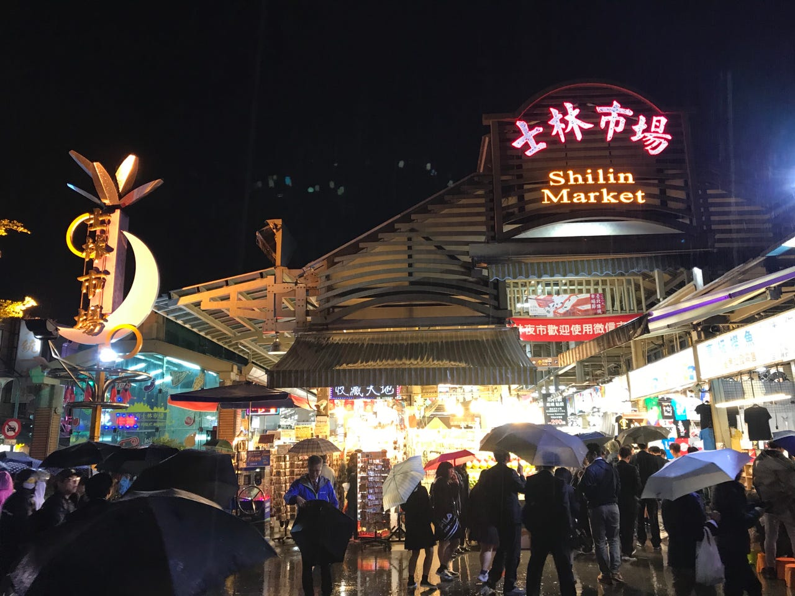

あいにくの雨でしたが、夜市は活気に溢れていました。

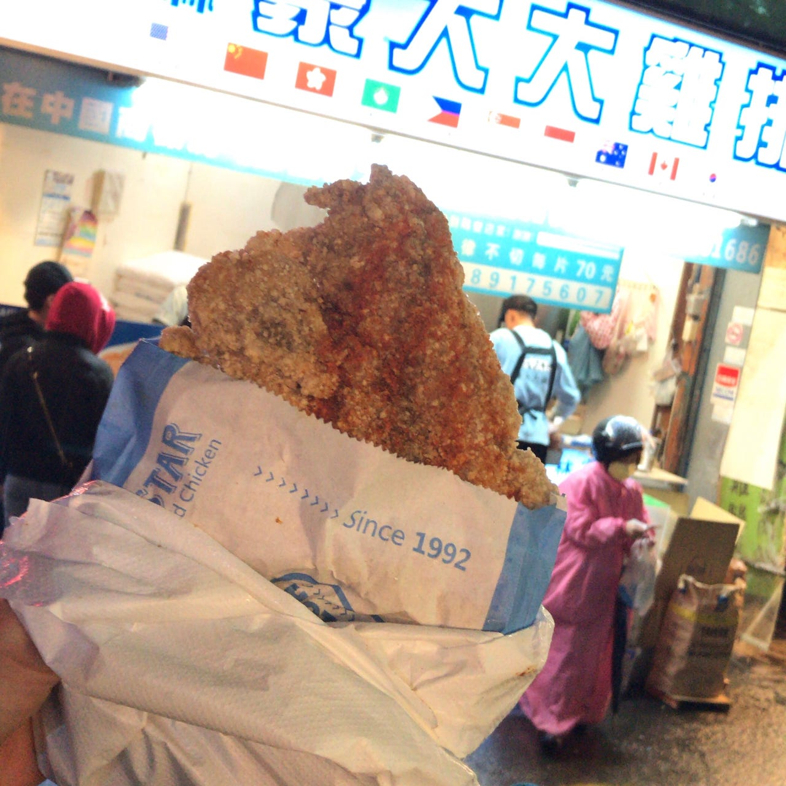

唯一下調べしてた巨大唐揚げ屋さんにも行けました〜

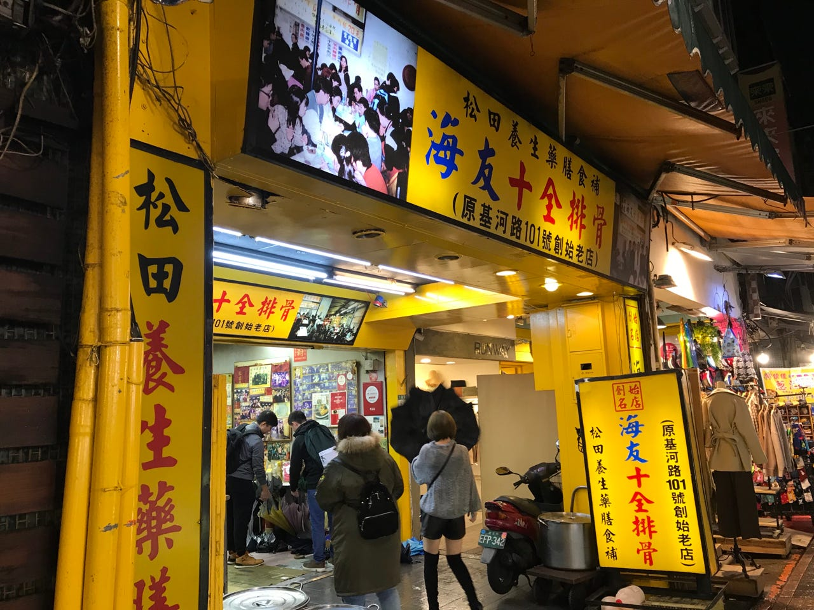

そのままこの黄色いお店で話してました。加藤さんは社会人3年目で有給をとって台湾へ来ていたそうです。こっちはゲームしに来ました〜！って言ったらめっちゃ笑ってました、、、そんな感じで話がはずみ気づいたら1時。

まとめると初日の夜は新たな出会いもあり大満足〜！

### Day2 ingress

#### 13:00

台北のingress fsの集合場所は台北駅の広場とめっちわかりやすかったです！

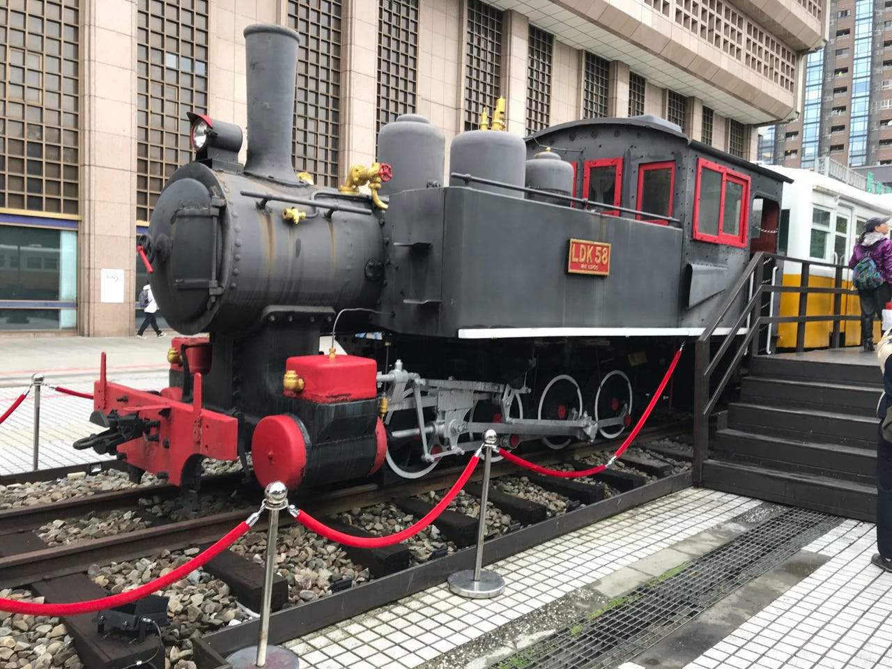

集合場所に行くとそれらしき人々が

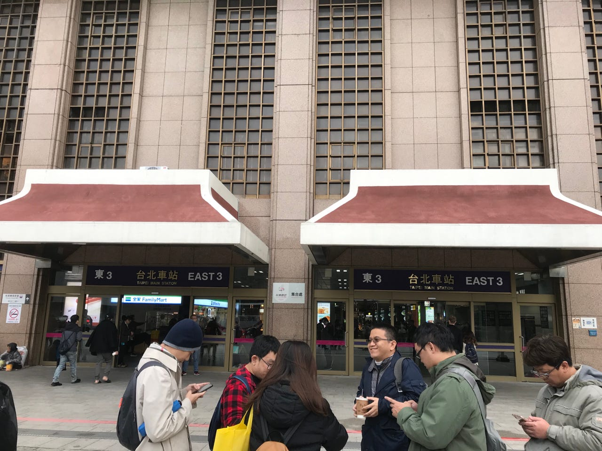

チェックインを済ませイベントスタートです！(AP2倍は14:00~16:00)片言な英語で主催者のMelenさんと会話する事に成功！！しかし、2人で写真撮ってくださいと伝えたものの多分恥ずかしいから嫌だと言われました、、、中国語むずかしい、、、

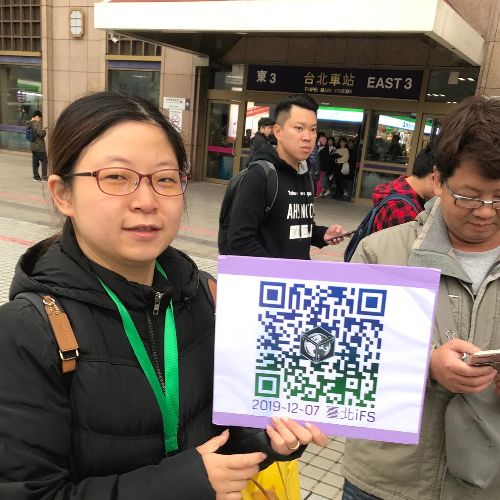

チェックインのQRコードとならオッケーだったらしく写真とらせていただきました。

今回のfsは台湾で1周年記念だったらしくたくさんの人がいらっしゃってました。

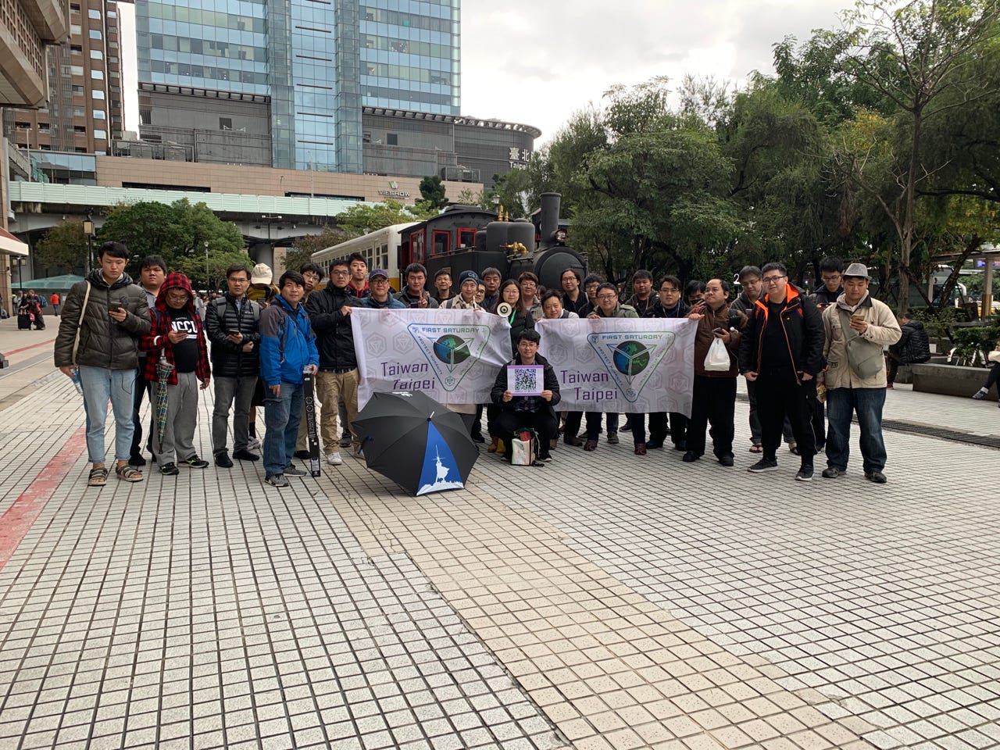

にしても男性が多い〜

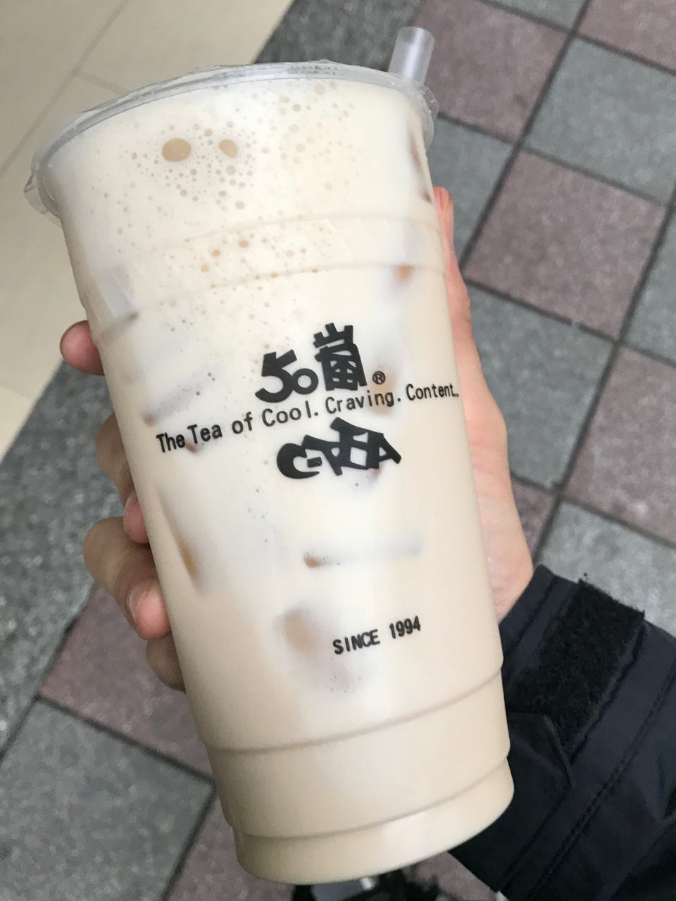

ゆる〜くヒカキンさんが紹介してたタピオカを飲みながらひたすらデプロイしてました！

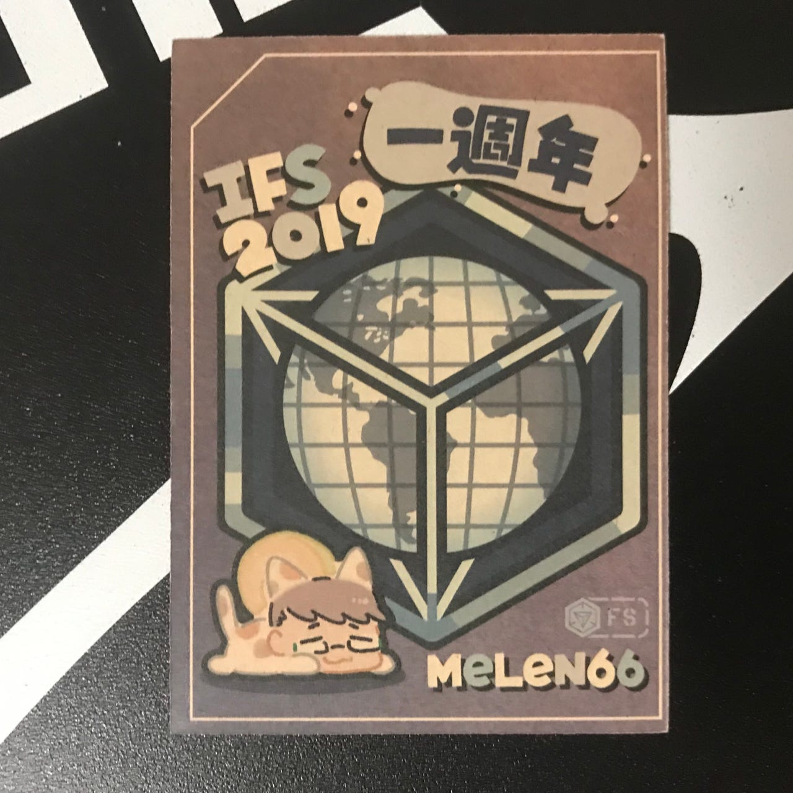

こんな1周年記念カードももらえました〜！

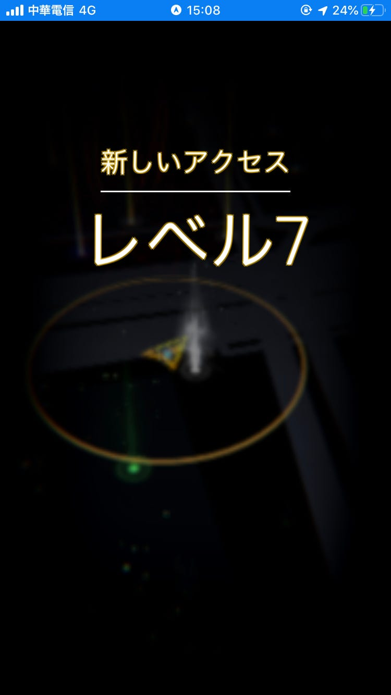

テッテレ〜！レベル7になりました！あと1レベあげれば一人前だ！！

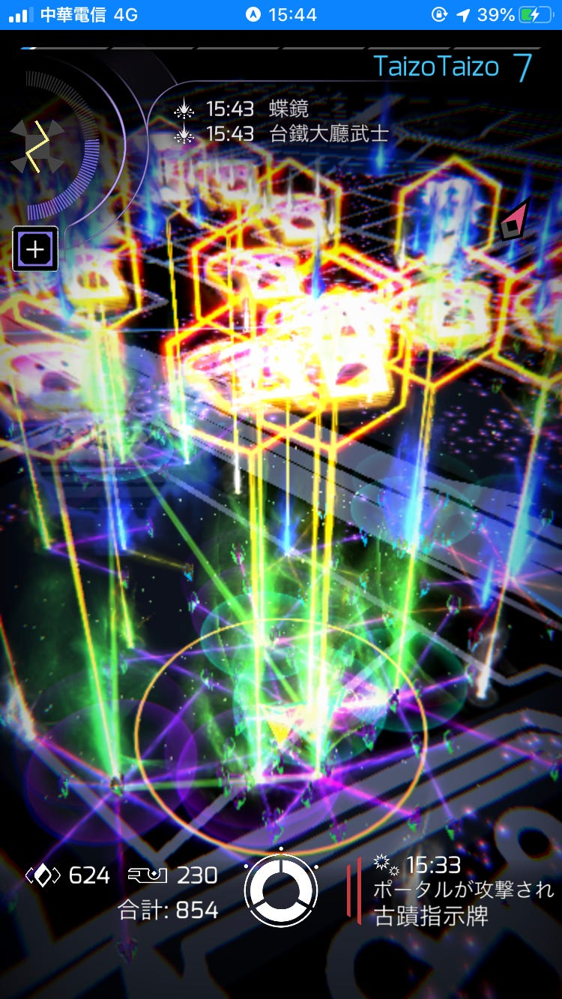

二度目のFS参加で感じたことがあります。前回参加した日本でのFSと違いみんな個々でなるべく多くの経験値を得てました。日本では助けてもらってたので、これが本来のFSなのかな〜と思いつつ気付いたら16時。

#### 16:30

解散し飛行機が深夜ってことをMelenさんに伝えると、九份へ行ってきなと言われ、九份行きのバス停まで案内してくれました！

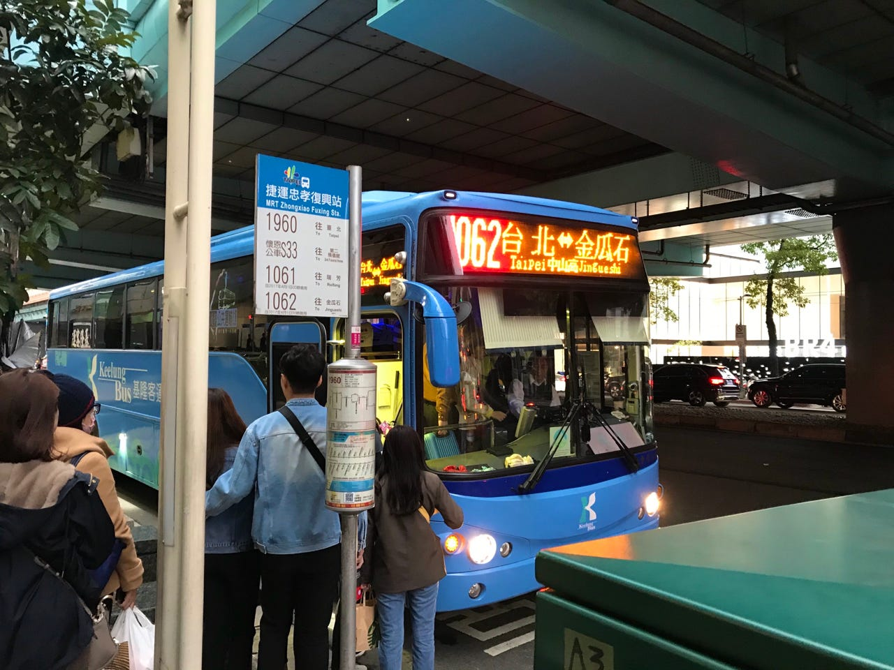

谢谢と伝えいざ九份へ

バスの運転の荒さはタイの同等でした。高速バスだったため立ち席ななく座れて快適〜ちなみに、

「台湾はバスでも充電できる〜サイコー！」

#### 18:00

到着！！

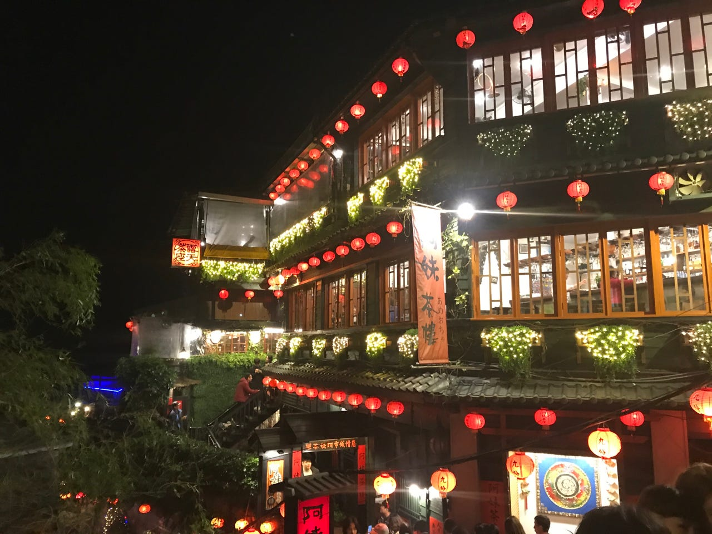

千と千尋の所か〜って着いて気づきました！なんも観光してなかったので行けてよかったです！

その後空港へ向かうだけでしたので割愛させていただきます。

### 終わりに

今回台湾のFSに参加してみて、ingressと言う1つのゲームをきっかけに初対面の方と仲良くできるのは日本と一緒でした。位置情報ゲームは、はまればはまるほど抜け出せない中毒性がありまだまだ奥深いゲームです。帰国後も日本でingressやっている自分がいました。反省点としては言語の壁はやはりあり、主催者との写真を撮るのに失敗してしまいました。日本で最低限の中国語を学ぶべきでした。

ingressのイベントで行くのも、友達との旅行で行くのも、台湾は本当におすすめです！

ストラバです

[https://strava.app.link/MVUaYoQWj2](https://strava.app.link/MVUaYoQWj2)
