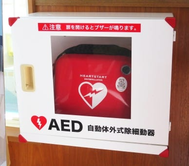

### ドローンによる人命救助の加速案

みなさんこんにちは、3年の佐野公紀です。

私は、ドローンと街中で見るAEDなどの「公共性」の要素を織り交ぜて見たら中々面白い内容になるのではないかと思い、これをゼミ論テーマとして決定しました。

そもそも、ドローンというのはまだ厳密には一般の人にどういうものなのか理解されていないのではないでしょうか。そしてドローンは活用の方法次第で受け取れる恩恵が多いのにも関わらずこの現状はものすごくもったいないことなのではないかと考えたわけであります。

街中でよく見受けられるこの装置。説明の必要性はないとは思いますがAEDです。このAEDの特徴として「万が一の際、誰でも簡単に人命救助を行うことができる」「気軽である」というものがあると思います。それと同じ要素をドローンに埋め込むことができれば、より高次元な人助けにつながると考えました。AEDはあくまで一例ですが、根底にあるのは「ドローンを用いてより多くの人による人命救助を可能とさせる」というものです。 (例)台風などの災害時に、現在ではドローンにを用いて救助活動を行うことができる人がかなり限定されており、そこでその類の人が現場に到着する前に、既にもうそこにいる一般の人がドローンを駆使して一早い救助活動を行う等。

しかし、それを実際に行うには障害となる規制があります。それはズバリ航空法。一般の人が操作するとなると、簡単にこれに引っかかってしまうことは目に見えているため、これをどう対処するかというところに至りました。そこで私が考えた方法は「ドローンに飛行制御マイクロチップを埋め込む」というものでしたが、ゼミ論中間発表の際に古橋教授から「それはもう実際に行われていることだ」というご指摘をいただき、自分の下調べの足りなさを痛感しました。

### **今後の展望**

ゼミ論発表から少し時間が経ちましたが、いまだに「これだ！」といった代替案を思いつくことができていないのが現状です。そこで、次のような項目を行なっていきたいと思います。

・引き続き代替案の探索（街中でどうすれば飛ばせるようになるか）

・ドローンに親しみのない人々にどうドローンの存在をアピールするか

・AED等の救助グッズとドローンの融合方法の模索

今後、これらの調査を臨機応変に行い、充実味のある内容としたいです。
