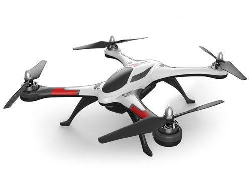

### ドローン部週報 第8週目

こんにちは！古橋研究室3年の古屋百々葉です。

今回の週報では、活動報告とドローンを飛行させるために必要な資格について書いてみました！

### **活動報告**

今回の活動では、ドローン部の今後の目標について話し合いました。

今は、ドローンをお昼に飛ばすだけなので、目標というものがなかったので、ドローン部の今後の目標として、

_・相模原祭でゼミの出し物として、ドローンの体験コーナーを出せるようにすること_

_・ドローンを使ったプロモーションビデオの作成_

を設定しました。

### **ドローン飛行に必要な資格**

ドローンを飛行させるのに特に免許や資格は**必要ない**そうです！しかし、民間によるドローンの認定資格を取得しておいた方がいいそうです！

まず、ドローンを基本的に飛ばす時のルールとして、航空法や自治体の条例によって詳細は変わりますが、大まかなルールとして、以下の[条件](https://www.mlit.go.jp/koku/koku_tk10_000003.html#a)がそろっていれば誰でも飛行させることが出来ます。

_・飲酒時に飛行させない_

_・衝突の恐れがあると判断した場合衝突回避の対策を行う事_

_・急降下など、危険を伴う迷惑な飛行をしないこと_

_・期待や周囲の状況を事前準備をして、安全確認を怠らないこと_

_・200g未満で技適マークがついた機体であること_

_・日中の時間帯に目視できる範囲内で飛行させること_

_・飛行禁止区域で飛行させないこと危険物の輸送や投下をしないこと_

_・人、建物、自転車等と30m以上の距離をとること_

_・イベント会場やその周辺で飛行させないこと_

大きなイベントが開催される時は、普段は飛行禁止されていない地域も飛行禁止エリアになることがあるので、飛行計画時にしっかりとチェックすることが大切です！

さて、本題に入っていきたいと思います！

#### **ドローンを飛ばすのに持っておいた方がいい資格**

ドローン別にみていきたいと思います！

一般ユーザー向けの、**トイドローン**や**ホビードローン**と呼ばれるドローンは、周波数が、「2.4 GHz帯」が主流であり、この周波数は、電波法でほかの無線機に影響を及ぼさない微弱無線であるとされており、無線免許が必要ありません。

一方で、ビジネスで活用される**産業用ドローン**や[ドローンレース](https://www.jdra.or.jp/whats-droneracing/)で使用される**FPV対応ドローン**はそれぞれの周波数に応じた無線免許が必要とされています。

**産業用のドローン**の周波数は「5.7 GHz」であり、この周波数の場合、**『[第三級陸上特殊無線技士](https://www.brainnet.co.jp/youseikatei3/about/index.html)』**と呼ばれる、無線免許が必要です。この、陸上特殊無線技士は総務省が決める国家資格の一つであり、試験科目は、無線工学と法規で、多種選択方式によって行われています。そして取得方法は、2つあり、国家試験もしくは、養成課程(公募型・受託型)を選択できます。

国家試験の場合、6月10月2月の年三回受験可能で試験料は5163円です。一方養成課程(公募型)の受講料は関東エリアの場合2万2650円で、講義から試験まで1日で行われるため、合格率が高いという特徴があります。そして、受託型では、法人及び団体向けの養成課程で、受講者20~40名以内で100km以下の距離の場合受講料は32万9400円。100km以上の場合46万4400円です。

ドローンレース用のドローン**FPV対応ドローン**の周波数は「5.8 GHz」。『**[第四級アマチュア無線技士**](https://www.jarl.org/Japanese/6_Hajimeyo/shikaku.htm)』と呼ばれる無線免許が必要です。試験は年4回行われ試験地によって異なります。東京の試験月は5月、7月、11月、3月です。

