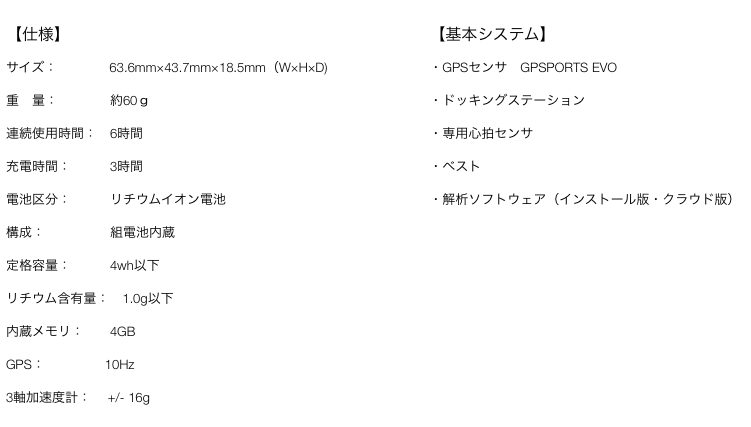
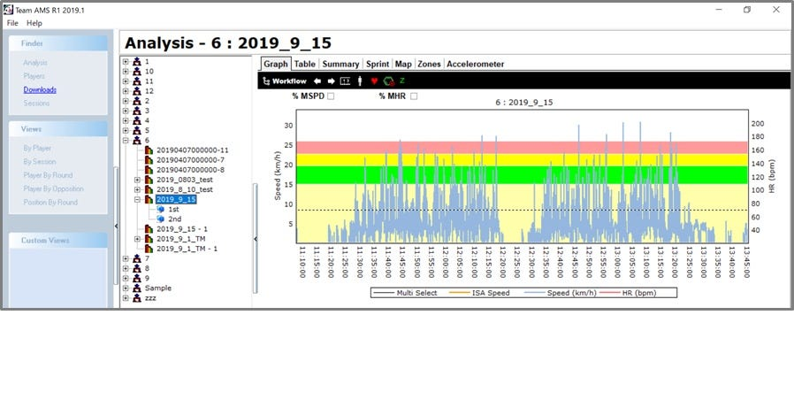
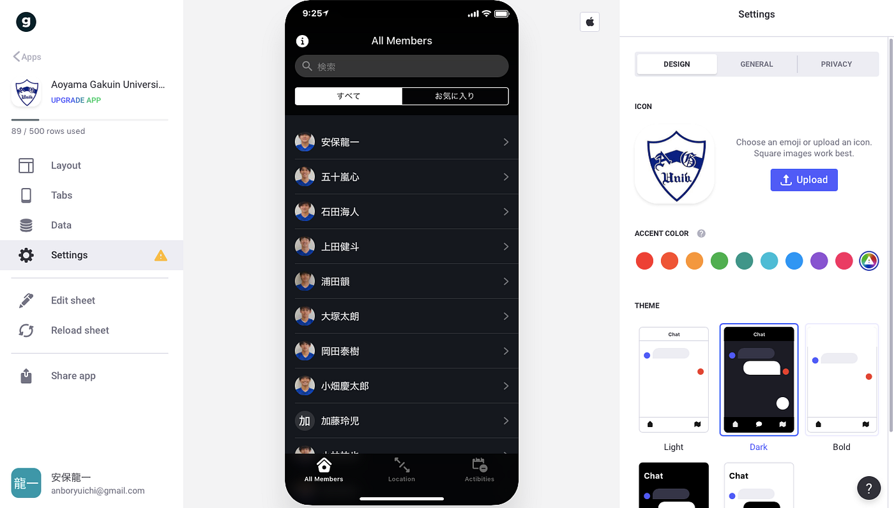

### 12/20 ゼミ論中間報告

こんにちは、古橋研究室3年の安保龍一です！

今回の僕の[ゼミ論は「位置情報×football」というテーマ](https://docs.google.com/presentation/d/1OoMceupmSV5lmiR66yzRAXN-5ewf4eF814-CYeI9b1w/edit?usp=sharing)で進めております。僕が青山学院大学体育会系サッカー部に所属しているといことで、古橋研究室でのゼミ論をどうにかしてサッカー部にも還元したいと思いこのテーマで研究をスタートしました。一言でサッカーとGPSをリンクさせると言ってもいまいちピンとこないと思いますが、簡単に説明すると選手にGPSを装着させて試合させるということで。この方法は現在サッカーの世界では当たり前のようなものになりつつあり、競技のクオリティーや戦術のバリエーションの進歩に大きな影響を与えています。

#### **機材紹介**

**・[GSPORTS EVO**](https://www.4assist.co.jp/製品一覧/gpsports-evo/)

今回は株式会社フォーアシストの「GSPORTS EVO」という最新モデルですデータの収集を行いました！！

中間報告時に古橋教授からご指摘を受けた機材の種類と計測頻度は明らかとなりました。GSPORTS EVOは業界最小最軽量クラスになっており、従来のモデルから約10％の減量に成功しています。また計測頻度（スペック）は15Hzまで使用できるとのことで、これもまた最高水準の機材で情報収集を行えています。実際には30Hzまでの計測頻度の機材もあるが、スポーツ中においては位置情報がブレてしまうためマイナス効果とのこと。従来はスパイクに機材を装着して測定する方法が主流でしたが、足につけることで情報にブレが生じてしまうため[局部にバンドを用いて装着](https://image.jimcdn.com/app/cms/image/transf/dimension=1920x400:format=jpg/path/s5e4b7c33d4469a11/image/id7795b0b720ac231/version/1489718085/image.jpg)するようになりました。ここで最も重要なポイントは、衛星との通信でデータを取得するため機材が常に上を向いていないといけなということ。プレー中のデータを集める方法も進化し続けていました。

↑ 今回使用したGSPORTS EVOの詳細データです。

#### どのようにデータを活用するのか

①[GPSユニット](https://image.jimcdn.com/app/cms/image/transf/dimension=178x10000:format=jpg/path/s5e4b7c33d4469a11/image/ie9882ae3e06f1ee0/version/1489380933/image.jpg)のデータを[ドッキングステーション](https://image.jimcdn.com/app/cms/image/transf/dimension=1920x400:format=jpg/path/s5e4b7c33d4469a11/image/i5c1035f201fec872/version/1489718085/image.jpg)を経由してパソコンに落とし込む

GPSユニットで収集したデータは一度ドッキングステーションに移します。ドッキングステーションに移行が終わるとユニット内のデータは自動的に消去される。その後ドッキングステーションとパソコンを接続し、分析ソフト「Team AMS」にダウンロードしていく。

②デートを各選手ごとにネーミングする

ダウンロードしたデータにに付けや試合の名前をつける。また、各ユニットのデータと選手のデータが間違っていないかを確認し各データに選手の名前をつけて管理。（あらかじめユニットに番号を書いておくと◎）

③ファイルを分割する

全体のデータがグラフとして表示されている為そこから各選手のデータとして分割する。開始時刻と終了時刻もこの時に登録する。

④選手の個人データとして情報追加

このセクションでは選手のデータを打ち込んでいく方法もしくは、選手の100%を基準としたパーセンテージを各ゾーンに入力して保存する。

最終的にデータは以下のような形でスプレッドシートになります！！

[Furuhashi Lab. sample...2018/10/14 vsTokai
Sheet1 Player,: E.Yuma Session,: 2018.10.14 vsToukai Start,24:36.0 End,27:31.0 Time,Cumulative Time,Heart Rate,Heart…docs.google.com](https://docs.google.com/spreadsheets/d/17lT0XVyXJozqO1wsH5tX2P5AnA_z_b-jU0-xmMwcYtE/edit?usp=sharing)

#### 今後の課題と方針

今回の中間発表で、ヒートマップ作成が思ったよりも大変なのと全試合のデータの編集が確実に間に合いそうにもないことが見えてきました。データを個々に分けてもそのあとどのようにヒートマップに結びつけるかのハウツーがないのが現状です。古橋先生やサッカー部の支援してくれている顧問の先生お力添えいただき形にしていきたいと思います。

そして同時に進めているのがアプリ作成です。古橋研究室でも活用している[Glide](https://www.glideapps.com)でアプリを作り最終的にはそこに試合情報やヒートマップ等を掲載していけたらいいと思っています。現状はマップの作成に時間がまだかかりそうなので、部員名簿・グラウンド・活動報告のタブを作成してスプレッドシートを用いて情報を入力しています。

[Aoyama Gakuin University Football Club
Edit descriptionfdutz.glideapp.io](https://fdutz.glideapp.io)

以上で僕のゼミ論中間発表とさせていただきます。
