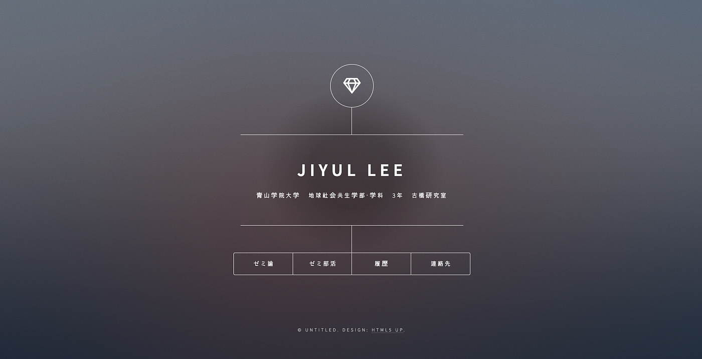
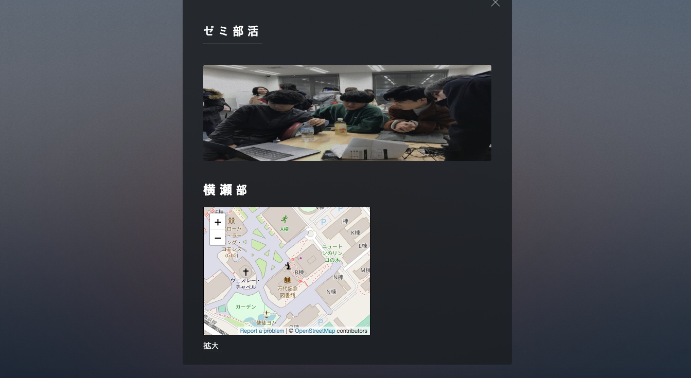

### 12/21 ゼミ論中間発表報告

こんにちは、古橋研究室3年LEE・JIYULです。

#### ゼミテーマ変更

まず、夏の合宿で発表したオリンピックに備えた外国人向けの銀座喫煙地域マッピング計画は喫煙所マップと言う他のアプリですでに改善されていたため、テーマ変更する事にしました。代わりに古橋先生が前アドバイスくださった個人用ホームページ作り方についてゼミ論を進む事にしました。

#### 古橋研究室専用多目的プライベートホームページテーマ構築

目標として簡単なプログラミングスキルさえあれば、研究室専用ホームページを構築方法を紹介して、今後自分のポートフォリオ或いは自己紹介で利用してネット上で活用できるようにする事です。そのためにまず初スタップとして研究室専用ホームページテンプレートを作成する予定です。

研究室の学生の中ではプログラミング知識がある学生もいるが、大体の人がプログラミングを接した事がない事を踏まえて、なるべく簡単なテンプレートを良いするつもりです。上記のホームページはワンページで作成されており、HTML5反応形でボータン押して四つのスモールページを利用する事ができます。まだ、研究室用でどういう内容が必要かについて決めてないので、今後先生との相談の上に必要なものを決めるつもりです。

この様に各自が入ってるゼミ部活活動を紹介する掲示板か、或いはメディウムとの連携で自分が書いた記事をリンクさせて紹介する事もできると思います。

そして、一番重要なものでマップの活用ですが、 OpenStreet Mapを埋め込んでどういう活用ができるかについてはもう少し工夫するつもりです。

ホームページの背景や色などももっと古橋研究室の色を出せる様に写真などを背景に入れる事や古橋研究室のロゴを入れるつもりです。

作成が終わったテンプレートはGITHUBに載せ、みんなと共有できる様にして、使い方をスクリンショットや動画を利用して作成して一緒に載せて、すぐ誰でも使えるようにする計画です。

結論として、このホームページを構築する過程で得られる物は三つ予想されます。

一番目は現代学生として必要な基礎的なIT知識の習得です。

二番目は難しいプログラミングに対する抵抗感の減少が予想されます。

三番目は自分だけのホームページで自己アピールをもっと効率よくできるようになり、今後の就職活動または社会に出た時他の人とは差別をつける強みを得られると思います

以上でゼミ論の中間発表とさせていただきます。
