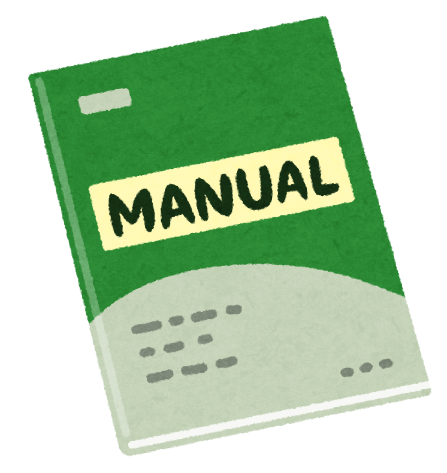

### マップツールの動画マニュアル化

[Furuhashi Lab. Advent Calendar 2019](https://qiita.com/advent-calendar/2019/furuhashilab) 12月22日

こんにちは、古橋研究室３年の吉田です。
今回は私のゼミ論の中間発表の内容について書いていきたいと思います。

私のゼミ論のテーマは「**マップツールのマニュアル化**」です。



内容としては、古橋研究室で使う頻度が高いマップツールのマニュアル化を動画でしようというものです。

「なぜ動画なの？」

先日の中間発表で多く聞かれた内容です。
正直、動画である絶対的な必要性はありません。私自身が動画制作に関心があるのでそこに絡めて研究できればなと思い、動画制作を選択しました。また、個人的に何かわからないことがあったらYouTubeで検索してしまう性分なのも関係していると思います。

#### 背景

私が1年次に空間情報システム入門Ⅰを受講した際、私の周りには [Tasking Manager](https://tasks.hotosm.org/)や[Mapillary](https://www.mapillary.com/app/)の使い方がわからないという子や、留学前のフィールドワーク論でも[Strava](https://www.strava.com/)の使い方がわからないという子が多い印象でした。

毎回毎回同じことを繰り返し教えていて、
**「わかりやすいマニュアルどっかないかなー」**と感じていました。

空間情報学初心者勢に向けたマニュアルになるようなものを作ることで、今後私と同じように感じている人を減らしたいという思いから、このテーマで進めることにしました。

#### 先行研究

古橋研究室の先輩でTasking Managerについて動画を出されている方が数名いらっしゃいましたので、そちらを先行研究として見させていただきました。そのうちの一つが以下の動画になります。

How to use Tasking Manager (青山学院古橋研究室)

冗談交じりに楽しく説明されていて一見わかりやすいかもと思うのですが、よく聞くと女性の方が1人で説明されていて、せっかくの掛け合いが意味をなしていないように感じられました。コンセプト的な違いかもしれませんが、自分のゼミ論ではもう少し初心者に寄り添った形にできればなと思います。

また、Tasking Managerの公式YouTubeチャンネルで動画が出ていたので、これも参考にしていきたいと思います。

Two Minute Tutorials: Adding a building to OpenStreetMap

#### デメリットへの対策

この動画マニュアル化をすることによって生じるメリットはもちろんですが、それと同じように以下のようなデメリットも考えられます。

```
-動画閲覧のための再生環境がなかった場合はどうするのか
-新しい情報への更新はどうするのか
-多くの情報を伝えにくく細かい手順を伝えられない
```

先日行われたゼミ論中間発表でも同じような質問がされていたので、これに対する対処を挙げていきたいと思います。

まず再生環境については、大学構内を想定しています。そのため、通信環境や機器に関しては問題ないと考えられます。ただ、構外での再生に関しては個人差が出てくると思われ、そこに関しては1年次に製作したスライドを参考にしながら新しく製作しようかなと考えている段階です。

次に、新しい情報への更新はどうするのかという点ですが、これに関しては、後輩などにバトンタッチできればいいなと思っています。私自身も卒業された先輩方のアップデート版としてこのゼミ論に取り掛かっています。

そして、多くの情報を伝えられない部分はどうするのかという点に関しまして、これは最初に提示した「わかりやすいマニュアル」というコンセプトにつながります。初心者に詳しく説明したところで、理解できなければそれは意味がありません。そのため、まずは基本情報で尚且つ疑問に思いそうな部分をマニュアル化することが大切だと考えます。

#### 現状と今後の課題

中間発表内では年内の撮影・編集完了としていました。動画自体は先日撮り終わり、残すは編集作業のみとなっています。こちらに関してはスケジュール的に年をまたぐことになりそうです、、、
今回撮り終えた動画については、もし改善点が見えれば撮り直しもしていきたいので、一旦デモという形になりそうです。

また、自分的には「動画を撮って編集してハイ終了！」という感じにしたくはなく、これを踏まえた上での研究を何かできないかなと模索中です。
現段階でぼんやりと浮かんでいるのは効果測定です。これに関してはつい最近思いついたことなので先行研究を完全に調べられておりません。これについては今後調べながら先生にご相談しようと思います。

以上、ゼミ論中間発表の内容報告でした。
