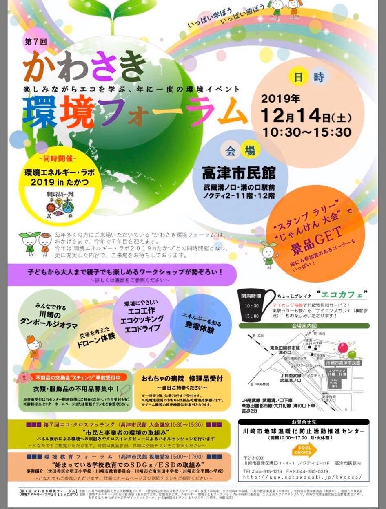
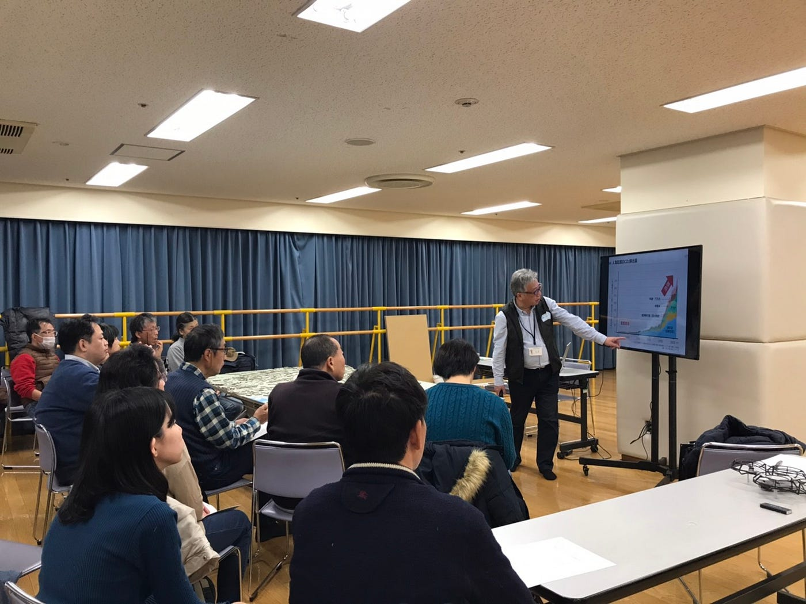
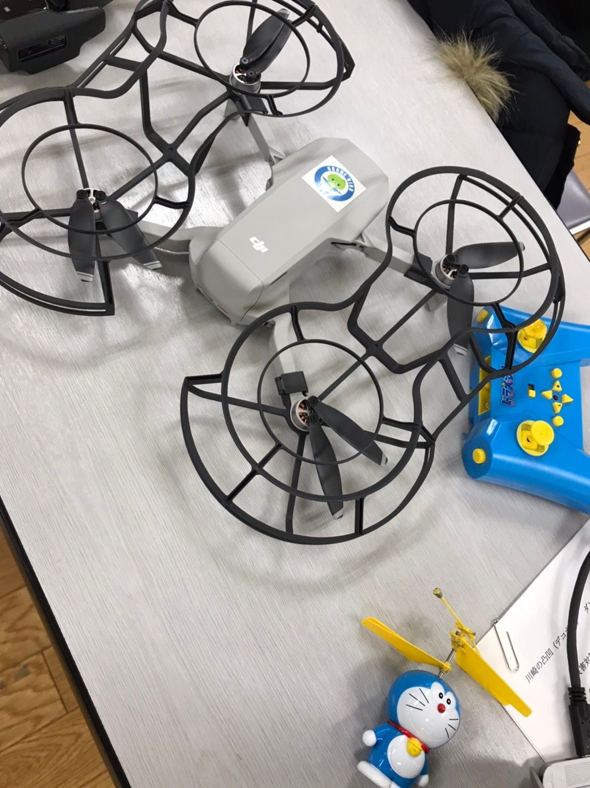
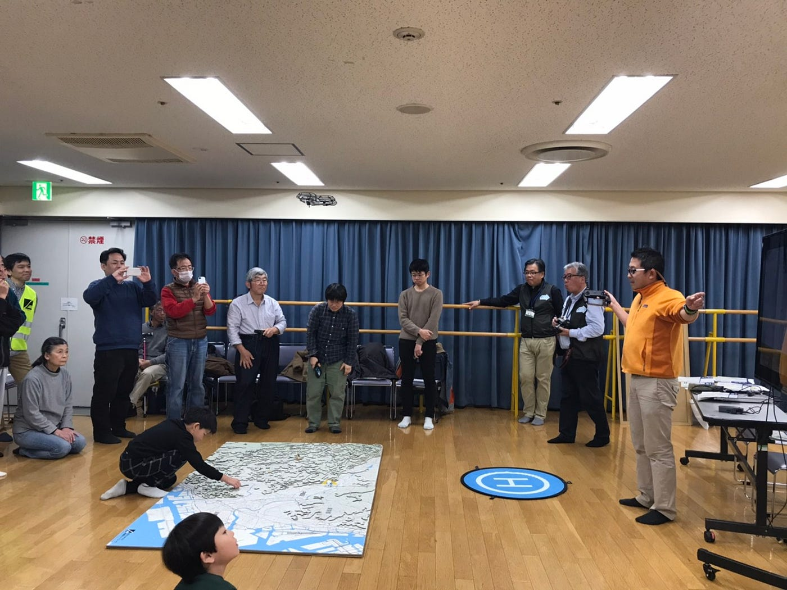
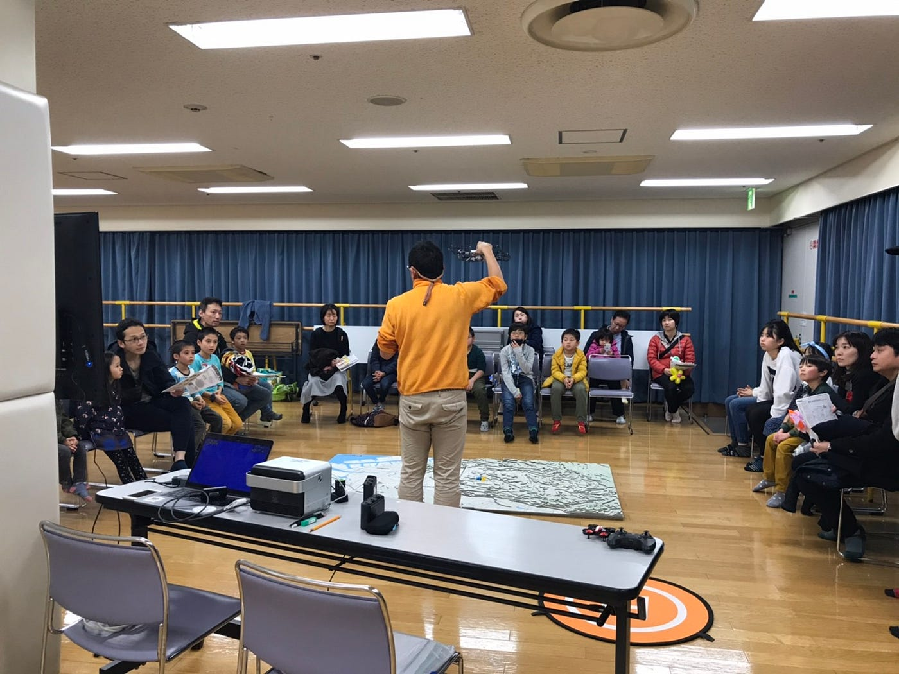
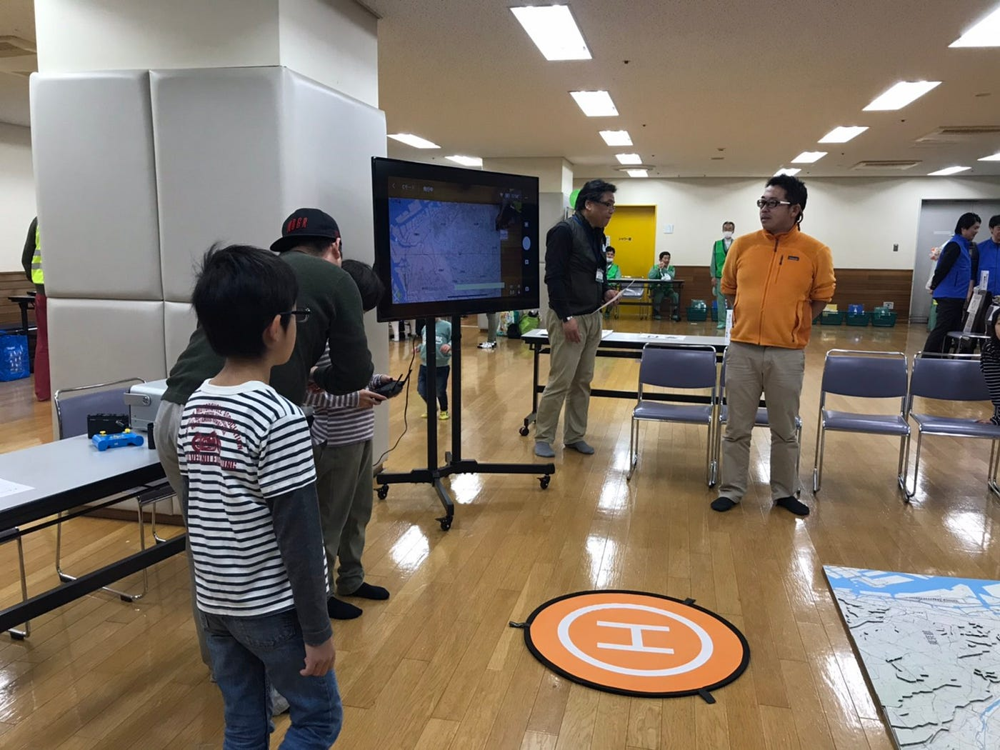
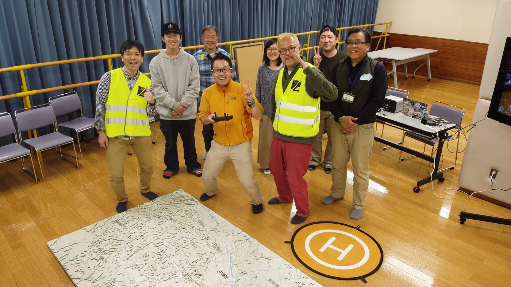

### 環境・エネルギーラボ2019inたかつ

こんにちは、古橋研究室3年の森玲子です！

先日12月14日に、川崎市高津区で環境・エネルギーラボ2019が開催されました。

本題に入る前にこのイベントはどういった内容なのか…？？といいますと

子どもから大人までが楽しめるワークショップ型形式となっていて、川崎市のダンボールジオラマを作るコーナーや環境にやさしいエコ工作、発電体験など、主に環境をテーマとした企画が多く揃っていました。

その中で、私は先生が活動されている「DRONEBIRD」の一員として、「災害に備えたドローン体験」のお手伝いを行いました。

①まず、会場に到着すると私たちの前の時間の企画である「ジオラマづくりで知る川崎の姿」の説明を行っていました。ひと通り説明が終わると、その終盤で実際にドローンのデモ飛行を行いました。

当日使用した主なドローンがDJI Mavic Miniでした。短い充電時間で長時間飛行出来ること、一般的なスマートフォンと同じ重さで手軽であること、など長所の多いドローンです！

ヘリポートからドローンを飛ばし、ジオラママップの上で下に置いてあるドラえもんを撮影し、ヘリポートまで戻ってくる、という動作です。

参加者の方々は全員、興味津々のまなざしで驚き・感動の声をかけてくださいました。自分自身、ドローンでの撮影を目にしたことが初めてに近かったため、非常に貴重なデモ飛行となりました。

②その後、実際にDRONEBIRDがドローンチャレンジ教室を開く時間になり、準備をしました。その準備段階で前もって練習しておく機会があったのですが、そこで感じたことがやはり大きいドローンほど飛ばしやすいということです。ですが、その分ドローンが体にぶつかり怪我をしてしまうリスクが大きい、などの危険はたくさんあります。

参加者の大半は小さなお子さんでしたので、事前に充分に危険について知らせたうえで行うことが必要不可欠でした。

このチャレンジ教室では、先ほどのデモ飛行と同様の内容を実際に子供たちに体験してもらう、という構造で行われました。最初に古橋先生からの説明・操縦方法・注意等はしていただき、その後参加者1人ずつが実際に飛行の体験を始めます、私たちはその補助にあたりました。

実際に補助として操縦方法を教える過程で…

1．前後、左右に動かす際に両方のハンドルを同時に動かしてしまう

2．撮影用のダイヤルの回し方がうまく伝わらない

3．他の参加者の危険に及ぶ部分、飛ばし方をしてしまう

などなど…かなりの問題点が発生してしまいました。。

子どもたちはまだ経験も少なく難しい…ということはもちろんあると思います。でもそれ以上に、教える側としてはきちんとやってはいけないことはその場で声を上げて阻止しなければならないこと。教えている子のみに集中するのではなく周囲の参加者にも目を向けて注意を払うこと。ドローンの操作技術以前に、人としてやらなければならないことを多々学びました。

もちろん自分自身の技術がもっとあればより的確かつ迅速な対応が出来たと痛感しておりまだまだ未熟者であるので、残りのゼミ内サークル活動や自身のゼミ論研究の過程で成長していきたいと考えます。

～イベント終了後～

終了後は、自分たちのブースのドローンや機材の片づけをしつつ、ダンボールジオラママップの片づけも行いました。余談ですが、一つ一つの小さなピース（地域）から大きな枠までをもとに戻すことはとても大変で時間のかかる作業でした…一般の参加者の方も手伝ってくださいました。

当日撮って頂きました写真です。これもドローンを使用して撮影して頂きました！！

最後になりますが、改めてこのイベントでは自分のゼミ論のテーマである「ドローンによる撮影」について実践的に知識や技術を得ることが出来、有意義な機会となりました。それだけではなく、人としての子供や参加者の方々との関わり方（注意喚起、的確な指摘など）も学ぶことができました。ここで得た知見を忘れずにゼミ論やこれからのゼミ活動に精進していきたいと思います。

ありがとうございました！

当日の駅から会場に到着するまでのStrava記録です。

[https://strava.app.link/b4t8L0mLy2](https://strava.app.link/b4t8L0mLy2)
