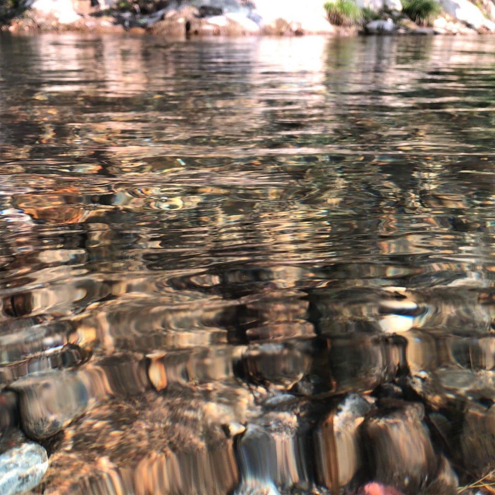

### 横瀬部週報 #撮影行ってきました

お久しぶりです。横瀬部部長の大庭啓太です。

んん、ん？

「部長って週報書かないんだよね？」

そうなんです、ゼミの中で、先生より「ゼミ内サークルでの役割をしっかりと降る様に」と言われたこともあり、

私たち横瀬部はメンバーが多いこともあり、部長以外のメンバーで、週報を書くことになったのです。

「でも、なんで大庭書いてるの？」

ありがとうございます。よく聞いてくれました。w

答えは一つです。

みんな一回ずつ週報を書いたので、

前回の活動で、じゃんけんで決めました。でも、押し付けではないので、
もちろん横瀬部はどんな時も男気じゃんけんです。

はい、私見事6人もいる中で、勝ち取りましたw

ということで、今回は、先週横瀬に撮影で行ってきたので、その様子を書いていきます。

### 横瀬のPR動画を撮る

前回のブログにもある様に、私たち横瀬部の今年度のメイン活動は横瀬のPR動画を撮影編集することです。

ということで、12月14日（土） にメンバー全員で横瀬へ撮影しに行ってきました。

動画はまだ編集段階ですので、今回は使用した機材を全部紹介していきたいと思います。

### 使用機材

私たち横瀬部は、撮影機材にもこだわりました。

カメラの数はなんと、4台体制です。

しかも、全部私の私物でございあすw

### SONY A6400

[https://www.amazon.co.jp/%E3%82%BD%E3%83%8B%E3%83%BC-SONY-%E3%83%9F%E3%83%A9%E3%83%BC%E3%83%AC%E3%82%B9%E4%B8%80%E7%9C%BC-%CE%B16400-ILCE-6400/dp/B07MYZ1PZK?th=1](https://www.amazon.co.jp/%E3%82%BD%E3%83%8B%E3%83%BC-SONY-%E3%83%9F%E3%83%A9%E3%83%BC%E3%83%AC%E3%82%B9%E4%B8%80%E7%9C%BC-%CE%B16400-ILCE-6400/dp/B07MYZ1PZK?th=1)

メインカメラとして使用しました。４kで動画撮影が可能で、値段もめちゃくちゃ高くはないので、おすすめです。

何と言ってもコンパクトでYouTuberにも人気のカメラです。

レンズは基本高倍率ズームレンズを今回は使用しました。

### SIGMA 単焦点広角レンズ

[https://www.amazon.co.jp/SIGMA-%E5%8D%98%E7%84%A6%E7%82%B9%E5%BA%83%E8%A7%92%E3%83%AC%E3%83%B3%E3%82%BA-%E3%82%BD%E3%83%8B%E3%83%BCE%E3%83%9E%E3%82%A6%E3%83%B3%E3%83%88%E7%94%A8-%E3%83%9F%E3%83%A9%E3%83%BC%E3%83%AC%E3%82%B9%E3%82%AB%E3%83%A1%E3%83%A9%E5%B0%82%E7%94%A8-929749/dp/B00BPZD0M4](https://www.amazon.co.jp/SIGMA-%E5%8D%98%E7%84%A6%E7%82%B9%E5%BA%83%E8%A7%92%E3%83%AC%E3%83%B3%E3%82%BA-%E3%82%BD%E3%83%8B%E3%83%BCE%E3%83%9E%E3%82%A6%E3%83%B3%E3%83%88%E7%94%A8-%E3%83%9F%E3%83%A9%E3%83%BC%E3%83%AC%E3%82%B9%E3%82%AB%E3%83%A1%E3%83%A9%E5%B0%82%E7%94%A8-929749/dp/B00BPZD0M4)

基本は高倍率ズームレンズを使用しましたが、やはりインタビューシーンなどは、単焦点で撮りたいですよね。

しっかりとその辺もこだわりSIGMAの19mm F2.8を使用しました。

このレンズは、本当にコストパフォーマンスがいいですねw

一気に画角がプロっぽくなるので、おすすめです。

### DJI RONIN S

[DJI Ronin-S - Dare to Move - DJI
The DJI Ronin-S is a superior 3-axis stabilization system for DSLR and mirrorless cameras that features a 3.6 kg tested…www.dji.com](https://www.dji.com/jp/ronin-s)

今回は外での撮影ということもあり、DJIのスタビライザーRONIN Sにメインカメラを載っけて撮影していました。

本格的に使うのは初めてだったので、最初少し操作に手こずりましたが、さすがDJI製！本格的です。

値段もお高いだけあって使いやすかったです。

### OSMO POCKET

[DJI Osmo Pocket - 3-Axis Stabilized Handheld Camera - DJI
How do you capture moments worth keeping? As the smallest 3-axis stabilized handheld camera DJI has ever designed, the…www.dji.com](https://www.dji.com/jp/osmo-pocket)

サブカメラとして使用したのがOSMO POCKET！

このカメラが本当に大活躍してくれました。メインカメラとは違う画角で常に回していましたが、コンパクトなので、身軽に取れます。

人混みやあまり撮影感出したくない時やメインカメラに映らない様に撮影するときなど置きっぱなしでいいのでとても便利でした。

今回はカメラど素人のアンボくんが撮影しましたが、とてもいい画が撮れていました！

GOPRO NEW HERO

[https://www.amazon.co.jp/GoPro-%E3%82%B4%E3%83%BC%E3%83%97%E3%83%AD-CHDHB-501-RW-%E3%80%90%E5%9B%BD%E5%86%85%E6%AD%A3%E8%A6%8F%E5%93%81%E3%80%91GoPro-HERO/dp/B07B4TQMX8/ref=sr_1_3?__mk_ja_JP=%E3%82%AB%E3%82%BF%E3%82%AB%E3%83%8A&keywords=GOPRO+NEW+HERO&qid=1577022702&s=electronics&sr=1-3](https://www.amazon.co.jp/GoPro-%E3%82%B4%E3%83%BC%E3%83%97%E3%83%AD-CHDHB-501-RW-%E3%80%90%E5%9B%BD%E5%86%85%E6%AD%A3%E8%A6%8F%E5%93%81%E3%80%91GoPro-HERO/dp/B07B4TQMX8/ref=sr_1_3?__mk_ja_JP=%E3%82%AB%E3%82%BF%E3%82%AB%E3%83%8A&keywords=GOPRO+NEW+HERO&qid=1577022702&s=electronics&sr=1-3)

OSMO POCKETがあったので、そこまで稼働はしませんでしたが、やはり安定のGOPRO！

少し古いタイプだったので、メインにはしませんでしたが、ちょいちょい抜きで撮るときなどに使用しました。

何より充電の持ちは安定でした。

### DJI SPARK

[DJI Spark - Selfie Drone - DJI
Seize the Moment Meet Spark, a mini drone that features all of DJI's signature technologies, allowing you to seize the…www.dji.com](https://www.dji.com/jp/spark?site=brandsite&from=nav)

古橋研究室なので、もちろんドローンでの空撮も行いました。

大庭の私物はSPARKしかないので、SPARKを使用しましたが、
十分な操作性と画質を実感できました。

MAVIC MINIを使用したいところでしたが、結局４kでは撮れないので、SPARKで十分といった感じ。

今回も1080に統一してとったので、個人的にはMAVIC AIRはまだ即決できないですねw

### 最後に

今回は、使用機材についてお話ししてきました！今後古橋ゼミで動画撮影をすることがあればぜひ参考にしてみてほしいと思います。

また、横瀬部の動画は年始ごろには完成すると思いますので、お楽しみに！！
