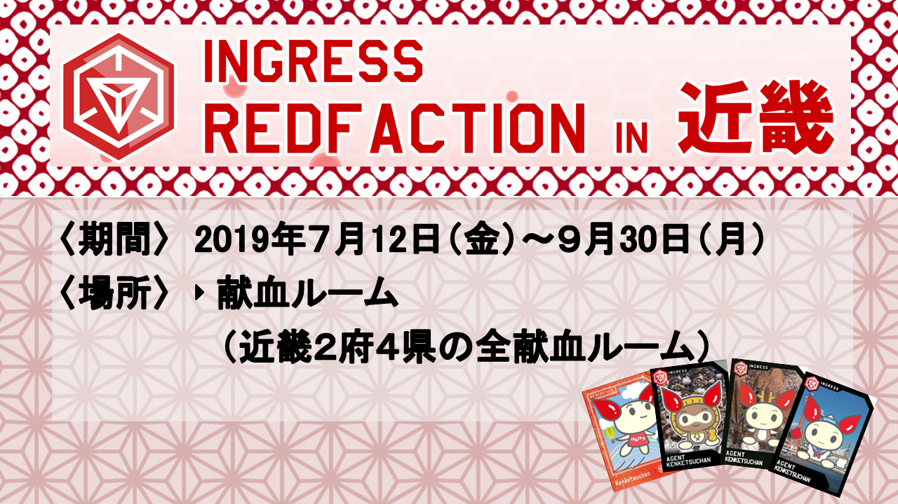

### 位置ゲー部週報

青山学院古橋研究室 松本瑞季です！

今回の週報では、12月9日に平澤くんが書いた週報で取り上げていたingressと日本赤十字社の連携についてを、もう少し掘り下げてみたいと思います！

### RedFactionとは

先週の平澤くんの週報の画像や、上の画像にも書かれている”RedFaction”という文字ですが、これはIngressと赤十字が連携し献血連動を促進するキャンペーンのことです。

Ingressにもしも架空の第3陣営があったら、という仮定と献血が結びついたキャンペーンで、3年前にブラジルで発祥しましたが、日本でもここ数年定着しつつあるそうです。

Ingressとありますが、ユーザー主体のイベントで、Nianticの関与はほとんどありません。また、ノベルティを配っているのはあくまでもIngressのエージェントであり、日本赤十字社さんはノベルティ配布に関しては特にかかわっておらず、献血会場のスタッフさんにノベルティに関して聞いてもわからないことがあるそうです。

赤十字社はイングレスだけでなく、コミケ連動キャンペーンなど様々なキャンペーンを行っているそうです。

エージェント主体でこのようなことが行われているということで、Ingressユーザーの積極性に左右される部分が大きいのかなと思いました。
