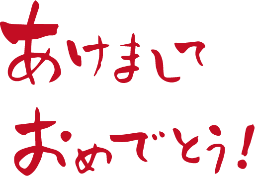

### ドローン部週報

あけましておめでとうございます。こんにちは！3年の上田泰三です。

今回の週報では、活動報告とドローンレースについて書いてみました！私も今回週報を書くにあたって初めてドローンレースについて調べてみました！！！

### 活動報告

今回の活動ではゼミ論でドローンを使う場合、具体的に誰がどのようにして使いたいのか、またゼミ論が現状どれほど進んでいるのかを話し合いました。

### ドローンレースとは

一般的なドローンレースの概要としては、ドローンを遠隔で操作しながら、一定のコースを飛行する速度を競うというルールになっています。決められたコースをより速く飛行した方が勝つという、シンプルな内容です。過去にもB棟でドローンレースを行っていた動画がユーチューブにアップされていて自分達でもいつかやってみたいです！！

現在国内でも様々なドローンレースが開催されています。今回はドローンレースを主催している３つの団体を紹介します。

#### JDRA

正式名称は一般社団法人日本ドローンレース協会。ドローンレース公式ガイドブックを策定した団体で、ドローンレースのルールも法律、安全基準に則っていることが特徴です。

「JAPAN DRONE NATIONALS」「全国ドローンレース選手権」「NINJA DRONE 忍」など、全国各地で様々なレースを開催しています。スピードドローンレース、マイクロドローンレース、障害物ドローンレースなど、様々なカテゴリーがあり、エンターテイメント性が感じられるレース内容となっています。

#### JDL

一般社団法人ジャパンドローンリーグです。ドローンの可能性と技術への理解を深めてもらうことを目的とし、ドローンレースの運営や支援を行っています。年間を通して数多くのレースがあり、JAPAN DRONE LEAGUE 2019では日本各地でRoundと呼ばれる７つの大会を開催しています。

練習と本戦の日が設けられており、獲得したポイントごとにオープンクラス、エキスパートクラス、プロクラスとランク分けされていくポイント制の大会です。

#### Drone Impact Challenge

2015年４月に結成された、ドローンレースDrone Impact Challengeの主催団体です。2017年８月開催の日本最大級のドローンレースと言われた「DRONE IPACT CHALLENGE2017 YOKOHAMA」は２万人超の観客が集まり、Drone Impact Challengeの認知度を高めました。

2019年８月には、川崎でDrone Impact Challenge2019が開催され、今後も国内のドローンレースを盛り上げていく存在となっていくことでしょう。

### しかし

これらの大会に使われるドローンは5.6〜5.8GHzの電波帯の通信機器を扱うためには、第4級以上のアマチュア無線技士の資格が必要となります。電波を扱うものですので、最低限の資格が必要であることを知っておかなければなりません。。。アマチュア無線技士の資格は、前回の週報に記載した通り国家試験を受験するか、全国各地で開催されている講習会を受講しなければなりません。また、200g以上のレース用ドローンであれば事前の飛行承認申請が必要です。
