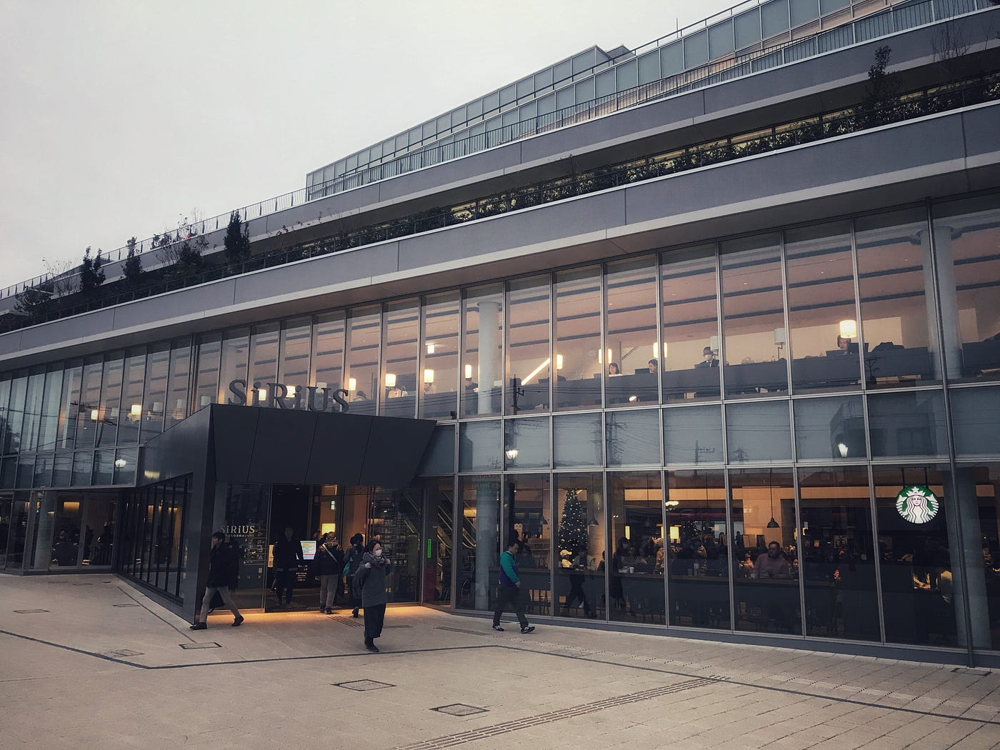
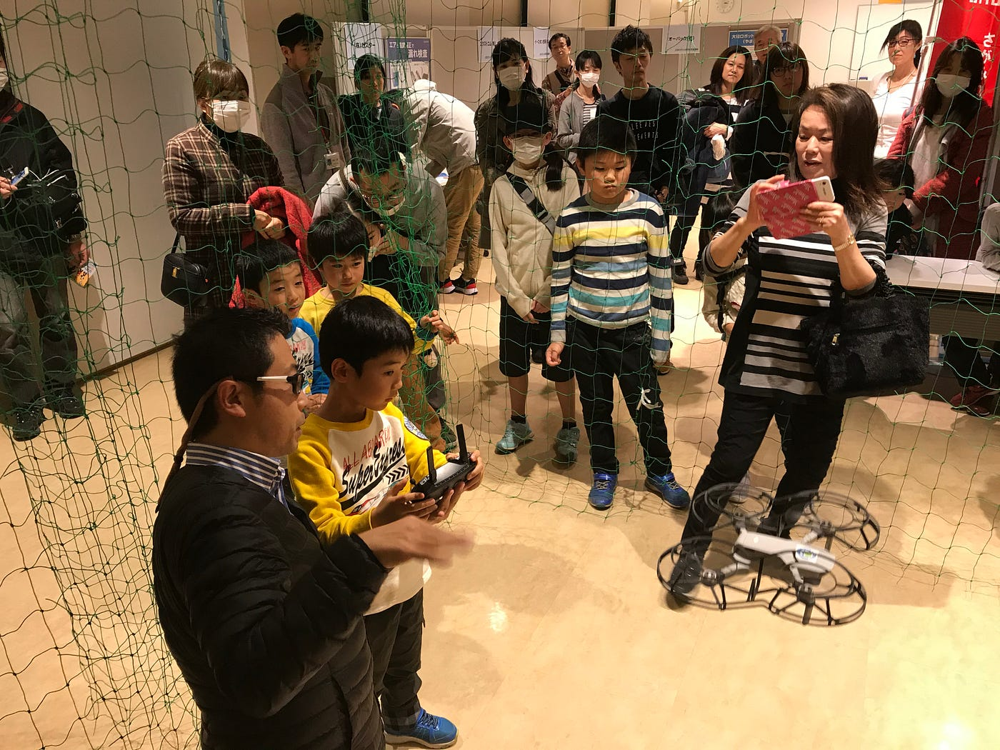

### 大和市ロボットフェスタ

こんにちは。3年の上田泰三です！12月21日に大和市のシリウスでロボットフェスタが開催されました。

めっちゃキレイです！！

正式名称は”大和市文化創造拠点シリウス”になります。

14:30~15:00頃まで古橋先生が子供達を対象にドローンについて講義してくださいました。ドローン部にも関わらず知らない内容ばっかりで驚きでした！その中でも1番驚いたのは子供達がマインクラフトにめっちゃ反応していた所です。TNTに大興奮していました(笑)

ドローンの地図はマインクラフトで使われています。地図の情報とマインクラフトが連動されており、今後地図を情報にすることで使い方は増えていくそうです。

講義の後はDJIの最新機種であるMavic Miniによるドローン体験コーナーを古橋先生と交互に回しました。バッテリー３つで丁度1時間ぐらいでギリギリ回すことが出来ました！皆興味津々ですごい楽しそうでした。自分が小さい頃はドローンなんて身近になかったので子供達が羨ましかったです！

駅からのストラバです。

[https://strava.app.link/f4IKzqmGD2](https://strava.app.link/f4IKzqmGD2)
