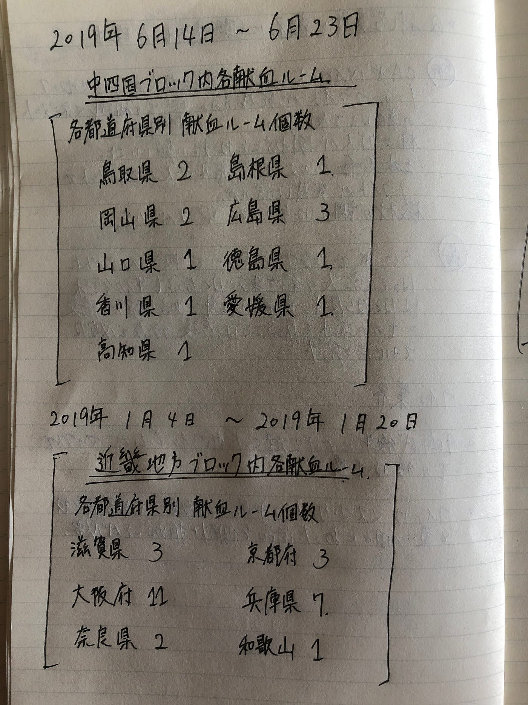
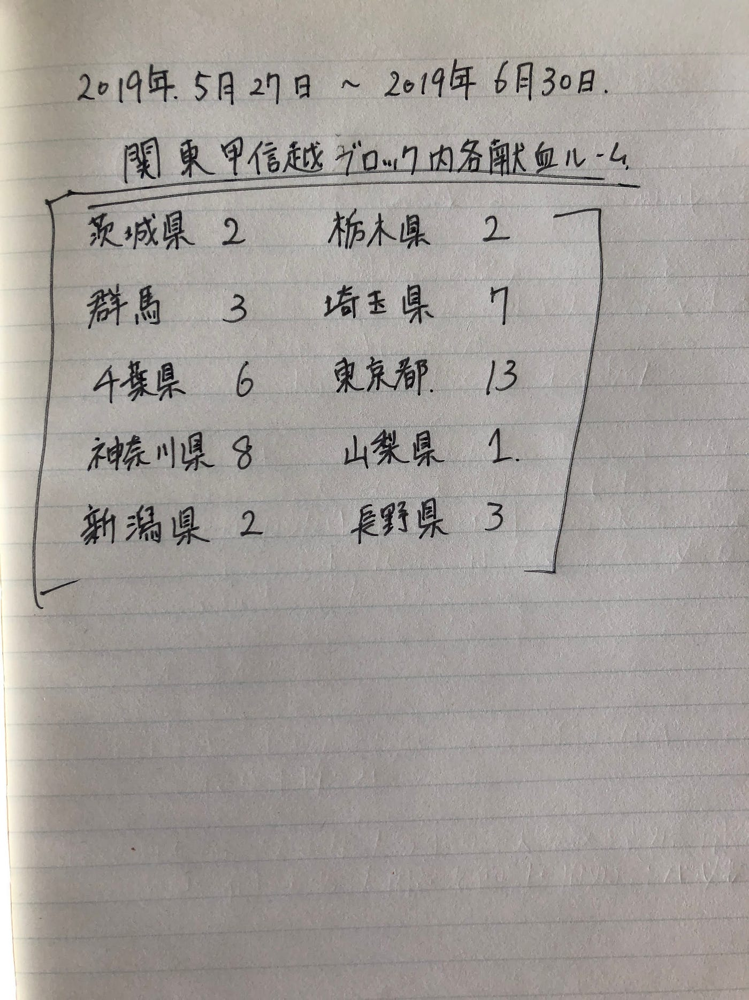
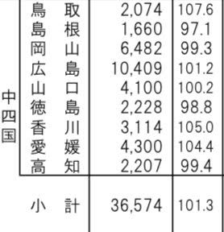
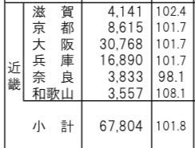
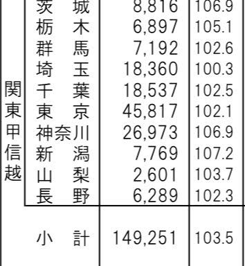

### 位置ゲー部週報

こんにちは！

以前週報で取り上げた、赤十字×ingressに興味が湧き再度調査してみました！

この週報の目的は、実際にこのイベントって効果あったの？ってことを調査したすることです！

献血してくれる人の変化で、イベントの効果を見ていきたいと思います！

まず公式HPを元に、イベントの時期、場所、行われた献血所の個数をまとめてみました！

この表から分かるのは、大きい街があるところは献血所も多いってことですね！

次にイベントを通して、献血してくれる人は増えたのかということを調べてみました！

行われた月と前年の同月の比較してみました！表は赤十字が公式で出している統計からもってきました！

中国・四国地方

＊県名の左1列目は人数で2列目は去年との増減を表しています。

近畿地方

関東甲信越

数字から見ると、あまりこのイベントは効果的ではないのではないかと私自身は思いました。

イベントが行われているにも関わらず、前年同月に比べ、人数が減っている都道府県もありますね。

やはり、参加した時にもらえるノベルティという特典だけでは、人数は集められないのでしょうか？それとも、献血所のある場所の立地が悪い故に、参加したくてもできないという要因があるのでしょうか？

様々な要因が考えられますが、

次の週報では、イベントはなぜ、効果的に働かなかったのかということを詳しく調べていきたいと思います。

資料出典
[https://www.bs.jrc.or.jp/csk/bbc/index.html](https://www.bs.jrc.or.jp/csk/bbc/index.html)

[https://www.bs.jrc.or.jp/csk/bbc/statistics/m5_01_01_index.html](https://www.bs.jrc.or.jp/csk/bbc/statistics/m5_01_01_index.html)
