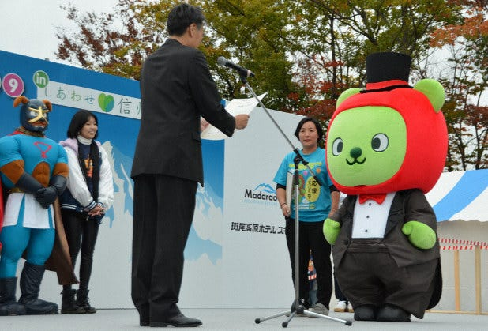

### ゼミ論報告

夜分に失礼します。中西です。画像は長野県のゆるキャラ「あるくま」です。

ゼミ論の進捗を報告します。とりあえず概要を書き始めました( ;∀;)

本研究は、National Network for Emergency Mapping(以下、N2EM)が主体となって行っている、災害時におけるボランティアセンター情報のデータ化作業を、2019年10月に発生した台風19号の作業経験をもとにマニュアル化したものである。近年、災害時においては、各地で被害に対応するためボランティアセンターが開設されるが、ボランティアセンターに関する情報がボランティア希望者に網羅されていない状況が課題となっていた。そこで、N2EMはGoogle spread sheetを用いてボランティアセンター情報を可視化することに取り組んだ。

なんかもう書き始めないと！とおもってとりあえず概要だけ書きました。書き途中なんですが、続きは明日書こうと思います。

書いたらTO DOが見え始めて、さらに焦ってきております。

[furuhashilab/sotsuron2019
You can't perform that action at this time. You signed in with another tab or window. You signed out in another tab or…github.com](https://github.com/furuhashilab/sotsuron2019/projects/21?fbclid=IwAR0vKYzvkcYxPXk12kK3gCW6Ylr00CLFnDiMytACzXeOQamM1ux7y5ZFzXs)

中西のゼミ論があまりにもやばいので古橋先生が管理用git hubを作成してくださいました。2月1日までほんとに頑張ります( ;∀;)

ただ、これまでちょくちょく書いてたブログが役に立ちそうです。少しづつでも書いておいてよかった…私が言えたことじゃないけど後輩様はブログ、ちゃんと書くようにしたら後々楽になると思います！(本当にどの口がいっているんだ)
