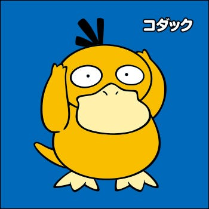

### 中西のゼミ論

この間ポケモンGOを始めた友人が猛スピードで私のレベルに追いついてきていて焦りを感じております。ここは友人対策にレベルを上げておきたいところ。でもその前にゼミ論とレポートですね。

その友人から中西はコダックと呼ばれています。似ているらしいです。コダックファンの方、ごめんなさい。

今から明日までのプレゼン資料とレポートを完成させます。

終わったらゼミ論に取り掛かります。

また3時くらいにブログ投稿します。
