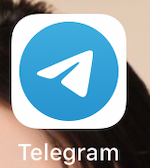
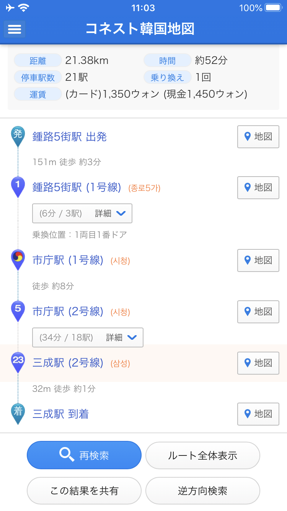
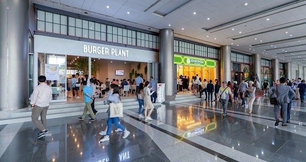
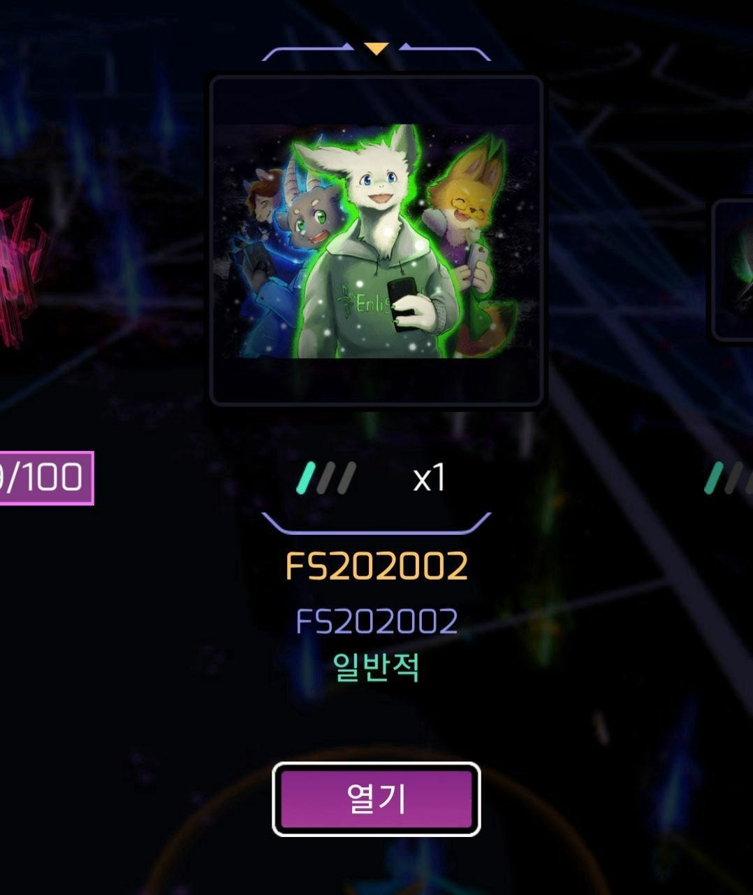
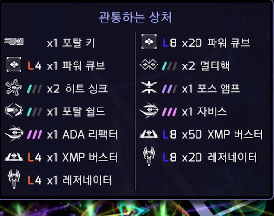
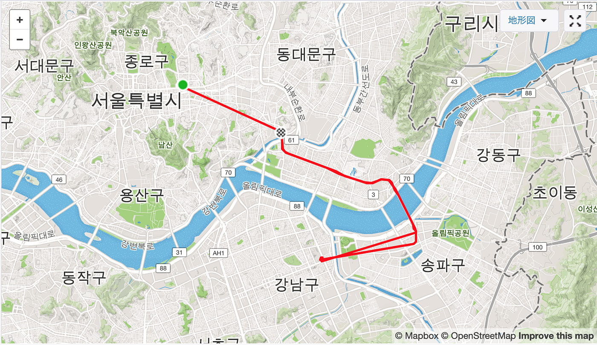

### INGRESS FS in Seoul, South Korea

こんにちは。古橋ゼミ3年の越後開登です！

今回私はIngress FSに参加すべく、韓国はソウルに出張して参りました。

ゼミ生は一回は国際会議に参加しなくてはいけない、というルールがある古橋研究室ですが、FSもカウントされるとのことでしたので、座学よりもアクティブに足を動かしてついでに観光もできたらいいな、という気持ちで参加を決定いたしました。

FSというのはFirst Saturday の略で毎月第一土曜日に世界中で開催されるIngress公式のイベントです。内容は、いわゆるルーキーランクの方々のレベル上げとなっています。

参加する為にはまず、[Ingress公式ホームページ](https://www.ingress.com)へ飛んでいただき、イベントの欄からFSを選択していただければ開催される場所の一欄が出てくるので、参加したい場所を選んで参加するためGmailなどの情報を送信したら申し込みが完了します。そこから２、３日後、私は見たこともないチャットアプリに招待されました笑。

そのアプリ内で、イベント開催の上での情報交換などを行いました。が、なんせ韓国語がわからず大苦戦しました。翻訳アプリに頼りまくりではありましたが、集合場所は確認できたのでなんとか一息つけました。

集合場所の駅までは、私が宿泊していたソウルの中心地から電車で１時間弱のなかなかの長旅でした。ここでもトラブルが発生、、、、

Wi-Fiが切れた！！！！！！！！！！

そのせいでStravaが途切れ途切れになってしまいました、、

私はいつも海外旅行に行く際は、poket Wi-Fiをレンタルしていくのですがなんせ1日500MBプランであった為、位置情報ゲームには通信に負荷がでかすぎた様です、、、

幸運なことに、韓国は日本よりもFree Wi-Fiの制度が整っており、私が通過した全ての駅と電車、複合施設には設置されていましたので、そこでなんとか生き延びてやっと集合場所に到着！！

そこは[COEX](https://www.starfield.co.kr)と呼ばれる巨大なショッピングモールでした！！

そこでも私はWi-Fiがあったのでまた一息笑

グループで送られてきた集合場所

送られてきても言葉が通じないから自分で歩き回りやっとの思いで合流、

この見たこともない画面が出てきたが、多分「参加」て書いてあるのだろう！と思いタップして参加できました！

始まって以降は、スクリーンショットはアプリが落ちるのを恐れてできなかったのですが、終了後三角のマークがたくさん出てきてアイテムを一気にゲットできました！！

内容としましては、ポータルを破壊してレゾネーターを打ち込む、ということの繰り返しでひたすらその場で終了してしまいました。笑

日本人はおろか、英語も一人片言話せる方がいらっしゃったのみで、最初はかなり心配だったのですが、皆さんとても親切に翻訳アプリを使いながら説明してくださってなんとかやりきることができました。

そして、お気づきかもしれませんが、韓国のモールのWi-Fiに繋いだせいか、Ingressが韓国語表記になってしまっています。。。帰国後、SIMカードを挿入してキャリア通信に切り替えたら日本語に戻ったのですが、、、バグですかね、、、

以上、国際会議参加報告でした！！

<iframe height=’405' width=’590' frameborder=’0' allowtransparency=’true’ scrolling=’no’ src=’[https://www.strava.com/activities/3060840221/embed/30313c636273bd645e333f28e3a42b49b697c104'](https://www.strava.com/activities/3060840221/embed/30313c636273bd645e333f28e3a42b49b697c104')></iframe>
