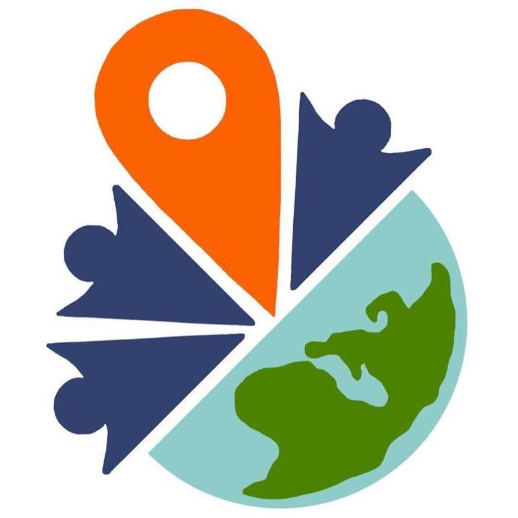

### Youth Mappers AGU 定例会議

こんにちは、古橋ゼミ2年の日向野邦春です。

2月10日にYouth Mappers AGUの定例会議を行いましたので報告させていただきます。

#### **Youth mappers AGUの活動目的と内容**

目的→**日本にマッピングを広める**

目的として日本にマッピングを広めるという事を提示しました。少し抽象的に聞こえるかもしれませんが、高校生などにもマッピング活動を普及させていき最終的には日本全体にマッピング活動を普及させていきたいと考えています。

内容→**OpenStreetMap YouthMappers 関連文章の和訳・公開**

内容に関してですが、現在英語で公開されているOpenStreetMap に関する文章を日本語訳して公開する作業を進めていきたいと考えています。また、和訳の最終確認は誰が行うのかについてですが、Github に公開したものをウェブサイトに載せて、変更すべき点があった場合は連絡してもらうようにしてもらう形にしていきます。特に他大学のユースマッパーに積極的に参加してもらいたいと考えています。

#### 定例会議の投稿

今後はこのMediumに定例会議の報告をさせていただきます。またリンクをFacebookの方にも貼っていきます。

#### メンバー対象のOpenStreetMap マッピング勉強会について

古橋ゼミのメンバーを対象にOpenStreetMap に関する勉強会を開く事となりました。

**日時：3月10日**

**場所：青山学院大学 B棟 古橋研究室**

3年生の方や既に古橋ゼミに内定している、２年生の学生などにぜひ参加していただきたいです。また、当日どうしてもキャンパスに来れない方はZOOMでも参加していただけます。

#### 最後に

まだ動き出したばかりですが、目的を達成できるようにメンバー一同頑張っていきますのでよろしくお願いいたします。
