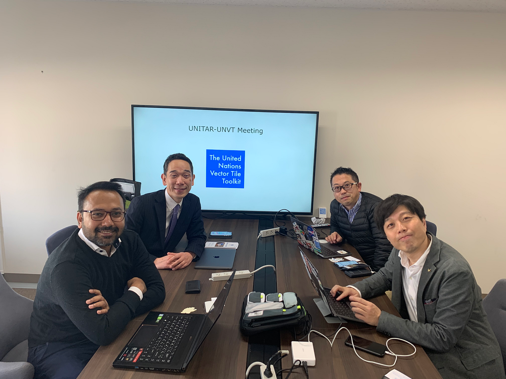
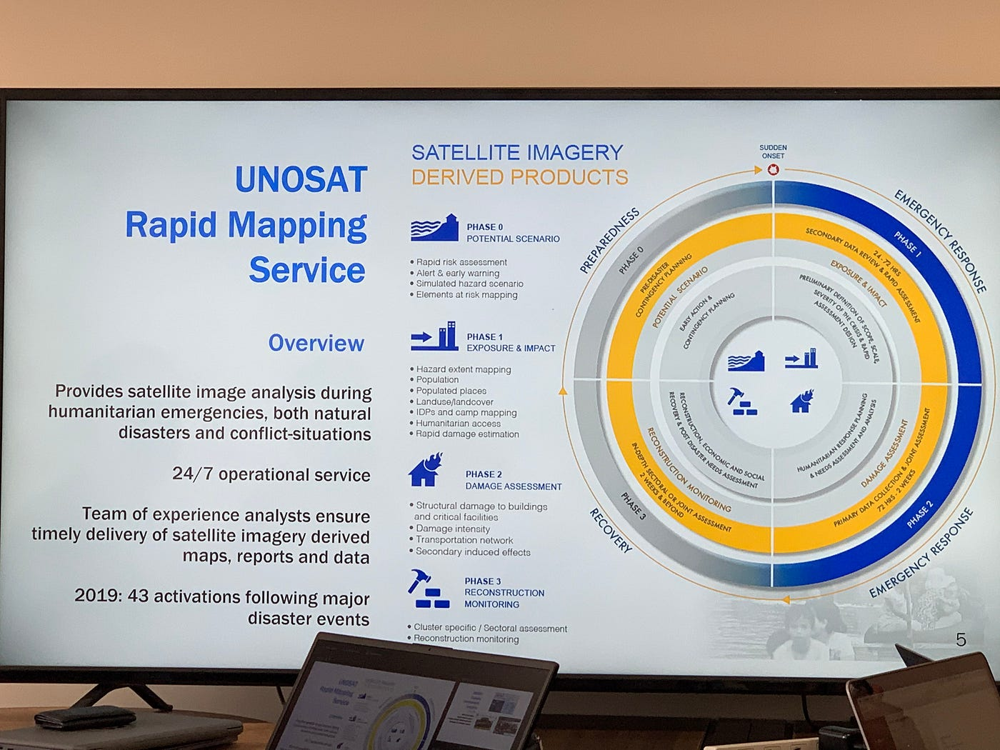
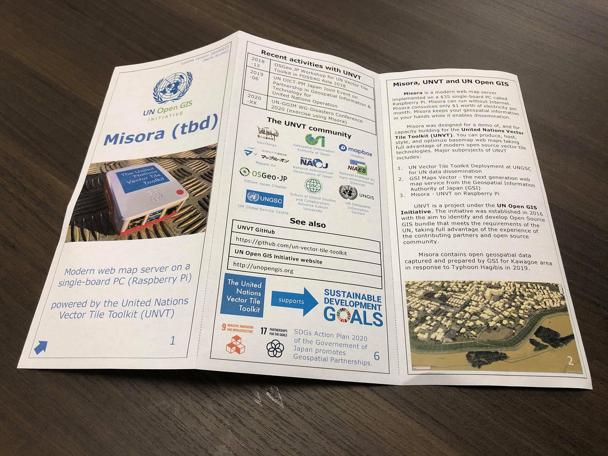
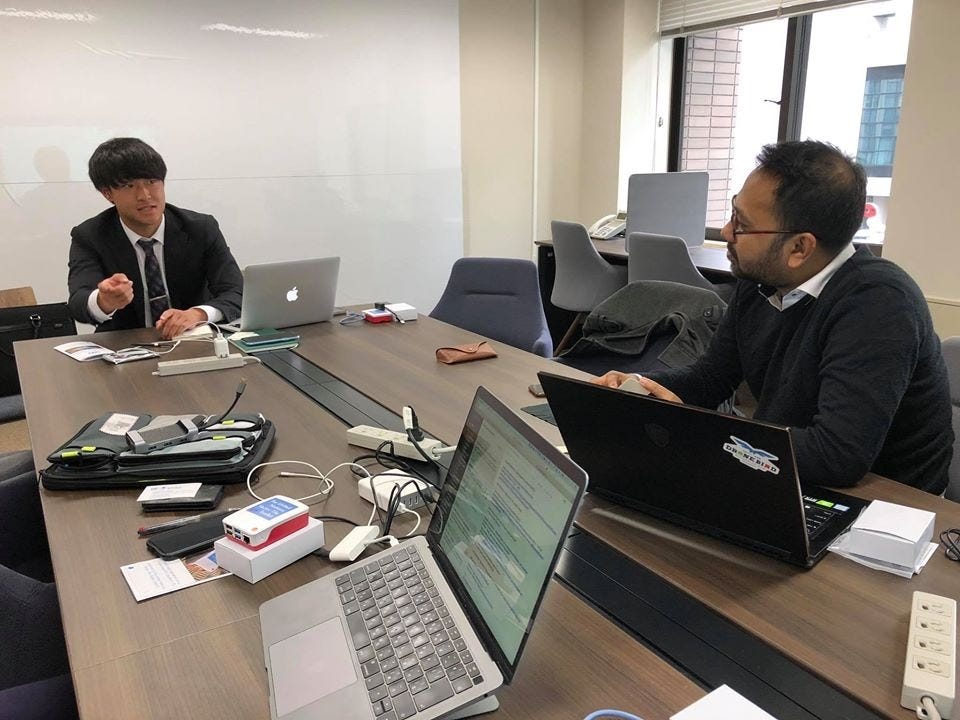

### 2/25 UNITAR-UNVT Meeting＠青山キャンパス

こんにちは、古橋研究室の安保龍一です！

2月25，26日に国連GGIＭ防災会議が開催される予定でしたが、新型コロナウイルスの影響で中止になりました。国際会議参加の最終チャンスが消えてしまったと思っていたら、既に来日しているゲストを招き少人数で会議をやるとのことで今回はそちらの会議に参加させていただきました。（なお、今回の会議は私と古橋先生の他、UNITARのKhaled MSHFIQさん、慶應義塾大学の深見嘉明特任准教授、昨年ゼミでも講義をしてくださった国土地理院の藤村英範さんの5人で行いました）

> UNITARとは？

> UNITARとは国連訓練調査研究所(United Nations Institute for Training and Research)の通称である。UNITARは研修を専門とする国連機関として、1965年に設立され、約50年にわたって世界中で外交・経済発展・環境・平和・復興といった多分野において研修を行っている。

> UNVTとは？

> UNVTとは国連ベクトルタイルツールキット(United Nation Vector Tile Toolkit)の通称である。簡単に説明すると、ベクトルタイル（タイル状に分割された機械判読可能なタイルデータ）を用いてサイズを最適化するということ。従来のラスタータイルでは作成時間とデータ容量が大きいため非効率的である。先日ゼミ内で体験した「Raspberry Pi」はUNVTをインストールしたmicroSDを挿入するだけで使えるものである。

最初にKhaled MSHFIQさんからIPP CommonSensingに関連して、UNITAR Operational Satellite Applications Program(UNOSAT)の概要な活動内容、災害時のマッピングサービスについてご説明いただきました。IPP CommonSensingとは国際パートナーシッププログラムで主に課題やニーズに直接一致する衛星ベースの情報サービスを開発することで、ソロモン諸島・バヌアツ・フィジー島らの島国で海抜５メートル以下に暮らす気候変動により海面上昇の脅威に脆弱な人々らへの気候資金へのアクセスと気候基金の報告能力を強化することを支援している。そこで国連も同様に衛星画像分析と能力開発をUNOSATとして加盟国に2001年から提供している。主な活動内容は「衛星プロダクトの分析・解析・改革」と「実践的な国や地域レベルの補強」にあたりこれらを相乗効果で向上させている。

これはUNOSATのRapid Mapping Serviseである。24時間体制で管理しており衛星データを用いて分析を行う。災害が発生した際にはphase0〜phase3の４段階に分けて対処する。この４段階はここに小分けされているが全てが循環型の役割を果たし、全４段階でRapid Mapping Serviseに当たる。事前に対策を行い、災害に対応して復旧までを一連で行う。

続いて国土地理院の藤村英範さんがRaspberry Piを実際に参加者全員に配って捜査してみた。本来では国連会議で国連に向けRaspberry Piをアピールでき普及できる機会ではあったが今回はKhaled MSHFIQさんに個人レクチャーされていました。埼玉県川越市のデータを収録しているようで、とりあえず配布された説明書をもながら工程を進めるも、、、なかなかできない。一度やっていてなんとなくで理解したつもりでいたがやはりど素人には難しいようだ。オフライン環境でもRaspberry Piによってマップを利用できるのは改めてすごいと感じた。その後、古橋先生からドローンバードに関する活動のプレゼンもありました。英語で聞くととても新鮮でした！

最後に、私から一言。何も考えておらず若干あたふた。Khaled MSHFIQさんに古橋ゼミの活動内容と本日の感想をお伝えしました。

日本語でもわからないような内容を英語のディスカッションの中で理解するのはなかなか大変でした。ゼミ論を通じてヒートマップに重きを置いてきましたがこのヒートマップを防災に発展せてみたいと思いました。ゼミで藤村英範さんのお話を聞ける環境や身近に国連の方とディスカッションできる環境を持つ教授がいることに今一度感謝し、今後もより多くの実践的な知識をつけていきたいと思います。

#### 『Strava記録』

↑今回Strava記録を忘れたため、Google My Mapにて代用します。
