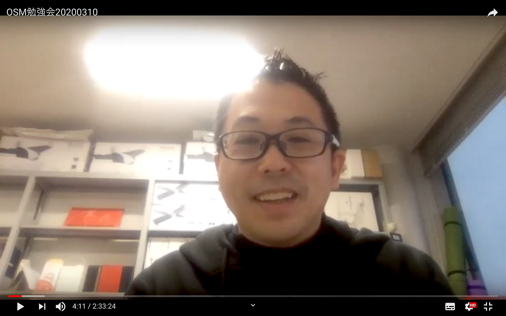

### YouthMappers AGU 定例会議

こんにちは、古橋ゼミ1年の髙橋彩子です。

2月26日にYouthMappers AGUの定例会議、3月10日にOpenStreetMapマッピング勉強会を行ったので報告致します。

### **定例会議**

#### YouthMappersAGUの活動目的と活動内容

目的→**世の中の役に立つ地図を作ることで世の中をよりよくする/地図の重要性を広める**

前回の会議で確認した「日本にマッピングを広める」という目的が、最終的にどこに行きつくのか話し合いました。上記の目的がYouthMappersAGUの一番大きな目的になるという事でまとまりました。

内容→**YouthMappers 関連資料の和訳・公開・拡散/ウェブサイトの改良**

引き続き和訳作業に取り組み、出来上がった日本語資料を公開します。YouthMappers 関連資料の和訳を一通り終えた後の活動として、MapSwipeの日本語化を考えています。また、多くの人に閲覧してもらえるようにウェブサイトの改良にも取り組むことを決めました。

### OpenStreetMapマッピング勉強会

今回はコロナウイルスが蔓延していることもあり、ZOOMを利用してオンラインで行われました。内容は下記のとおりです。

・4月の国境なき医師団との合同マッパソンで行う作業の手順

・GitHubで自分のウェブサイトを作る方法

・質疑応答

約2時間半の勉強会で、それぞれの作業方法を確認できました。グーグルドライブに勉強会の録画を保存してあるので、古橋ゼミのメンバーは勉強会の内容をいつでも復習することができます。

### 最後に

勉強会は今回が初めてでしたが、今後もっとこのような機会を増やしていきメンバー全員でマッピングに関する知識をつけていきたいと思います。和訳などの作業についてもできるだけ早く公開できるよう取り組んでいきます。

＃OpenStreetMap

＃YouthMappers

＃YouthMappersAGU
