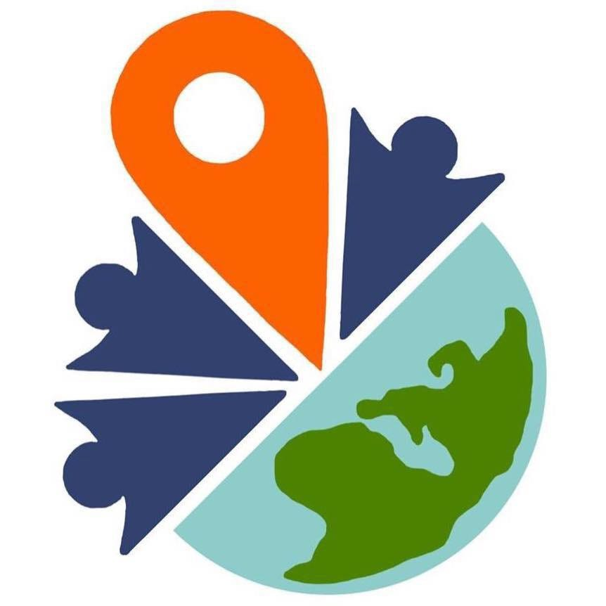

### YouthMappersAGU 定例会議

こんにちは、古橋ゼミ３年の日向野邦春です。

4月2日に第３回YouthMappersAGUの定例会議を行いましたので報告させていただきます。

#### ・新メンバー加入

新しい年度になり３年生の新メンバーが３名YouthMappersAGUに加入しました。今後は3年生４人と２年生２人の6名体制で活動していきます。

#### ・自分にとってのインセンティブ

新しいメンバーも加わりYouthMappersAGUに参加することで自分にはどんなインセンティブがあるのか？また、なぜYouthMappersAGUに入ったのかを全員で話し合いました。個人で色んな意見がありましたが、一番多かったのは**「面白そうだから」**と**「人助けをしたい」**ということでした。私もその一人で、一般人がマッピング活動をオンライン上で行うことによって自然災害などで苦しむ人々の助けになる。これは一昔前では考えられなかったことだと思います。机上で既存のものを学んでいるよりも自ら活動して社会のためになることをしていく、これによって自分に返って来るインセンティブも大きくて価値のあるものになるのではと私は考えています。

#### ・授業開始までの活動

青学の授業開始が5月1日からとなりました。また、前期は基本的にオンライン授業となります。この期間でYouthMappersAGUとしてはMapSwipeなどの英語サイトの和訳に加えてHOTTaskingManagerで公開されてる新型コロナウイルスに関するミッションを行っていきます。

[HOT Tasking Manager
'In order to make full use of the many features in the Tasking Manager, please use a desktop or laptop computer rather…tasks.hotosm.org](https://tasks.hotosm.org/project/8247)

#### ・公式ウェブサイトデザイン変更

YouthMappersAGUのウェブサイトを少しずつ改良しています。ウェブサイトの骨組みはゼミ4年生のLeeJyul先輩のテンプレートを利用させて頂いています。これから背景の映像またメンバーの写真を載せていきたいと考えています。

[YouthMaersAGU 2020
YouthMappersとは、世界中の若いマッパーで構成された国際団体です。大学単位でチームを構成し、それぞれがマッピングによる国際協力活動やその普及活動を行っています。国を超えて複数のチームが協力することも可能で、2020年月現在、48の…furuhashilab.github.io](https://furuhashilab.github.io/youthmappers4agu/)

新型コロナウイルスの影響でしっかりと集合しての活動が出来なくなっていますが、今後はZOOMやSlackを更に上手く使いながら活動を進めていきます。
