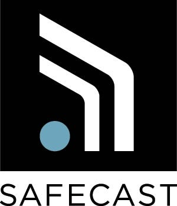
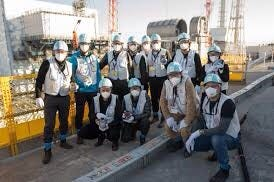
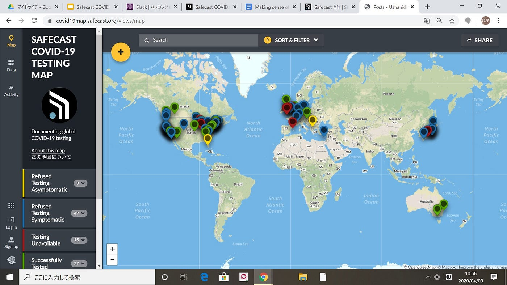
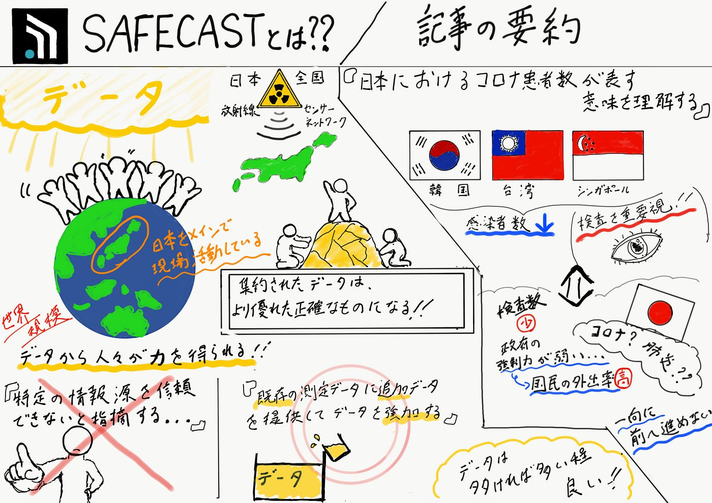

Making sense of COVID-19 numbers in Japanの翻訳作業

こんにちは！私たちハッカソン6班はSafecastさんが書いた記事の翻訳貢献をしました！

まず、[セーフキャスト](https://safecast.jp/about/)さんとは、、

人々が自ら力を持てるように、データを提供する活動を世界規模で行うプロジェクトで、

最も重視していることは、、

### 日本の放射線

具体的に過去の事例として、3月11日に起きた東日本大震災による、福島第一原発事故が挙げられます！

この事故以来、より多くのデータを必要としていることが明らかになり、セーフキャストさんは、協力団体と協働し、警戒区域周辺を含む日本全国に配置された、固定センサーおよび移動センサーから成る放射線センサーネットワークを構築してきました。

今回は、コロナウイルスの情報を集め、[コロナウイルスの検査状況のマップ](https://covid19map.safecast.org/views/map)を作ってくださいました！

このマップは、さまざまな地域での検査状況に関する情報を提供しています。信頼できる情報を提供することにより、このマップが情報をより的確に伝えていけるツールになることを願っているそうです！

さて私たちの今回のタスクは、

2020年3月24日　Azby Brownさんにより書かれた「[Making sense of COVIT-19 numbers in Japan」](https://safecast.org/2020/03/making-sense-of-covid-19-numbers-in-japan/)

という記事の翻訳作業です！

翻訳する際の注意事項は、

- 直訳しない

- 想いの伝わる表現で

- 日本語として読みやすい文章で

ということでした！

これが実際私たちが[翻訳した文章](https://docs.google.com/document/d/1eWC4e-mbLJwQRbU9giNumPi4ndMizZt3V3V_gPVtaZM)です。

最後に、グラレコと[プレゼン資料](https://docs.google.com/presentation/d/1_YiLr_zljXiQE9qR-M4iXGOivrRcOTTiAfLaQjJEiIQ/edit?usp=sharing)です！

参考文献

- Azby Brown 「Making sense of COVIT-19 numbers in Japan」

[Making sense of COVID-19 numbers in Japan
Last week we wrote an article about COVID-19 testing in Japan. We've also been publishing an (almost) daily newsletter,…safecast.org](https://safecast.org/2020/03/making-sense-of-covid-19-numbers-in-japan/)

- Safecast 「Safecastとは」

[Safecast とは
Safecast…safecast.jp](https://safecast.jp/about/)

- Safecast COVID 19 Testing Map

[covid19map.safecast.org](https://covid19map.safecast.org/views/map)
