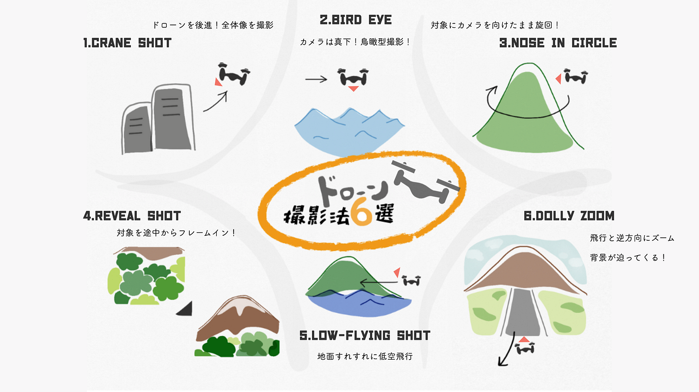

### 古橋ゼミ ハッカソン チーム大庭

#### 課題F ドローン撮影スキル

#### チームメンバー

4年生 大庭啓太、李じゆる

3年生 斎藤祐花、若松暖子、日向野邦春

今回はこの６つの撮影方法をアーティストのPVを参考に説明していきたいと思います。

#### １.クレーンショット

目標物から遠ざかるように後退しながら撮影する技法です。

この撮影方法を採用しているのが、、、

みんな大好き乃木坂ちゃんです！！

この動画の2分37秒からの数秒間、完全にクレーンショットです。クレーンショットはドローンの代名詞とも言える撮影方法で壮大な自然風景などを撮ることが出来ます。

#### 2.バードアイ

カメラを真下に向けて移動しながら撮影する技法です。

この撮影方法を利用してるのは、、、

EDMの王様であるDavid GuettaのPVです。この動画は後半部分からバードアイ以外にも様々な手法で撮影を行なっています。バードアイでは鳥類視点で撮影が出来るため、クレーンショット同様、壮大な風景を撮影できます。

#### 3.ノーズインサークル

この撮影方法は撮影対象を固定したまま周りを旋回して撮影する方法です。よくニュースでスカイツリーの周りを周回している映像が流れていますが、あれもドローンではないですがノーズインサークルです。

では、この手法を利用したPVは、、、

サムネイルがバードアイで始まっていますが、この動画では普通のノーズインサークル撮影に加えてかなり高速での撮影を行なっています。特に1:39秒と4:15秒からの映像は見ものです。

#### 4.リヴィールショット

この撮影方法は撮影対象を途中からフレームインさせる方法です。この手法を使っているPVが少なくて探すのが大変でした。

K-POPはたくさんドローンを使っているそうで、、

15秒からの数秒間がこの手法で撮影されています。

#### 5.ローフライングショット

低空飛行で撮影する技法です。ドローンは対象物の近くを通ることができるので、スピード感のあるダイナミックな映像が撮れます。

2分26秒からの数秒間はローフライングショットを使っています。
この撮影方法は他の技法に比べ、周囲にいる人や障害物に注意して飛ばさなければなりません。

#### 6.ドリーズーム

これはドローンのズーム機能を使用した撮影技法です。ドローンは後退させるのですが、カメラをズームさせることで対象物のサイズを変えることなく撮影できます。

この超特殊な撮影方法を使っているのが、、

ドローンで撮影したかと聞かれると何も言えませんが、、

マイケルジャクソンがゾンビになった43秒からの数秒間はドリーズームが使われています。

ここまでドローンの撮影方法を６つ紹介しました。この撮影方法は普段のビデオ撮影でも使えるので是非使ってみてください。

参考文献・先行研究

[furuhashilab/2019gsc_ReikoMori
https://docs.google.com/document/d/1byJXRJ5HP0sg6D75-jGFYc0t3cKEgAWMUt96TyHPkj4/edit?usp=sharing…github.com](https://github.com/furuhashilab/2019gsc_ReikoMori)

[https://www.monosus.co.jp/posts/2018/12/142714.html](https://www.monosus.co.jp/posts/2018/12/142714.html)
