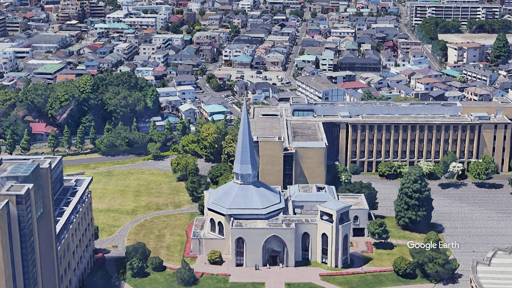
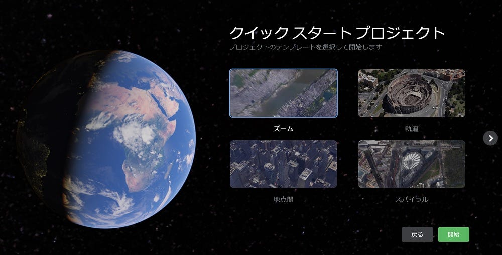
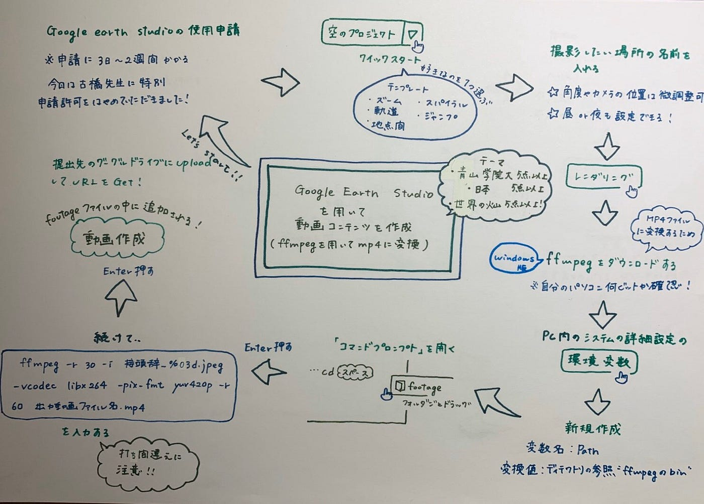

### Google Earth Studio を用いた動画コンテンツづくり

こんにちは。ハッカソン3班ではGoogle Earth Studio を用いて「**青山学院大学**」、「**日本**」、「**世界の火山**」の作品を各5作品作りました。

そもそもGoogle Earth StudioはGoogle Earthの衛星画像と3D画像を使ったアニメーションツールです。まずこのGoogle Earth Studioを使うときにGoogleに申請をしてから3–7日程度かかるのですが、今回は古橋先生がGoogleの方に問い合わせていただいたので約一日で利用することができました。

このGoogle Earth Studioでは「空のプロジェクト」から作ることもできますが、クイックスタートを選択することである程度決まったアニメーションのテンプレートが用意されているため、初めての人でも直感的に利用することができると思いました。クイックスタートには、「ズーム」、「地点間」、「軌道」、「スパイラル」、「ジャンプと軌道」が用意されています。

実際に作ることができたらレンダリングをしていきます。レンダリングが終わり、ファイルを解凍するとファイルの中にたくさんの写真があるのでこれを次にmp4にしていきます。

最後にmp4にするためにFFmpegを使用していきます。このFFmpegを使用するために環境変数にpathを通した後に私はwindowsなのでコマンドプロンプトを使用してレンダリングをmp4に変更していきました。

[最終成果物はここから](https://drive.google.com/open?id=1EVFk9QafEJcK56_IsToQJCcFVJzttUxP)

特にFFmpegのレンダリングからmp4に変換するときのコードが1つでも間違っているとうまく反映されなかったり、pathのがそもそも通らなかったりして大変でした。
しかしこのGoogle Earth Studioを用いることによって撮影の仕方、膨大な量の自然や都市があるので色々参考になると思いました。

最後にグラレコとプレゼンの資料です。
[プレゼン](https://docs.google.com/presentation/d/15DBs3IYkaX5_QSeubUaW0sWNggebH_fyb_ydNtebk0Y/edit#slide=id.g8308def568_0_110)

参考資料

[furuhashilab/googleearthstudio
Google Earth Studio Know-How. Contribute to furuhashilab/googleearthstudio development by creating an account on…github.com](https://github.com/furuhashilab/googleearthstudio)

[Google Earth Studioでmp4を作成するチュートリアル - Qiita
Google Earth Studioを登録してみたものの、動画を作るまでにちょっと引っかかった部分があったのでチュートリアルを書いてみました。 Google Earth Studioへ登録申請 Google ChromeでGoogle…qiita.com](https://qiita.com/iwathi/items/b0655e80067b361ea2c2)
