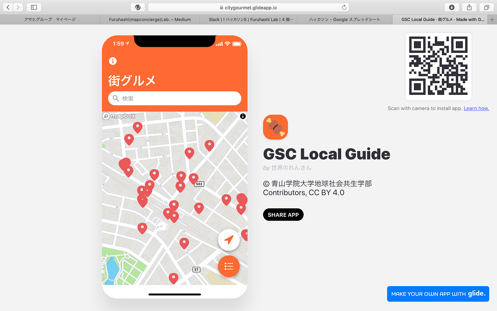
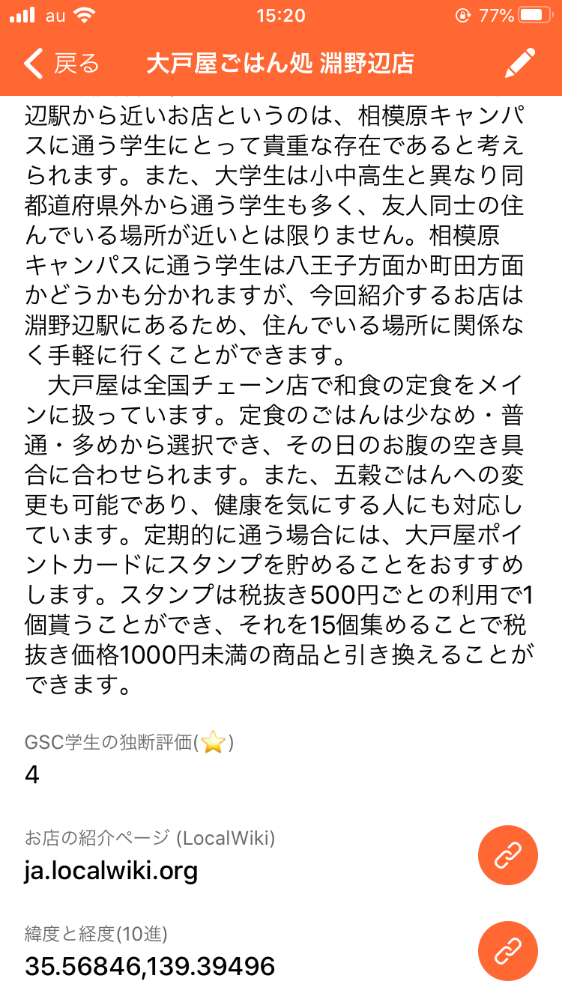

### GSC Local Guide

タイトルの通り私たちは古橋研究室の定番「地図作成」に「アプリ」の機能を追加を加えていきました。

みなさん留学前フィールドワーク論の授業で古橋教授が登壇した回を覚えていますか？初めてそこでストラバやmaps.meをインストールした人がほとんどだと思います。その際出された課題である、駅からお店までのストラバとお店の紹介文の提出をもとに私たちはこれらをアプリにまとめていきました。

個人的には「むにぐるめ」のGSCバージョンです！！

### アプリを制作する前に

#### 「Glide」

とは Google スプレッドシートをデータストアとして、PWA を作ることができるサービスです。アプリを新規作成しようとする際にスプレッドシートを利用します。そのため、データがスプレッドシートに記載されているのが前提になります。

#### 「PWA」

とはProgressive Web Appsを略した言葉で、モバイルサイト上でネイティブアプリのようなユーザー体験を提供する技術です。イントール不要・ダウンロード不要・コスト不要であり、ウェブとアプリの両方の良さを兼ね備えているのが特徴です。

#### 手順①

スプレッドシートに店データを整理していきます。大戸屋例にしますと、「大戸屋」、「大戸屋淵野辺店」「大戸屋ごはん処淵野辺店」とバラバラだった店名を統一させました。また、必要な緯度・経度の情報もここで統一させました。

#### 手順②

整理したデータを次に選別していきます。本当に必要なお店の情報であるお店の紹介文、GSC学生の独断評価(⭐️)、お店の紹介ページのリンク、maps.meの緯度・経度のリンクを掲載することにしました。

#### 手順③

最後にデザインのレイアウトを編集し、より見やすいアプリにしていきました。

### アプリ制作にあたり苦労した点

•膨大な量のデータを選別し、誤字脱字を確認する事

•デザインにも配慮しなければならなかった事

•シンプルによる見やすさの追求

#### まとめると、、、

・GlideAppsで簡単にアプリを作れる

・データ元となるスプレットシートの情報の正確性が求められます

・正確且つ誰による情報かを可視化することが大切

ぜひ以下のQRコードかリンクからお試しください！

[GSC Local Guide
© 青山学院大学地球社会共生学部 Contributors, CC BY 4.0citygourmet.glideapp.io](https://citygourmet.glideapp.io)

〈プレゼン資料〉

〈グラレコ〉

〈参考資料〉

[Create an App from a Google Sheet in Minutes · Glide
Glide turns spreadsheets into beautiful, easy-to-use apps, without code. Pick a spreadsheet or start with a template…www.glideapps.com](https://www.glideapps.com)

[furuhashilab/gsclocalguide
ローカルガイド. Contribute to furuhashilab/gsclocalguide development by creating an account on GitHub.github.com](https://github.com/furuhashilab/gsclocalguide)

[お弁当マップ（glideapp） — HackMD
On a scale of 0–10, how likely is it that you would recommend HackMD to your friends, family or business associates?hackmd.io](https://hackmd.io/KERfMDnJSw6WSBQt_EDBzw?fbclid=IwAR3XPalgcFVUh7fE8b-5pupnyE0_Tv627Z0PZj9fFRkAX-1xPVEmcInO8vo)

[むにぐるめ ～唯一無二の絶品グルメ～
Edit descriptionmuni-gurume.com](https://muni-gurume.com)
