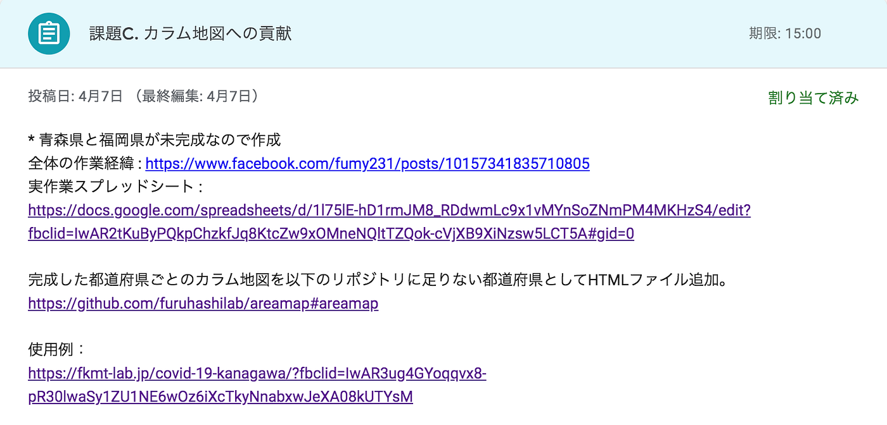
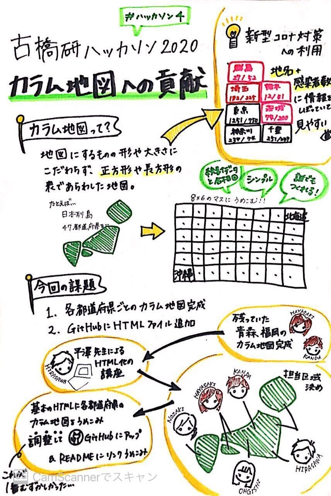
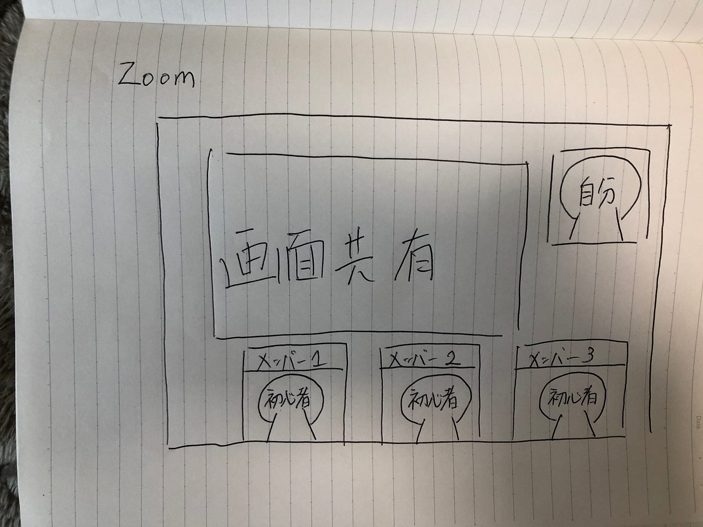

### ハッカソン -カラム地図の作成-

ずばり、今回の記事で言いたいことは、、、、、

### めちゃくちゃチームワーク良かった！

ってことです。お互い初見の状態でチグハグした状態のなか、
なんでうまく連携がとれて作業をうまく進められたのかを共有したいと思います！

まずは、僕たちのチームが何をやったのかを説明したいと思います！
 このハッカソンで以下の課題が与えられました！

ぶっちゃけ、これだけだとわかりにくいですよね・・・。
ごめんなさいm(_ _)m

そもそも、カラム地図ってなに？ 
カラム地図作ってなにしてんの？？ 
結局どんな作業をしたの？？わかりやすく説明して！
ってところだと思うのですが、

そこを班員の3年生がうまくGoogle スライドとグラレコにまとめてくれたので参考にしてください！

さて、本題なのですが、今回の作業のネックな部分は

#### ”GoogleスプレッドシートのデータをHTML実装する”

という点です。

コーディング未経験の班員がいるなか、大量のデータをHTML実装しなくてはならない・・・。やばい・・・。作業終わらない。って思ったのですが、結果は見事作業を終わらせることができました。

じゃあ、それをどうやったの？？ってことなのですが・・・・！

簡単に言えば、コーディングの知識がある僕が、知らない人に教えた。ってことなんですねー。だけど、その教え方に工夫を施しました！

図で書くとこんな感じです笑
何？これ？って感じですよねｗｗ今から説明します！

ZOOMを使ってコーディングの作業を画面を見せながら説明しましたー！

これだけだと、何も工夫してないように見えますよね。ここで工夫した点は2点です！

> ・初心者とリアルタイムでコミュニケーションをとり、不明点は逐一説明してもらう

> ・教えている風景を録画して後から見れるようにする

#### 以上の工夫の効果として、

> 双方向のコミュニケーションがあることで
指導者が教えたことで満足するのではなく、しっかりと理解を促せる。

> 録画することによって、参加できなかった人への周知を促せる＆不明点があれば見返すことができる。

コーディング未経験者がほとんどの中、47都道府県すべてをHTML実装することができました！

古橋研って専門的な知識が必要になることが多々ありますが、その知識の共有の仕方としてこの記事が役に立つことを願います！

今回のハッカソンの成果を貼っておきます！
[https://github.com/furuhashilab/areamap](https://github.com/furuhashilab/areamap)

[スライド資料](https://docs.google.com/presentation/d/1-US3CCMYIa5GR40hAq2mfL1YU5lJmfNc569is9mivCI/edit#slide=id.gc6f73a04f_0_42)
