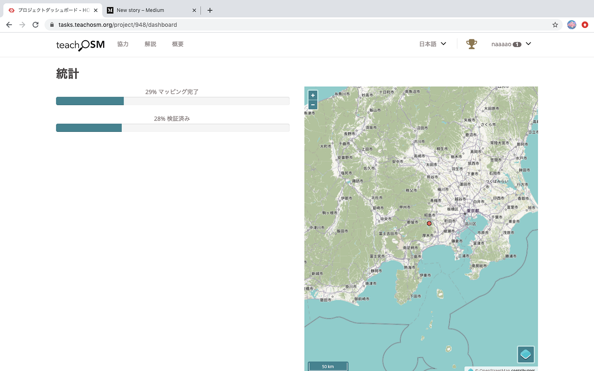
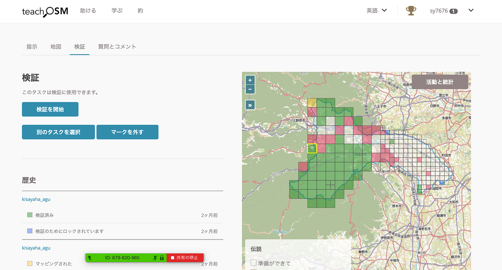
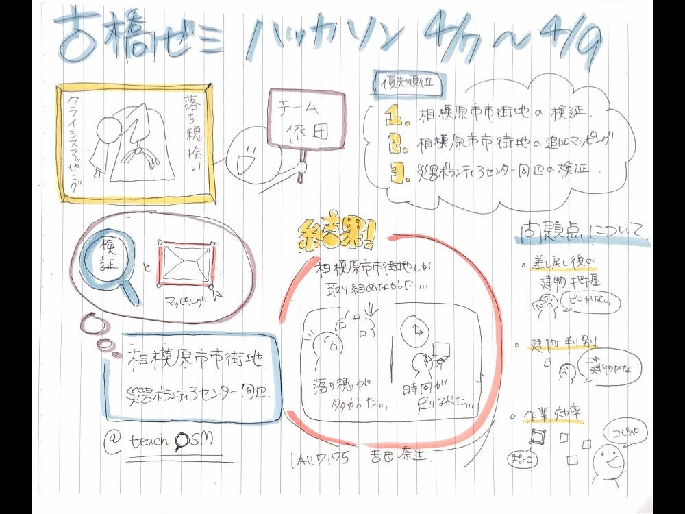

### ハッカソン(4/7〜4/9) チーム依田

こんにちは、４年の吉田です。
今回のハッカソン（4/7〜4/9）について私たちのチームの報告をします。

### **＃チームメンバー**

４年：Shunsuke Yoda, Nao Yoshida
３年：Ayaka Kawashima, Yuta Kita, Rito Yokoi

### ＃チーム課題

課題B. 2019年 台風15号/19号 クライシスマッピング落ち穂拾い

[HOT Tasking Manager（災害ボランティアセンター）
HOT Tasking Manager is a mapping tool designed and built for the Humanitarian OSM Team collaborative mapping.tasks.teachosm.org](https://tasks.teachosm.org/project/949)

[HOT Tasking Manager（相模原市街地）
HOT Tasking Manager is a mapping tool designed and built for the Humanitarian OSM Team collaborative mapping.tasks.teachosm.org](https://tasks.teachosm.org/project/948)

### ＃内容

私たちの計画としては、

**相模原市市街地建物マッピング検証
↓
相模原市街地建物追加マッピング
↓
災害ボランティアセンター周辺マッピング検証**

としていました。理由としては２つあり、１つは災害ボランティアセンター周辺マッピング完了率は98％だったのに対し、相模原市街地は39%と少なかったということ。もう１つはTasking Managerに慣れていない３年生もおり、２つの地域に分担するよりは１つの地域をみんなで作業した方がいいと判断したからです。

Tasking Managerの大まかな使い方（マッピングと検証について）を共有した後、各々作業をし始めました。

### ＃作業結果

作業結果としては次の画像をご覧ください。

ここで疑問なのがマッピング完了率が10%ほど減っているということです。。。差し戻しをした分も修正してマッピングをしているのでタスク数的には増えているはずなのですが、検証済としてマークされればマッピング完了から外れてしまうのか、、、謎です、、、

画像を見た時点でお察しの方もいらっしゃると思いますが、災害ボランティアセンターまではたどり着くことができませんでした。これについては、検証の段階で時間がかかってしまったことが原因です。

### ＃問題点について

#### **＃＃問題点１**

> 差し戻し後、建物の把握が難しい

今回の作業手順としては、全てのタスクの検証→検証地域のマッピングという手順で作業を進めましたが、一部のみマッピングが完了していないタスクが多く存在したこと、検証したタスクを他の人が担当する可能性を考慮していなかったことから検証後の地域における「二重検証」のような状態になってしまい、作業を効率的に進めることができませんでした。

#### ＃＃＃これを踏まえての改善点

検証を行ったタスクにおいて差し戻しが行われた場合、その都度追加のマッピングを行うようにする→記憶情報が新しいので、未入力の建物をすぐに発見、マッピングができると考えます。

#### **＃＃問題点２**

> 建物の判別が難しい

主に山岳部になるが、建物かどうかの識別がつかないことが多々ありました。

この問題に対しては、レイヤーの切り替えなど、複数のレイヤーを使用し際記別を行いました。

#### **＃＃問題点３**

> **作業効率**

マッピングは常に時間との戦いでもあるので、作業効率について作業を進行しつつ話し合いを進めました。

今回でた案として「コピー&ペースト」が挙げられましたが、実践してみたところ、建物の大枠をとらえることには効率的な方法であると言えますが、正確なマッピングを行うためには適していないと判断し、あまり利用しませんでした。

### ＃まとめ

このような問題がありながらも

#### ９６タスク

の検証

#### **約３６００件**

の検証地域における追加マッピングを完了することができました。

最後に今回のグラレコとプレゼン資料です。

プレゼン資料
