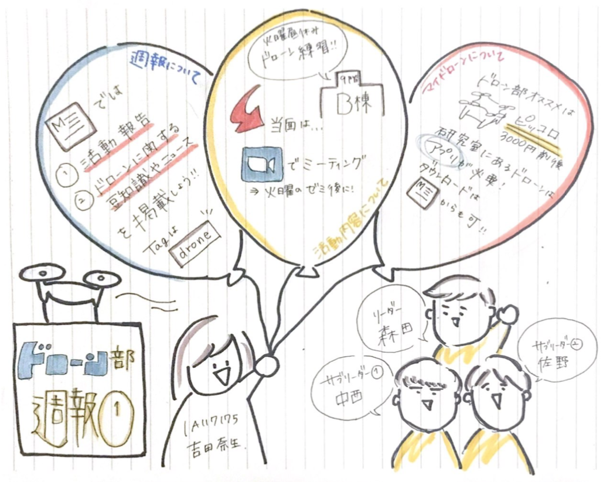

### 新生ドローン部、始動。

今週のゼミ（4/14）でゼミ内サークルの所属先確認やその中でのチーム振り分けなどが決まり、今年度のゼミが本格的にスタートしました！

私たちドローン部はこのゼミの後に集まり、以下のことについて4年生中心に話し合いを行いました。

**・週報で書く主な内容
・活動内容
・マイドローンについて**

今回の週報はここでの話のまとめを中心に書いていきたいと思います。

#### ＃週報の内容について

昨年度のドローン部週報は、主にその週の**活動内容に関する報告**と**ドローンに関する豆知識やニュース**を盛り込もうということで全員作成しており、今年度もそのスタイルを続行することにしました。皆さんの為になる週報を目指していきます。

#### ＃活動内容について

こちらも昨年度と同様に**火曜の昼休み＠B棟9階**を予定していますが、現在の状況からすると当面の間、直接対面での活動ができるのかは不明です。その為、オンラインゼミの後にミーティングをすることになりました。そこで何を議論していくかは今のところ未定です。

また今年度からは月に1回、高田橋でのドローン訓練も参加必須になりました。それに加えてSTMで使われる装置の作成も計画しています。（STMの詳細については[2019年 ドローン部週報 第7週目](https://medium.com/furuhashilab/%E3%83%89%E3%83%AD%E3%83%BC%E3%83%B3%E9%83%A8%E9%80%B1%E5%A0%B1-%EF%BC%97%E9%80%B1%E7%9B%AE-917d1b32d7be)をご参照ください）
これらの活動を機にドローン部全体の操縦スキルを向上させたいです。

#### ＃マイドローンについて

私たちが入部する際、マイドローンの購入が入部条件になっていた為、今年もマイドローンを持ってもらおうと考えています。今回の週報では、おすすめのドローンについて紹介していきたいと思います。

私たち4年生の中で所持率が圧倒的に高いのが、古橋ゼミ生であれば一度は聞いたことがある「**ピッコロ**」です。

[超極小ドローン ピッコロ 赤
超極小ドローン ピッコロ 赤のレビューが6件。満足度評価なし。Q&Aが0件。超極小ドローン ピッコロ 赤に関するレビューを読んだり、ギモンを解決したいときは、「ヨドバシコミュニティ」で。www.yodobashi.com](https://www.yodobashi.com/community/product/100000001003079611/index.html)

トイドローンで超小型なため室内で飛ばしやすいですが、操縦が難しいため、基礎練習には最適だと思います。しかも3000円ほどで買えるので他のドローンよりとてもお財布に優しいです。

もし、お金に余裕があればTelloなどもおすすめです。

[【国内正規品】 Ryze トイドローン Tello Powered by DJI
Amazon.co.jp： 【国内正規品】 Ryze トイドローン Tello Powered by DJI: カメラwww.amazon.co.jp](https://www.amazon.co.jp/%E3%80%90%E5%9B%BD%E5%86%85%E6%AD%A3%E8%A6%8F%E5%93%81%E3%80%91-%E3%83%88%E3%82%A4%E3%83%89%E3%83%AD%E3%83%BC%E3%83%B3-Tello-Powered-DJI/dp/B07979Q4YS?ref_=ast_sto_dp)

ピッコロはプロポがついているのに対し、こちらのドローンはスマートフォンでダウンロードできるアプリでの操作になり、また写真や動画の撮影ができます。ドローン空撮に興味のある方は検討してみてはいかがでしょうか。

ちなみに、研究室内にあるドローンを操作する場合はTelloのようにアプリのダウンロードが必要です。

[‎FreeFlight Mini
‎Parrot Minidrones専用の公式アプリ。 スマートフォンまたはタブレットであなたのドローンを操縦 FreeFlight Mini を入手しませんか。Parrot Minidronesを操縦する無料アプリです。 直観的な操縦…apps.apple.com](https://apps.apple.com/jp/app/freeflight-mini/id1137022728)

[‎Potensic-G
‎A toy quadrocopter control by wifi with video transfer real time. Support iOS 7 ,iOS 8, iOS 9,iOS 10,iPhone 5 ,iPhone…apps.apple.com](https://apps.apple.com/jp/app/potensic-g/id1356392188)

[‎DJI GO 4
‎空から世界の風景をとらえよう DJI GO 4 アプリは、 DJI の最新製品すべてに対応するよう最適化されています。最新製品には Mavic Series、Phantom 4 Series、Inspire 2…apps.apple.com](https://apps.apple.com/jp/app/dji-go-4/id1170452592)

[‎DJI Fly
‎The DJI Fly app was designed to help pilots fly drones with ease (DJI FLY is only available with Mavic Mini for now)…apps.apple.com](https://apps.apple.com/us/app/dji-fly/id1479649251)

これらのアプリをダウンロードをしておけば研究室内のドローンは操縦できると思います。ドローン部でない方も、もし興味があればダウンロードして使ってみてください！

私たち4年生もまだまだドローン初心者ではありますが、3年生に教えられることをできる限り教えていき、自分達自身も成長していきたい思っています。新生ドローン部をよろしくお願いいたします！

今回のグラレコです。

以上、ドローン部週報第1週目でした。

4年 吉田奈生
