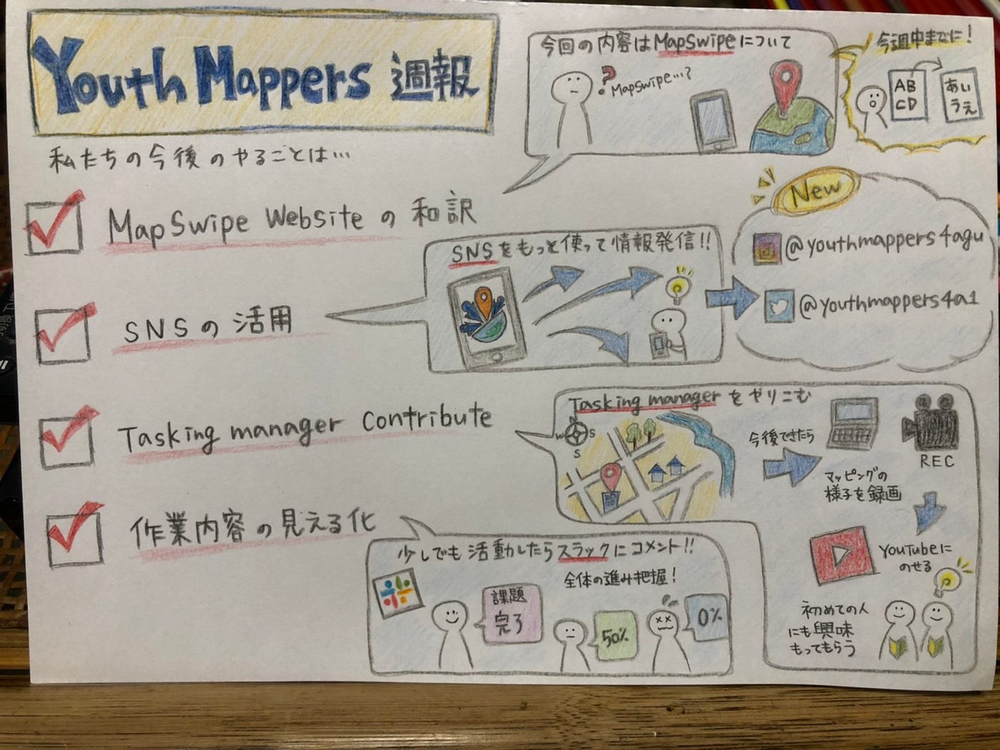

### 初めてのMedium投稿

今回初めてMediumを担当することになった3年の木多祐太です。

4月14日に第４回YouthMappersAGUの定例会議を行いましたので報告させていただきます。

#### **・YouthMappers AGUのSNSアカウント作成**

今回の活動では、どのようにして**OpenStreetMap**を一般の人々に理解して貰うかを話し合いました。その結果、やはりSNSを使って知名度や、やっている事を理解してもらうのが一番効果的だという結果が出ました。そこで、まずはTwitterとInstagramのアカウント作成を行いました。今後はYouTubeを活用し、YouthMappersどのような事をやっているかなどの動画をあげる予定です。

Twitter ： @youthmappers4a1

Instagram：@youthmappers4agu

#### **・今週の活動**

今週の活動では、mapswipe のwebsite和訳を分担して行いました。分担する事によって、一人一人のノルマがはっきりと分かり、皆が責任を持って進めていくことができました。

#### **・今回のグラレコ**

