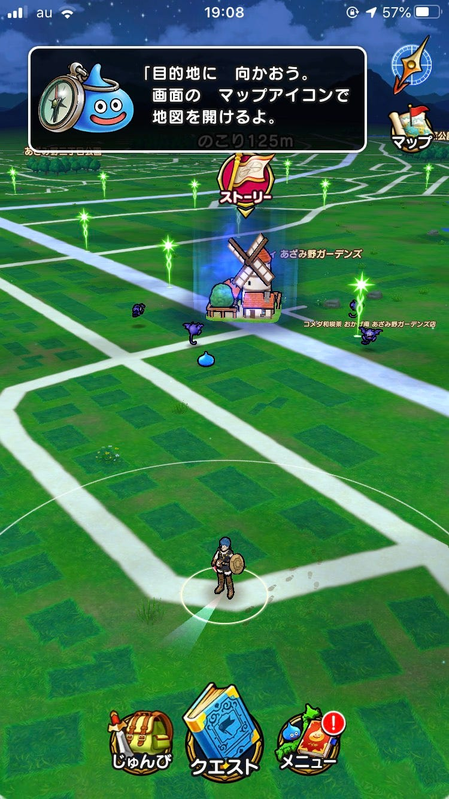
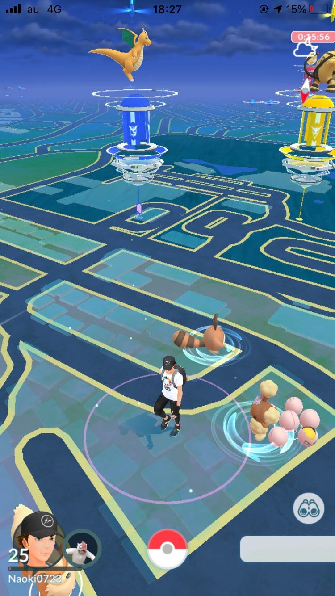
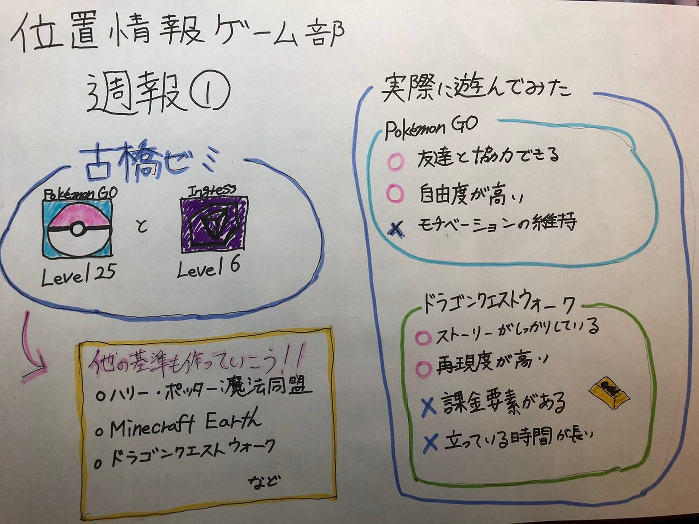

### 新しい位置情報アプリの基準

今回の週報は古橋研究所の三年生の間に達成しなければならない位置情報ゲームについて考えていきました。古橋研究室では「Ingress Level6」、「Pokémon GO Level 25」を達成しないといけません。しかしこれ以外にもハリー・ポッター：魔法同盟やMinecraft Earth、ドラゴンクエストウォークのような位置情報ゲームは存在します。そのためこれらの位置情報ゲームの達成条件に追加していこうという話をしました。

そのため今回、私は「ドラゴンクエストウォーク」と「Pokémon GO」を実際に遊んでみて、良かった点、悪かった点を比較していきたいと思います。

ドラゴンクエストウォークについて書いていきたいと思います。
まずドラゴンクエストの町の形状、モンスター、武器、職業、キャラメイク、音楽すべてがきちんと反映されていたので、ドラゴンクエストの世界観がそのまま位置情報に反映されていて良かったです。また、他の位置情報ゲームとはストーリーが作りこまれている印象があります。

次にドラゴンクエストウォークの悪かった点について述べていきたいと思います。まずドラゴンクエストウォークは武器を「ふくびき」から引くというシステムがあります。このふくびきの提供割合として、☆５ 7％ ☆４ 23% ☆3 70%の割合で排出されていきます。☆が多ければ多いほどその武器の性能が良いため結果としてより楽に冒険をすることができます。そしてそのふくびきをするためには冒険して引くか、課金をして引いていくことができます。そのためプレイヤーの間で力の差が出てしまうのではないかと思いました。またストーリーがあるために外に出た際にそれらを読む作業をしなければならないため、その場からすぐに次の場所へ行くことができないため寒かったです。

次にPokémon GOについてまとめていきます。良い点として友達とレイドバトルに挑戦をしたり、ポケモンを交換したりできるように友達とも交流が安易にできることだと思います。悪い点としてポケモンを育成する以外に特にストーリーがないためモチベーションを上げずらいことだと思います。

グラレコはこちらです。

