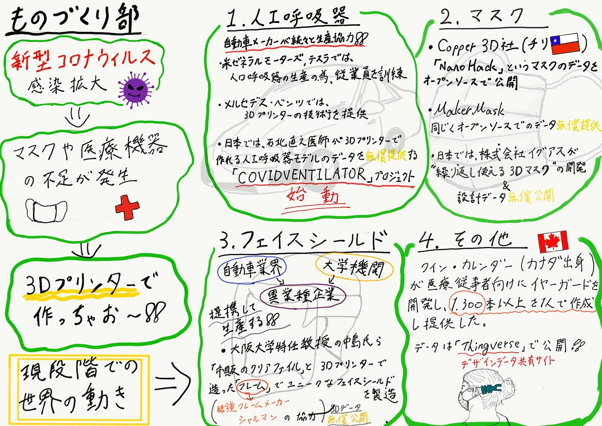

### 今できるものづくり

今回の週報は「今だからこそできること」という観点で今一番大きな社会問題である新型コロナウイルスに対するマスクや医療機器についての3Dプリンタなどを活用した世界の取り組み事例を 1.人工呼吸器　2.マスク　3.フェイスシールド　4.その他　のジャンルに別けてそのデータの入手先と一緒に調べましたので紹介していきます。

### 1. 人工呼吸器

感染拡大により生産、売り上げに打撃を受けるなかその技術力を活かして医療機器の生産に取り組み始める自動車メーカーが続々と出てきています。米ゼネラルモーターズやテスラは人工呼吸器の生産に力を入れ従業員を訓練しメルセデス・ベンツでは3Dプリンターの技術を提供することでパーツを製造しています。

また日本の石北直之医師による「COVIDVENTILATORプロジェクト」では3Dプリンターで製造できる人工呼吸器モデルのデータを無償提供し作成してくれる3Dプリンターユーザーを募集するなどの取り組みがありました。こちらのサンプルデータから実際にプリントすることができます。[https://idarts.co.jp/3dp/covidventilator/](https://idarts.co.jp/3dp/covidventilator/)

### 2. マスク

マスクも多くの企業が3Dプリンターを使った製造に取り組んでいてチリのCopper 3D社はオープンソースでマスクのデータ「[NanoHack](https://copper3d.com/hackthepandemic/)」を公開して個人がマスクを生産できるようにしたり同じくオープンソースでの無償提供を行なっている[MakerMask](https://www.makermask.com/)などがありました。もちろん国内でもマスク生産の取り組みは多く株式会社イグアスでは繰り返し使うことのできる3Dマスクの開発などがあり[マスクの設計データ](https://www.iguazu-xyz.jp/knowledge/trend_02)も無償公開されています。

### 3. フェイスシールド

トヨタ自動車、日産自動車、ランボルギーニなどの自動車業界や大阪大学、神奈川大学などの機関が異業種企業と提携するなどして生産するという事例が多く見つかりました。

中でも大阪大学特任教授の中島氏らのグループによる市販のクリアファイルと3Dプリンターで造ったフレームから成るフェイスシールドは発想がとてもユニークです。このフレームの開発には眼鏡フレームメーカーのシャルマンという会社が協力していてフレームの3Dデータがwebサイトで無償公開されています。[http://www.project-engine.org](http://www.project-engine.org/)

そしてこちらがオープンソフトウェアとしてGitHubで公開されている神奈川大学の道用大介氏のフレームのデータです。[https://github.com/doyodoyo/facesheild](https://github.com/doyodoyo/facesheild)

### 4. その他

その他はあまり多くの事例を見つけることができなかったのですが一つイヤーガードを開発したカナダのクイン・カランダー君の事例がニュースで大きく取り上げられています。彼は過酷な環境で働いている医療従事者がマスクによる耳の痛みを訴えているということに注目し1300本以上のイヤーガードを1人で作成し地元の医療機関に提供しました。彼はデザインデータ共有サイト「[Thingverse](https://www.thingiverse.com/thing:4249113?fbclid=IwAR1Mo5LsSKq1PjVMqCvWaGCl6HeyU7pf3SFnPA77FLC5Fgo4Dyqoo-pVSAE)」でこのイヤーガードのデータを公開しています。

以上が4つのジャンルに整理して3Dプリンターなどを活用した世界各地の活動とそのデータ入手先になります。今回の新型コロナウイルスに対する事例のように3Dプリンターの活用には様々な企業や個人がをオープンソースで公開しているデータを利用して作成することができるという特徴があります。

今回のグラレコです

