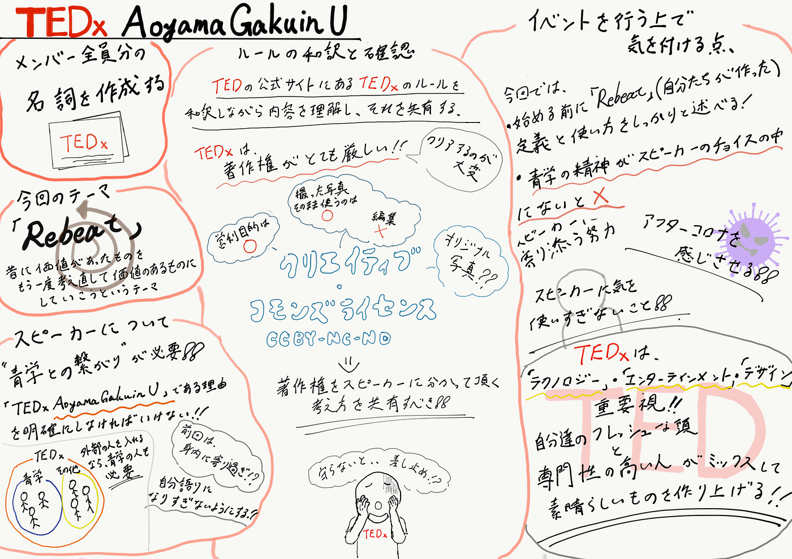

### 新生TEDxaguU活動開始!!!!!!!

「TEDxaoyamagakuinU」では古橋ゼミとエリックゼミの夢のコラボで活動が進められています。

### 今週の活動内容

今週のミーティングでは以下のことについて話し合いました。

> _・各メンバー名刺作成のための情報共有_

> _・今回開催のテーマの共有_

> _・TEDx基本ルールの確認_

> _・役割分担_

大まかに以上四点についてです。

#### ♯各メンバー名刺作成のための情報共有

→ 一人一人がスプレッドシートに個人情報を記載しました。

#### ♯今回開催のテーマ共有

→今回のテーマは「_**Rebeat_**」に決定！

「Re」⇒ 再び

「beat」⇒優秀なもの

という意味で一言で「価値の再発見」。

かつて需要が高かった物も時代の変容により、価値が薄いと見なされている物があります。

例えば、昔は役立っていたけれど、今では使われなくなり、”価値が薄らいでいるとされている物”

それらの本来大切にされていた物の価値を、

再認識するとともに、既存の価値をもっと先の未来へも共有し、さらなる価値観の広がりを目指す。といった意味が込められています。下記のものが今回のテーマに即したロゴのなります。

#### **♯**TEDx基本ルールの確認

メンバー一人一人が公式ルールを日本語に訳しGoogle Document上にまとめ、全員で確認しあいました。

※TEDxは著作権に対してとても厳しいため運営側がしっかり理解しスピーカーに伝えていく必要がある。

#### ♯役割分担

オペレーション

受付

フード・展示

テック

会計

スピーカー

パートナー

広報

翻訳

に分担することが決定。今週は、SNS担当を**水谷**、**吉田**が担当することのみ決まった。

### 課題

・スピーカーの青学との関連性の薄さ

⇒なぜこのスピーカーは「TEDxAoyamagakuinU」に参加しているのか青学との関連性を明確にする必要性を考えながらスピーカーを選ぶ。

### 来週のMTGまでにやること

・役職決め

・過去のイベント動画のチェック

・まとめたルールを再度確認

### 次回

・Rebeatについての定義を固める。

・スピーカー選びにあたって、TEDxAoyamagakuinUでの開催の意義を考える。

・役職決め

> ４月２５日１３時～

### グラレコ ↓

