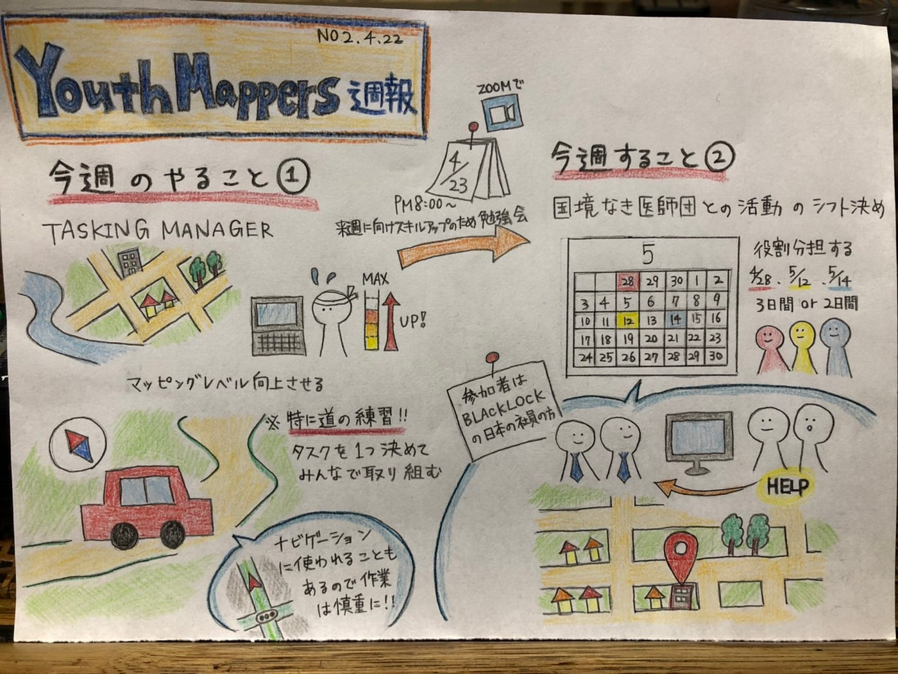

### マッピングレベルを上げようの会

こんにちは。まだなかなかマッピングについてよくわからない吉田です。

４月２１日に第５回YouthMappersAGUの定例会議を行いましたので報告させていただきます。

**・先週の振り返り**

先週はMapSwipeウェブサイトの日本語訳を全員で取り掛かりました。見事みなさん期限内にタスク完了したため、次は古橋先生のチェックが入ります！！！！

**・そして今週の目標は！！「マッピングレベルの向上！！！」**

ついに本題です。YouthMappersAGUのメンバーのほとんどが建物のマッピングは経験済みですが「道」をマッピングするという未知なる領域に足を踏み入れることが決定しました！！みちだけに、、、

と、いうことで

マッピング会をZOOMで開くことが決定！！

### 4月23日木曜日午後８時から！！

私たちも勉強は忘れません。

**・追加タスクとして、、、**

Missing Maps program MapSwipe説明記事の和訳→ドキュメント作る。

**・今後の予定としては。。。**

国境なき医師団との活動のシフトを作成します。

詳しいことはまだ決まっていないので来週の週報をお楽しみに、、、

**・今週のグラレコ**

