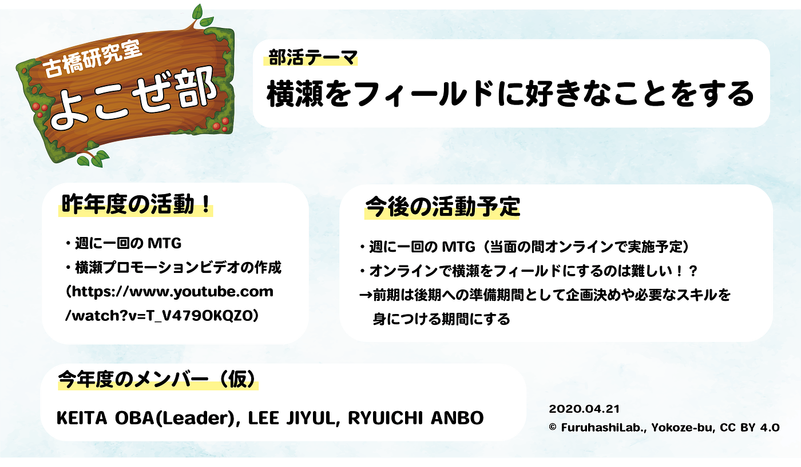

### 古橋研究室 横瀬部2020年度第一回

こんにちは！横瀬部部長の大庭啓太（4年）です！

新型コロナウィルスの影響で青山学院大学は新年度の授業スタートが遅れていますが、
古橋研究室は4月より早速オンラインで活動がスタートしています。

というところで古橋研究室の部活動もスタートしています。

私たち古橋研究室横瀬部も1回目のブログを更新していきたいと思います。

### 昨年度までの横瀬部

・週1回のMTG
・横瀬のプロモーションビデオ作成
（参照：[https://www.youtube.com/watch?v=T_V479OKQZ0](https://www.youtube.com/watch?v=T_V479OKQZ0)）

去年の活動は、週に一回のMTGをメインに年度末に横瀬で撮影を行い、横瀬のプロモーションビデオを作成し、古橋研究室のYoutubeチャンネルにて公開しました。

### 今年度の活動予定

・週に一回のオンラインMTG
・オンラインで横瀬をフィールドにするのは難しい！？
→前期は後期への準備期間として企画決めや必要なスキルを
 身につける期間にする

現在の状況だと、横瀬に実際に出向き活動をすることは非常に難しい為、
前期期間はオンラインでMTGを行い後期に向けメンバーのスキルを高める期間としたいと考えています。

ここについては、昨年度も前期期間中に準備をし、後期に撮影を行なったので、差し支えがないかなと考えています！！

### 今年度のメンバー

昨年度までは、８名ほどいたメンバーですが、今年度は残念ながらゼミから挫折してしまったメンバーが多い為半分以下のメンバーで活動をしていくことになりました。

そこも踏まえて、ゼミのメンバーみんなが楽しめるイベントを横瀬で企画するなどの活動の方がいいのではと考えています！

今年度も横瀬部をよろしくお願いします！！

### グラレコ

