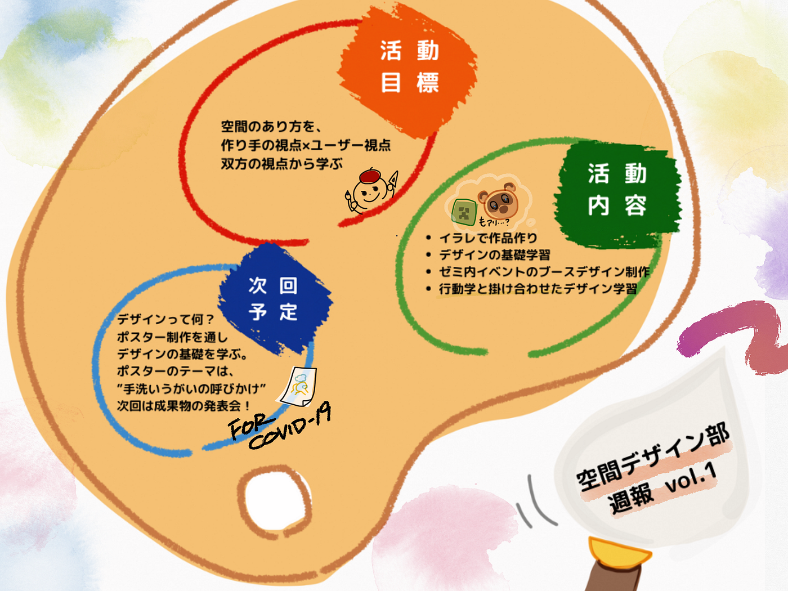

### 空間デザイン部始動します！

活動目標、活動内容決まりました！！！

空間デザイン部リーダー3年の若松です。

空間デザイン部、何するんだろう、、、？

恥ずかしながら決まっておらず、それを一から決めるところから始めました！

今回のMTGで決めたことは大きく３つです！

> _・活動目標_

> _・活動内容_

> _・活動計画_

**＜活動目標＞**

- デザインの基礎を固める

- 空間の在り方をユーザーとしての客観的な目線と作り手の目線を通して学ぶ

**＜活動内容＞**

- 毎週月曜日／18:30〜 活動（コロナ収束まではZOOMを用いたオンライン会議）

- [イラストレーター](https://www.adobe.com/jp/products/illustrator/beginner.html)などを用いて作品を作る

- デザインに関する専門用語などを実践を通して学ぶ

- イベントにおけるブースデザインを担当する

- 行動学の観点を盛り込んだ空間デザインを学ぶ

**＜活動計画＞**

第1,2回 (4/20,27) デザインとは何か

第3,4,5,6回 (5/5~26) 部屋の設計 (行動学、動線を意識した部屋とは)

第7,8,9,10回(6/2~23) [マインクラフト](https://www.minecraft.net/ja-jp/)で部屋作り,位置情報ゲーム部とコラボ？

第11~15回(6/30~7/28) F棟ラウンジ改造計画

＜**今週の空間デザイン部**＞

「デザインとは何か」よくわかっていないですが、わかっていないなりにもがいてみよう！ということで早速次回のMTGまでに課題を出してみました。

#### 課題『手洗いうがいのポスター作成』

つまらないなどと思うかもしれませんが、大事でしょう！今の時期！！特に！！！！ということでこの課題を設定してみました。

フォーマットも決めず、縦横も決めず、とりあえず作ってみようということになりました。

ターゲットは青学生含む大学生です。

果たしてどんなものができるのでしょうか！！！

＜今週のグラレコ＞

