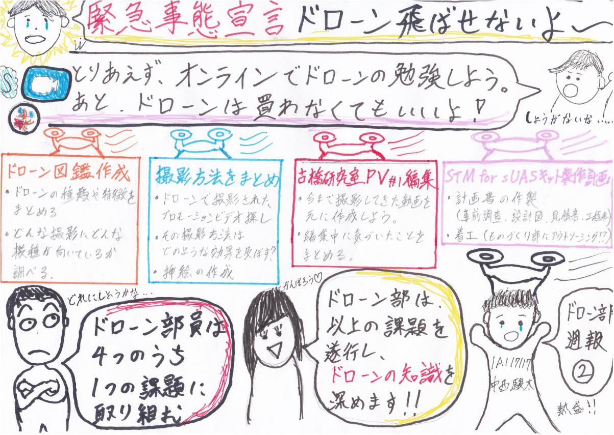
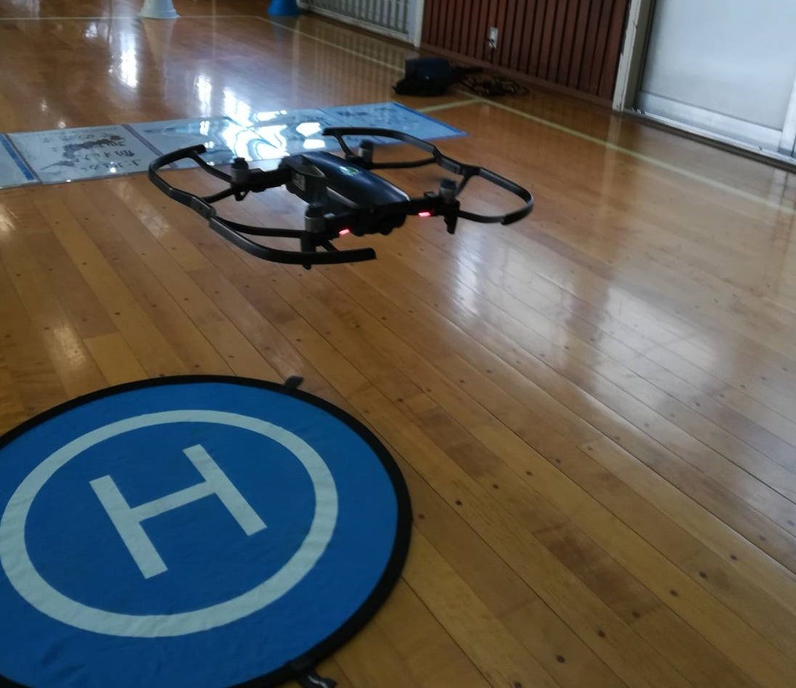

### ようこそドローン部へ！～オンラインで知識を深めよう。～

**■中西 駿太 地球社会共生学部 4年 A組 129番 1A117117**

**■ドローン部週報＃２（4/21）議題 :「オンラインでできることについて」** 
 昨今の新型コロナウイルスの蔓延により「緊急事態宣言」が発出されているため、現在も外出制限がかかっています。したがって、ドローン部の活動のメインであるドローンの飛行練習についても全く行えない状況となっています。今週の週報は、今後の活動方針についてを中心にお伝えします。

新型コロナウイルスの収束が見込めず、しばらくの間は屋外での活動が行えない為、先日のミーティングで以下の事項を決定しました。

### **１. 実践練習が行えないため、オンラインでドローンについての知識を深めていく。**

### **２. （特に新３年生）マイドローンの購入は強制しない。**

#### _**＃１．オンライン・ドローン知識養成計画の詳細について（4/28第三回ドローン部MTGで正式決定の見込み）_**

オンライン上でドローンの知識を深めていくにあたって、4つのtodoを設けました。ドローン部の部員はそれぞれリーダーによって割り振られた、もしくは興味があり自分で選んだ課題を行っていきます。（現時点の予定）

> **todoリスト（以下 森田浩徳ドローン部リーダー記述内容抜粋）**

#### **1.ドローン図鑑作成**

- _ドローンの種類や特徴をまとめる_

_┗メーカー、サイズ、重さ、飛行速度、上昇速度、下降速度、最大飛行時間、最大飛行距離、動作周波数、検知システム（センサー等）、動画解像度等_

- _どんな撮影に適してるのか_

_┗撮影時に分けて活用できるように_

#### **2. 撮影方法をまとめ**

- _ドローンで撮影されたPV探し_

- _その撮影方法はどのような効果を及ぼすのか_

- _挿絵の作成_

#### **3. 古橋研究室PV#1編集**

- _今まで撮影してきた動画を元に作成_

_┗コンセプトが決まってないため難しいと思うが、今ある素材で一個作る_

- _編集中に気づいたことをまとめる_

_┗撮影中に回転が早すぎると映像が遅れるなど_

#### **4. STM for sUASキット製作計画**

- _計画書の作製_

_┗事前調査：大きさ、資材がどれだけ必要かを調査
┗設計図：構造、意匠の決定、設計図作製（できればCADソフトの活用）
┗見積書：資材からいくらコストがかかるか計算
┗工程表：5W1Hに基づき、何にどれぐらい時間や人を割くか決定_

- _着工_

_┗ものつくり部にアウトソーシングしてもよい_

（参考文献：[STM for sUAS](https://www.nist.gov/el/intelligent-systems-division-73500/standard-test-methods-response-robots/aerial-systems)→[森田ブログ](https://medium.com/furuhashilab/%E3%83%89%E3%83%AD%E3%83%BC%E3%83%B3%E9%83%A8%E9%80%B1%E5%A0%B1-%EF%BC%97%E9%80%B1%E7%9B%AE-917d1b32d7be)）

_**ドローン部は、以上の課題を遂行し、ドローンの知識を深めて参ります。_**

#### **＃２．マイドローンの購入について**

これまでドローン部では”マイドローンの購入”が入部必須条件としていましたが、新４年生が新３年生にマイドローンを継承していけば良いとの理由で**購入しなくてもいい**との結論にした。

> _**・マイドローンで練習をし続けた新4年生は実用を考えてDJI製品を使う。（DJI製品は、是非とも研究室のを借りさせて頂きたい。）
・現在は新型コロナウイルスで練習ができないが、将来的に研究室にあるピッコロ（新４年生が使ってきたものも？）を使用していきたい。_**

以上の考えから、今年は_**マイドローンを購入しなくてもよい_**ことになりました。（新三年でマイドローンを購入するなら[ピッコロ](https://www.yodobashi.com/community/product/100000001003079611/index.html)がオススメ。）
 非常事態宣言解除後は、状況をみてマイドローンもしくは研究室のドローンをお借りし、練習する予定です。

**→[古橋先生と4/28のゼミ内で話し合いを行う。**](https://www.facebook.com/groups/furuhashilabnow/permalink/850693575410883/)

#### **＃空撮映像作成にチャレンジしたいな！！**

ようこそドローン部へ！ということで、ドローン部に入ったからにはドローンで**空撮映像作成**にチャレンジしたいですよね。新３年生からも、ドローンで撮影してみたいという意欲的な声がたくさん寄せられています。大変素晴らしいことだと思います。
 私は三年次に東京都の**伊豆大島において、実際に[ドローンを飛ばして動画を作成した**](https://drive.google.com/open?id=1Dvb9666xK5hGMwZcfjw5QszVlXArD6uQ)ので、是非これをひとつの目標（大した動画ではないですが…）としていただければと思います。（最初はカメラのカバーを外せないほどポンコツでした。みんなならもっといい動画が作れるよ！）
 週報が長くなってしまったので、私の動画の紹介と、ドローンで撮影をする上で参考になる週報やブログを紹介、グラフィックレコードの紹介で、今週の週報を終わりとさせていただきます。ありがとうございました。

> □ [伊豆大島空撮映像 short ver.](https://drive.google.com/open?id=1D5CFnrGDxZ0MMHM7Mf3Q7OGXMP9tG67T)

> [DID](https://www.gsi.go.jp/chizujoho/h27did.html)（人口密集地区）

> [古橋教授ブログ](https://medium.com/furuhashilab/%E4%BA%BA%E5%8F%A3%E9%9B%86%E4%B8%AD%E5%9C%B0%E5%8C%BA-did-%E3%82%92%E7%9F%A5%E3%82%8B%E6%96%B9%E6%B3%95-addf252045d2)（DIDについて）

> [航空法](https://www.mlit.go.jp/koku/koku_tk10_000003.html#a)とは…

> [中西ブログ](https://medium.com/furuhashilab/%E3%83%89%E3%83%AD%E3%83%BC%E3%83%B3%E9%83%A8-%E9%80%B1%E5%A0%B1-%E7%AC%AC%EF%BC%94%E9%80%B1%E7%9B%AE-1e78a2b2e04f)(航空法について）

> [吉田ブログ](https://medium.com/furuhashilab/%E3%83%89%E3%83%AD%E3%83%BC%E3%83%B3%E9%83%A8%E9%80%B1%E5%A0%B1-%E7%AC%AC%EF%BC%96%E9%80%B1%E7%9B%AE-b1bc18bb4d38)（海外ドローン空撮方法）

> [古屋ブログ](https://medium.com/furuhashilab/%E3%83%89%E3%83%AD%E3%83%BC%E3%83%B3%E9%83%A8%E9%80%B1%E5%A0%B1-%E7%AC%AC8%E9%80%B1%E7%9B%AE-9d9f2ae6eeeb)（ドローン資格について）

### **＃今週のグラフィックレコード**

以上、ドローン部週報第２週でした。先が見えない状況ですが前を向いて歩いていきましょう。くれぐれもご自愛ください。ありがとうございました。

４年中西駿太
