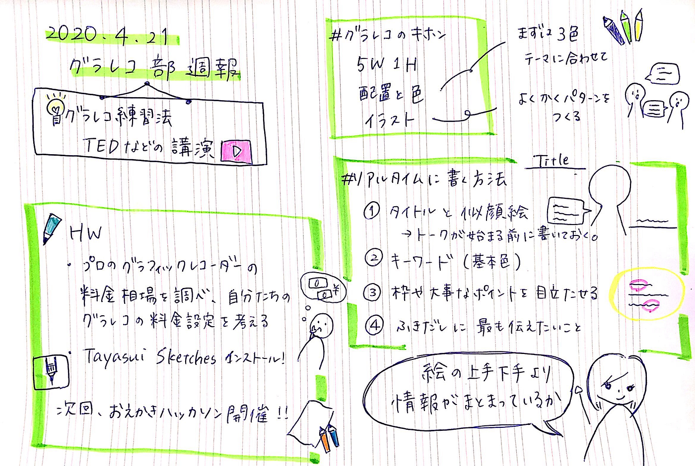
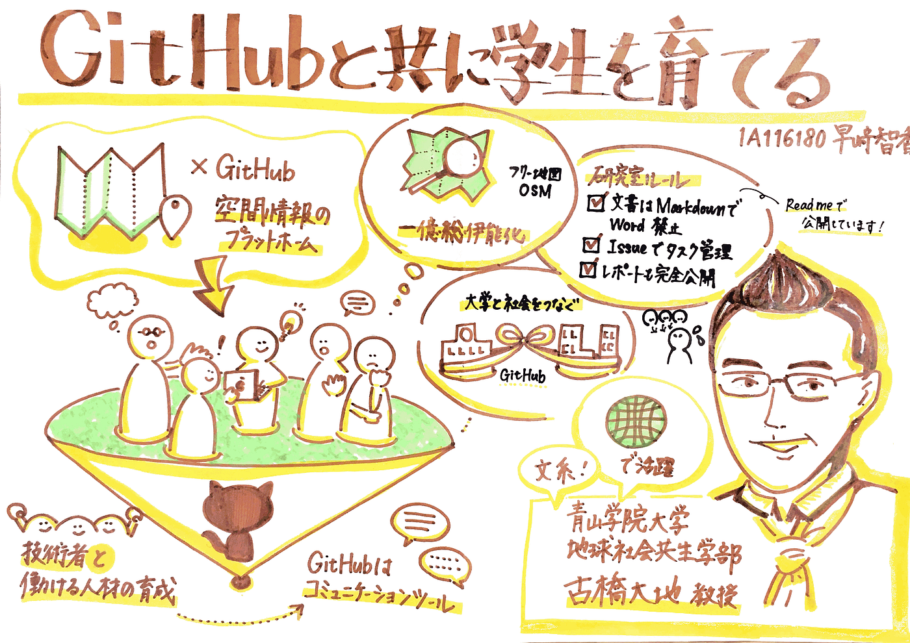
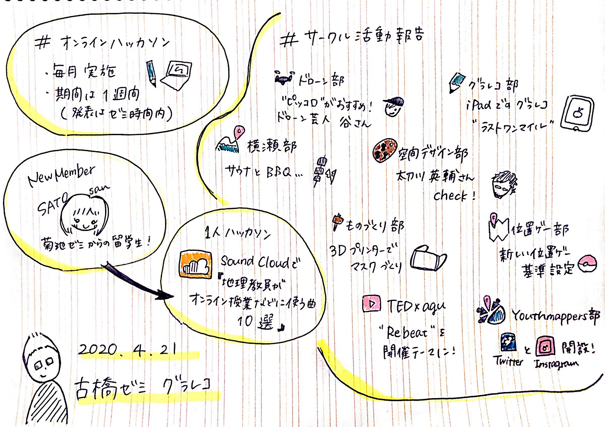
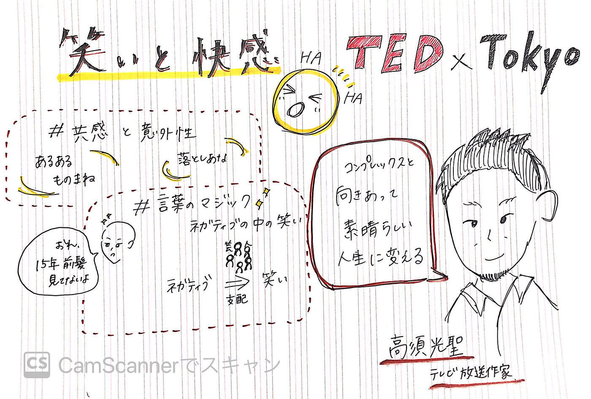

### グラレコ的はじめの一歩

今週のゼミ、私はとっても緊張していたのです…。なぜなら、今回のゼミのグラレコ議事録担当が私だったから…。

というわけで、今回は古橋ゼミ歴1か月、グラレコ歴2週間の私、大岸がお届けします！

##グラレコ部ミーティング

今回のミーティングでは、講演会などにおけるグラレコのイロハを教えていただきました。はじめにミーティングのグラレコです。

##グラレコの基本

まず基本となるのは、5W1Hの情報と配置や色、イラストなど。色は基本は3色で、その時の話のテーマに合った色を選ぶとより内容が入ってきやすくなります。例えば、以前グラレコ部リーダーの早崎さんの書かれたジオっぽい配色のグラレコ。

基本色が茶色、強調を黄色、サブを黄緑だそうです。確かに色の統一感がある中にも、テーマの地球っぽさがぱっと目に入ってきます。（そして絵がうますぎる…！）関連記事はこちらです。

[https://medium.com/furuhashilab/%E3%82%B0%E3%83%A9%E3%83%AC%E3%82%B3%E9%83%A8%E9%80%B1%E5%A0%B1-%E3%82%88%E3%82%8A-%E4%BC%9D%E3%82%8F%E3%82%8B-%E8%89%B2%E4%BD%BF%E3%81%84%E3%82%92%E7%9B%AE%E6%8C%87%E3%81%97%E3%81%A6-2ef97fff875](https://medium.com/furuhashilab/%E3%82%B0%E3%83%A9%E3%83%AC%E3%82%B3%E9%83%A8%E9%80%B1%E5%A0%B1-%E3%82%88%E3%82%8A-%E4%BC%9D%E3%82%8F%E3%82%8B-%E8%89%B2%E4%BD%BF%E3%81%84%E3%82%92%E7%9B%AE%E6%8C%87%E3%81%97%E3%81%A6-2ef97fff875)

##リアルタイムに書く方法

そしてグラレコ初心者の私が一番苦手なのが、**リアルタイムでグラレコを書いていくこと**。今回、古橋ゼミ全体のミーティングでもグラレコを担当させてもらったのですが、そのグラレコがこちら。

実はこれ、一度書き直したものです…。リアルタイムで書いていたものは最後の方で紙に収まらなくなってしまい、あとから書き直しました。早崎さんには、**先にレイアウトを決めておくと書きやすい**というアドバイスをいただきました。なるほどです！私もそろそろ古橋ゼミの全体像が見えてきたので、次回はもっとうまくなっているはずです！乞うご期待！笑

同じように講演会では、あらかじめタイトルと登壇者の似顔絵を描いておくことがコツです。この似顔絵というのが難しいですよね…。特に古橋先生をはじめとする男性の方々の髪型は、人それぞれ個性豊か！研究の余地ありです。

##とっても大事

最後のポイントは、特に私のように絵が苦手な皆様に声を大にしてお伝えしたいです！グラレコは_**絵の上手下手より情報がまとまっているかが大事！絵より情報！_**大事なことなので二回言いました。そしてよく使うキーワードは絵のパターンを決めておくというのもコツですね。

##やってみた

以上のことを踏まえて実際にグラレコを書いてみました！TEDx Tokyoの高須光聖さんの「笑いと快感」というトークで書いてみました。色は黒、茶、黄色の3色で、今回は書き直しなしの一発勝負でリアルタイムに書きました。

動画もとはこちらです。

[https://www.youtube.com/watch?v=6yRBSjcWUME](https://www.youtube.com/watch?v=6yRBSjcWUME)

似顔絵はなかなかうまくいったのではないでしょうか。特にスキンヘッドの方のイラストは表情なども合わせてうまくいったような気がします！

対して高須さんのトークの2つ目、“お笑い芸人さんたちはネガティブを笑いに変えることで観客を支配している”というところを絵やキーワードにするのが難しかったです。まず芸人さんを絵だけで表現できていないことが悔しいですね…。瞬時に単語やイラストに変換する練習をしていきたいと思います！

というわけで、今回は講演会でのグラレコのイロハをグラレコ初心者大岸の苦労を交えながらお届けしました！ご精読ありがとうございました！

青山学院大学 古橋研究室 3年

大岸 裕紀
