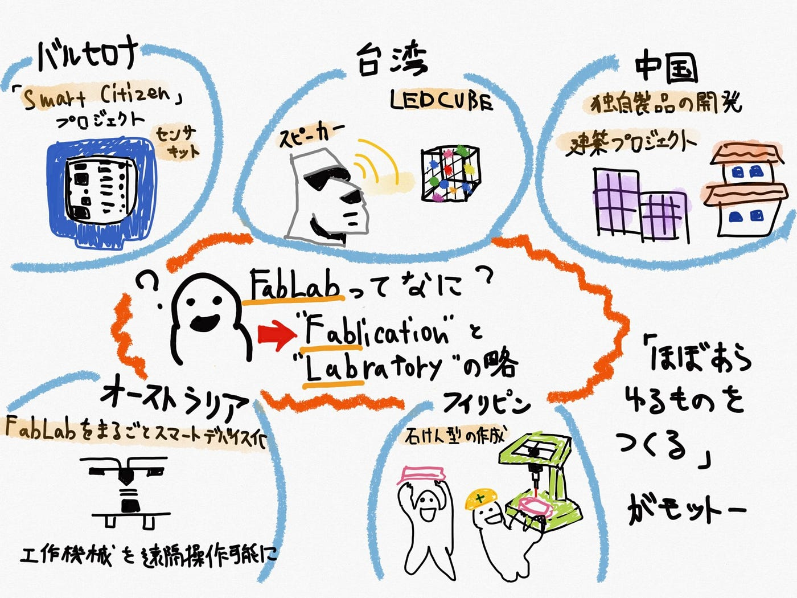

### 世界各地のFabLabの動き

今回の週報では、現在100カ国以上にわたって世界各地に配置されているFabLabの活動について大まかにまとめてみようと思います。

FabLabは毎年毎年その数が増え続けていて、日本で16ヶ所、世界では既に1,600カ所以上存在しています。

そもそもFabLabというのは、”fabrication laboratory” を略したものであり、「ほぼあらゆるものをつくる(Make almost anything)」をモットーに3Dプリンタやカッティングマシンなどの工作機械を備えたワークショップの事です。特徴としては、市民が自由に利用することが出来る事と、国境を超えたものづくりのコラボレーションです。

さて、本題に入っていきましょう。　まずはフィリピンのボホール島です。ボホール島では、量産用の石けん型を作成し、主な収入源である観光業にお土産開発としてサポートしていました。また、義足も3Dプリンタなどを利用し作成することによって、安い値段で義足を提供する事に成功していました。

先進国では、これまで個人の趣味やビジネス、高齢者を巻き込んだ地域活性化、また教育の一環として利用されていたのに対し、途上国では貧困削減であったり、生活の質を向上させるような地域問題の解決を目的とした活動を行っていました。そんな途上国的な活動をアジアで初めて行ったもがボホール島でした。

台湾の台北では、第二回のアジアファブラボ会議のプレゼンテーションの中でモアイ風のスピーカーや、アクリル板で作成したLED Cubeであったりとユニークな展示をしていました。

中国は、イノベーションと独自製品の開発、知財を得る目的でFabLabを始動したり、建築系のプロジェクトも進めていたりと国の中でも各地域ごとでプロジェクトの方針も違ってくるのでした。

オーストラリアのグラーツ工科大学のFabLabは、FabLabをまるごとスマートデバイス化というテーマで、工作機械や工房のありとあらゆるところにセンサを付け、それぞれの機械の稼働時間やコンディション、空気成分なんかの情報まで全て把握できるようにするという取り組みが発表されていました。これは、遠隔操作出来るだけではなく、数値情報を収集することによって異常を即座に確認出来るというものでした。

バルセロナを中心に「Smart Citizen」プロジェクトという活動も行っていました。これは、工房、町全体をスマートデバイス化し、地域の問題発見やより効率的な空間の活用を目指すという活動でした。具体的には、低価格のセンサキットを一人ひとりが所有することで、天候だったり、周辺の環境をデータ化し収集することを可能にするというもでした。これによって、都市全体でのエネルギー配分の最適化と快適な都市環境づくりに良い影響を及ぼすのです。

その他にも挙げ出したらキリがないのですが、インド、ネパール、ケニア、ガーナ、南アジアのような途上国にもFabLabはあって、Fablab以外の市民ラボもとても多く存在していることが分かりました。

こちらが今回のグラレコです。

〈参考資料〉

[1,600 Fab Labs Worldwide! - Fab Lab Connect
The Fab Lab network continues to grow and make impact across the world! As 2018 comes to a close, our network numbers…www.fablabconnect.com](https://www.fablabconnect.com/1600-fab-labs-worldwide/)

[市民に開放、注目のものづくり空間　／フィリピン・ボホール島の「ファブラボ」が熱い！　（前編）
今回は、いま私が一番はまっている分野を紹介します。 フィリピンにおける「ものづくりコミュニティ」、FabLab（ファブラボ）についてです。 FabLabとは、Fabrication Laboratoryの略ですが、「…www.google.com](https://www.google.com/url?sa=t&source=web&cd=4&ved=2ahUKEwif--j1jP7oAhWD7WEKHZ3aCX8QFjADegQIBBAB&url=https%3A%2F%2Fwww.abroaders.jp%2Farticle%2Fdetail%2F596&usg=AOvVaw1xBNH8Q32TIZ70xhR2JD47)

[【from FAN2】Lab Review：各国のファブラボによるプレゼンテーション
陣内和宏（FabLab Saga） FAN2の朝は、各国のファブラボによるプレゼンテーション「Lab Review」で始まります。以下に初日の様子をご紹介します。 最初のLab ...fablabjapan.org](http://fablabjapan.org/2015/08/09/post-5871/)

[「ファブラボ」の原点に触れる旅--第11回世界ファブラボ会議参加レポート｜fabcross
イベントレポート トピックス by 淺野　義弘…fabcross.jp](https://fabcross.jp/topics/event_report/20150929_fab11_01.html)
