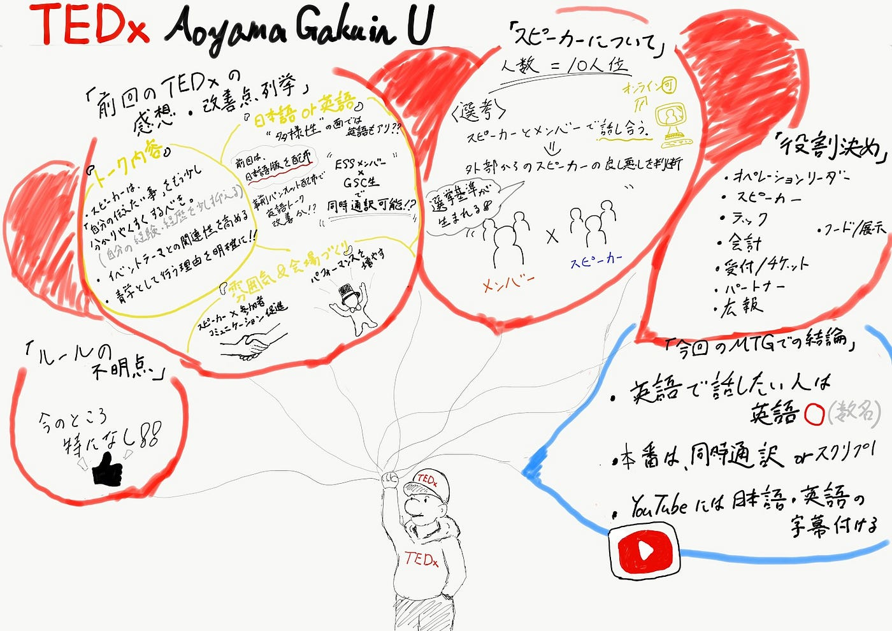

### TEDxAoyamaGakuinUであることの意義

### 今週の活動内容

- 役割分担

- TEDxルールについての不明点の解消

- 前回開催TEDxを見ての感想・改善案

- 次回TEDxのスピーカー選考（TEDx “Aoyama Gakuin U”であることに関して）

### ▪︎役割分担

#### オペレーションリーダー、スピーカー、テック、会計、受付・チケット、パートナー、広報、フード・展示　についてそれぞれメンバー割り振りが決定しました。※パートナーは全員が担当します

### ▪︎TEDxルールについての不明点の解消

#### TEDxルールに関しては細かく明確に示されていたためか特にメンバーで不明点の共有はありませんでした。

### ▪︎前回開催TEDxを見ての感想・改善案

前回TEDx 2018を見ての各自の感想や改善案報告を行いました。TEDx2018の5名のスピーカーについて主にトーク内容、雰囲気&会場づくり、日本語か英語かという点で話し合いをした結果まずトーク内容についてはスピーカーによってテーマとの関連性に差がある、青学の理念・モットーに沿った要素があまり感じられないといった意見が出ました。

これに関してはスピーカー本人の経歴・経験より「何を伝えたいのか・メッセージ」を視聴者側がわかりやすいように伝える事が大切なのでよりテーマとの関連性を高め、また TEDx “Aoyama Gakuin U”である以上「なぜ青学なのか」ということの意義をより伝わるようにするべきという結論になりました。

次に雰囲気・会場づくりに関してですが前回TEDxではスピーカーの中で1名が水晶玉を使ったパフォーマンス活動をされている方がおり、その方のパフォーマンスが参加者をスピーカーに惹きつけさせスピーカーと参加者が一体となって盛り上がる効果が生まれているという意見が多く出ました。

これに関して運営側からスピーカーと参加者のコミュニケーションを促進する雰囲気づくりのためもっとパフォーマンス要素を取り入れていく方針が検討され色々なTEDxやTEDを見てヒントを得ようということで決定しました。

最後にスピーカーがトークする際の言語として日本語がいいのか英語がいいのかという議論がありました。日本語のみでトーク派の意見としては会場にいる参加者を第一に考えると会場の一体感・雰囲気をつくるために日本語トークであるべき、英語弱者の観客がトーク内容を理解できずにいるのは問題というものがあり一方日本語・英語両方でトーク派は多様性を考慮、少数のネイティブの観客者への配慮、スピーカーが話しやすい環境を考慮するとスピーカーの話したい言語を尊重するべきといった意見が出ました。

この結論としては会場で英語の方が話しやすいスピーカーは英語で話してもらいその際には同時通訳やスクリプトを用意すること、イベント後にYouTubeで発信する際には日本語・英語字幕をつけることで世界に発信するTEDxとしてのブランドを保つということで決定しました。

### ▪︎次回TEDxのスピーカー選考（TEDx “Aoyama Gakuin U” であることに関して）

次回TEDxのスピーカー選考には前回の反省を考慮してより今回のテーマ（Rebeat「価値が薄れつつあるが価値が再発見されているもの」）に則したトーク内容であることと同時により「青学らしさ」を出すことが重要ということ、また「コロナ以前の視点・考え方」というアフターコロナの視点があることが求められています。

### ▪︎次回ミーティングまでの課題

- スピーカー候補を探す

- 暫定スピーカー4名のトーク関連資料チェック

- 他のTEDx・TED動画を見てヒントを得る

### 今回のグラレコ

