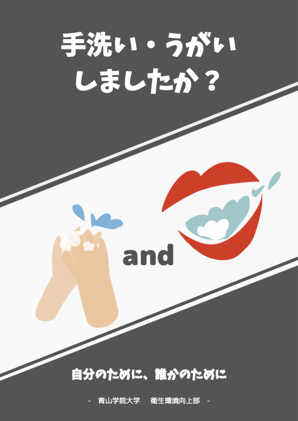
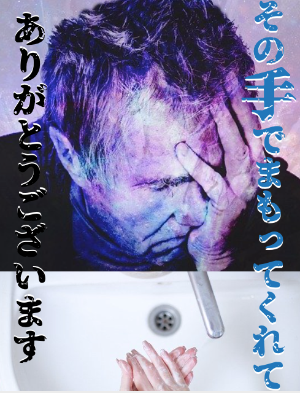
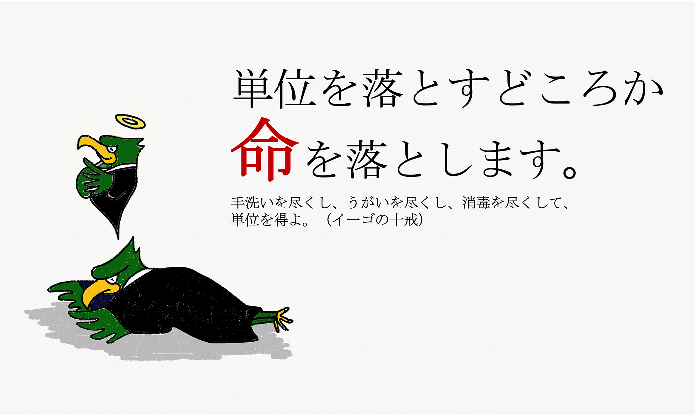
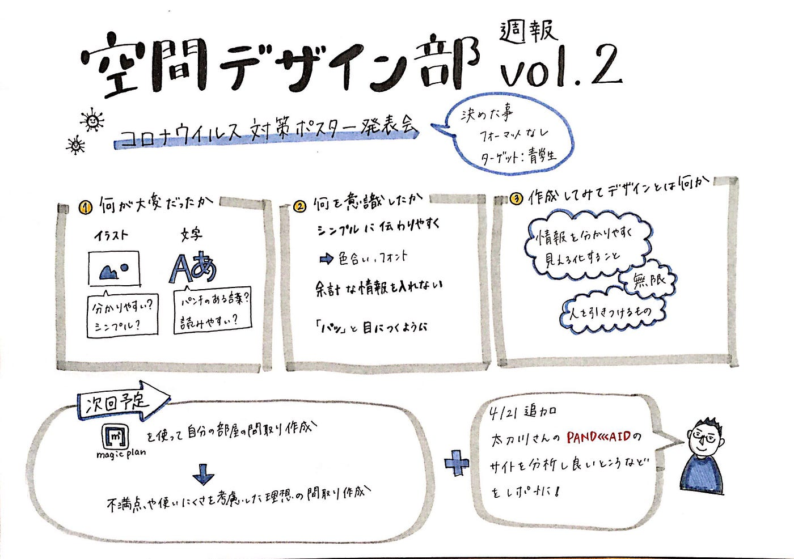

### デザインとは何かを考えよう

みなさん空間デザインとはなんだと思いますか？

先週決めた活動内容で本格的にスタートしました空間デザイン部！今週はデザインの基礎を考える会です！

空間デザインは単に部屋のインテリアやイベント会場の設計をするものではなく、その空間設計によって人を楽しませたり、人の行動を導けるものだと考えています。このような心理学やアートの効果などがつまった分野を考えるには、まずは基礎から！

ということで今週の活動です！

### ＜今週の活動＞

空間デザイン部は実際にアウトプットしながら自分たちなりの答えを出していこうという方向性になったので、今週はお題を出してポスターを作り、「デザインとは何か？」を考えてきました！

#### お題「青学のトイレに掲示する手洗いうがいポスター」

新型コロナウイルスの影響で感染対策として手洗いうがいの重要性が増しました。なので今回は大学のトイレに学生に対して手洗いうがいを促すポスターを作ってくるというお題でした！

### ＜作品紹介＞

**①若松暖子作**
・シンプルで見やすい色を意識（使う色を３色にした）
・パンチのある言葉を使って印象付ける（ウヨウヨなど）

**②斎藤 祐花作**
・イラストと文字をバランスよく配置
・一目で何を言ってるかがわかるような情報量に（文章は引き算）

**③青木怜作**
・パッと目に入る印象的な画像に意味が深い文章
・映画のポスターのような見たくなるデザインを意識

（画像は**[「O-DAN(オーダン)」**](https://o-dan.net/ja/)を使用。このサイトは画像のクオリティが高く、写真によってはライセンスの記載不要で商用利用も可能なのでおすすめ）

④川嶋彩香
・青学の象徴イーゴ君で目につく印象的なものに
・直接的な強い言葉遣いでウイルス対策を連想させる作戦

以上が作品集です！今回はお題のみ決めて、あとのデザインは自由でしたのでそれぞれ個性が出ました。

#### ＜ポスター制作を通して＞

**①何が大変だったか？
 **・どんなイラストが見やすいのか、どんな言葉が読みやすいのか
 ・本当にシンプルな方が見られやすいのか
 ・言葉選びの難しさ（パンチのある言葉？直接的な言葉？）

**②何を意識したか**
・色合いやフォントをシンプルに伝わりやすく
・余計な情報を入れない
・「パッ」と目につくように

**③デザインとは何か？**
・情報を見やすく分かりやすく**「見える化」**すること
・人によって個性が出る無限なもの
・人を引きつけるもの

#### **＜まとめ＞**

実際に作ってみて、このようにデザインの難しい部分や必要な技術がどのようなものなのか少し分かりました。メンバーそれぞれのデザインの考え方からデザインとは人を引きつけ、情報を見やすく分かりやすく見える化すること。そして、その方法は無限にあるのではないか？という結論になりました。

これからの活動ではデザインの技術や知識を学んでいきながら、デザインの定義をアップデートしていき、空間デザインに活かしていこうと思います。

#### ＜次週の空間デザイン部＞

> ①「**[magicplan**](https://apps.apple.com/jp/app/magicplan/id427424432)」を使って自分の部屋の間取りを作ろう！

> 今の自分の部屋の使いにくい部分や改善したい部分を考えてインテリアデザインしてみよう！

> ②古橋先生おすすめのデザインストラテジスト太刀川英輔さんが運営するサイト**「[PANDAID](https://www.pandaid.jp/)」**のサイトを分析！

今週のグラレコはこちら！

