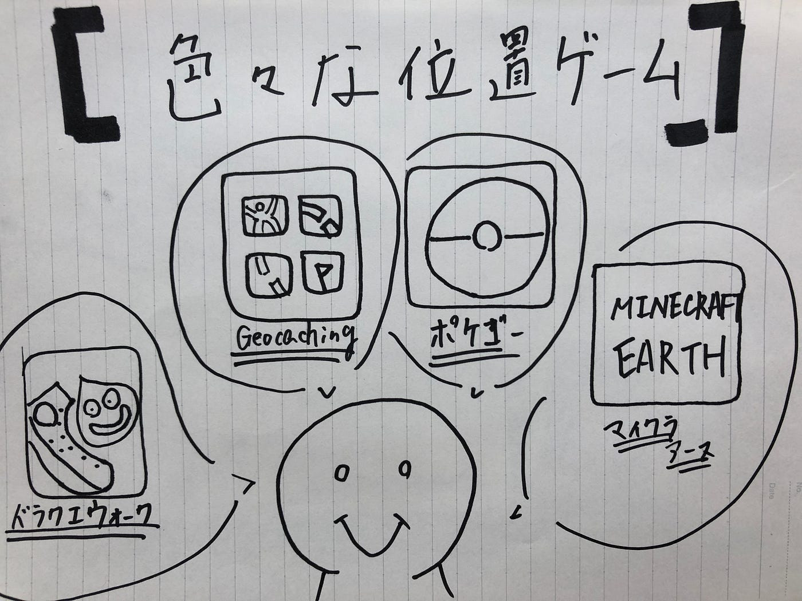
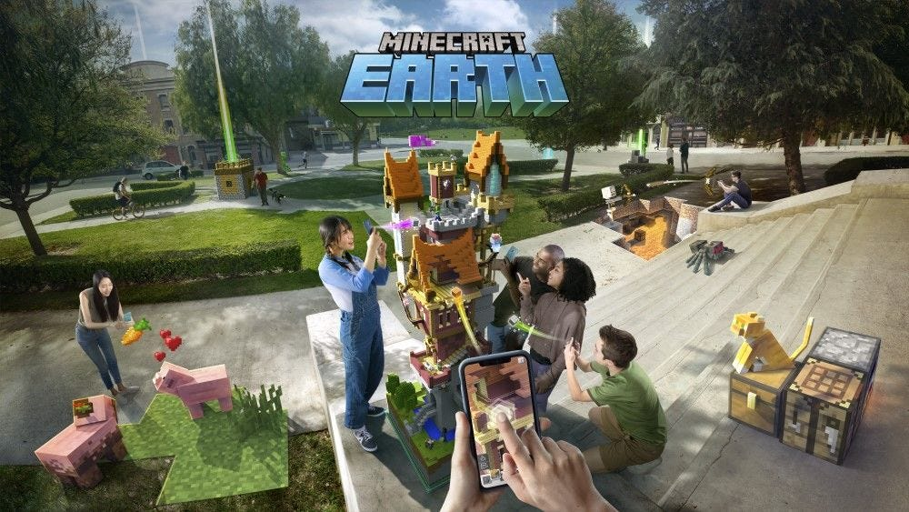

### 位置ゲー部 週報

今月始めから、ゼミ活動が始まり位置ゲー部も本格始動してきました！
今回の週報では

### **位置ゲーってどんなのあんの？？**

ってことについて書いていきたいと思います！

この世の中には様々な位置ゲームがあるなかで、自分がやってきてみんなにおすすめしたいゲームを紹介していきたいと思います！

① MINECRAFT EARTH

・現実世界に、マイクラの世界を展開できる！
・自分が作ったものを他人と共有することができる！

② ポケモンGO

・本家ゲームと同様に対戦ができる
・ポケモンがかわいい
・リアルにポケモンを捕まえることができる

③geocaching

・世界中に転がっている、キャッシュ（宝物）をリアルに探すゲーム
・リアルな宝物をゲットできる

④ドラゴンクエストウォーク

・ストーリー性があって楽しい
・強いアイテムが比較的に出やすいので、進めやすい

ドラクエウォークに関しては、先週の週報でも触れているので、確認してみてください！ （[先週の週報](https://medium.com/furuhashilab/%E6%96%B0%E3%81%97%E3%81%84%E4%BD%8D%E7%BD%AE%E6%83%85%E5%A0%B1%E3%82%A2%E3%83%97%E3%83%AA%E3%81%AE%E5%9F%BA%E6%BA%96-a2b56d6284b9)）
