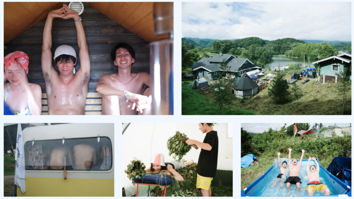
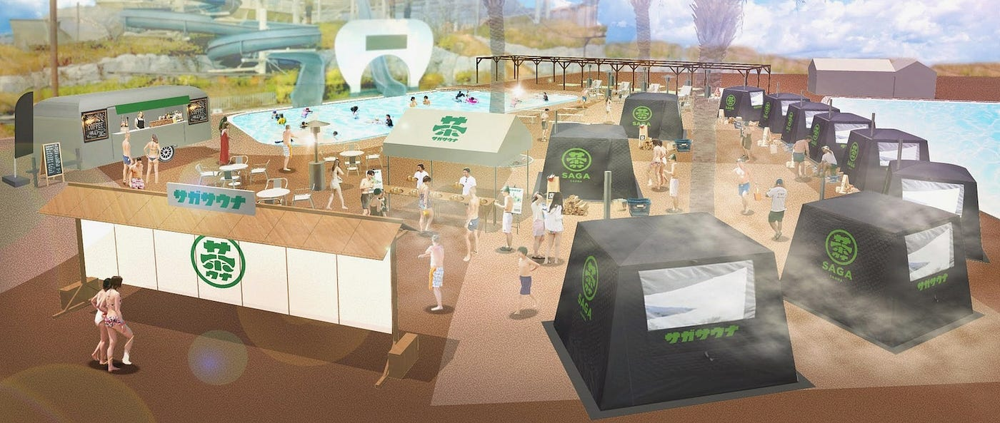
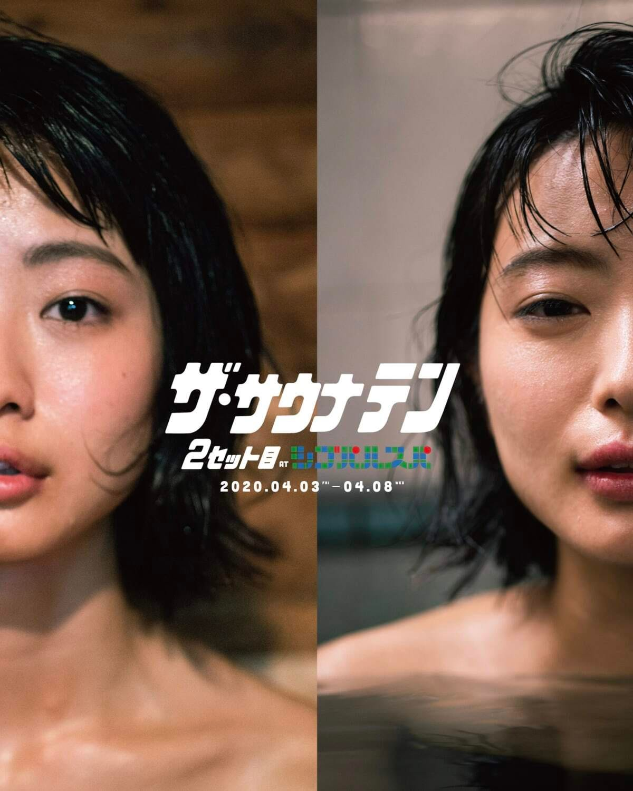
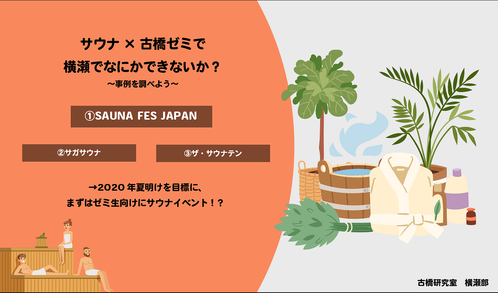

### 横瀬部週報

お久しぶりです！古橋ゼミ4年生で、横瀬部のあんぼです！

前回のゼミにて、古橋先生より「横瀬でサウナを使用したイベントをできないか」という提案がありました。ということで、今週のMTGでは、サウナを活用したイベント事例を調べてみましたので、皆さんにも紹介をさせていただきます。

> **①SAUNA FES JAPAN**

> まず、最初にご紹介するイベントは、日本最大級のサウナイベントである、SAUNA FES JAPANです。本イベントは、2015年に始まり、長野県小海町のフィンランドヴィレッジにて、FSC（フィンランドサウナクラブ）メンバーで運営が行われています。食べ物を販売するお店やワークショップなども同時に開催され、とても一般的なサウナのイメージとは違います。抽選が行われるほど有名で人気なイベントのようです。

[SAUNA FES JAPAN 2020｜日本最大級のサウナイベント
日本最大級のサウナイベント 国内著名サウナー、サウナブランド、サウナ関連企業が一挙に集結する日本最大級のサウナイベント！「SAUNA FES ...www.saunafesjapan.com](https://www.saunafesjapan.com)

> **②サガサウナ**

> 2020年3月6日(金)から3月8日(日)にあのよみうりランドのプールWAIにて、開催される予定であったサウナイベント「**サガサウナ」**です。しかし。新型コロナウイルスの感染拡大の状況を踏まえ、イベントは開催延期（時期未定）になってしまいました…有名な遊園地でサウナに入れるなんて楽しそうでね。

[【開催延期】よみうりランドプールWAIでサウナイベント「サガサウナ」が3月に開催決定。嬉野茶のテントサウナ→巨大水風呂でととのう
2020年3月6日(金)から3月8日(日)の3日間、稲城市のよみうりランドのプールWAIにて、サウナイベント「 サガサウナ」(通称:「茶(チャ)ウナ」)が開催されます！…tamapon.com](https://tamapon.com/2020/02/07/sagasauna/)

> **③ザ・サウナテン 2セット目 ～シブパルスパ～**

> 最後に紹介するのは、サウナを愛するブランドやアーティストが一同に会し、開かれるサウナ愛イベント「ザ・サウナテン」です。こちらはなんと渋谷・表参道で開かれることもありグッズなどがとてもお洒落ですね。ぜひ個人的に参加してみたいと思います！

["サウナ愛"を追求したイベント「ザ・サウナテン」が再び開催、ノントーキョーなどがアイテム発売
第2弾となる今回は、クリエイティブ集団「NEW TOWN」が手掛けたサウナアートを展示するほか、参加ブランドによる新作ウェアやバッグ、サウナグッズを販売。ウィメンズブランド「ノントーキョー（NON…www.fashionsnap.com](https://www.fashionsnap.com/article/2020-03-22/sauna-comingsoon/)

#### まとめ

上記であげただけでも、日本にはお洒落で楽しそうなサウナイベントがたくさんあることがわかりました。横瀬部として、横瀬でサウナを活用した取り組みができないか考えていきたいと思います。

