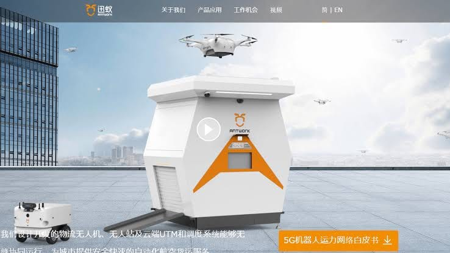
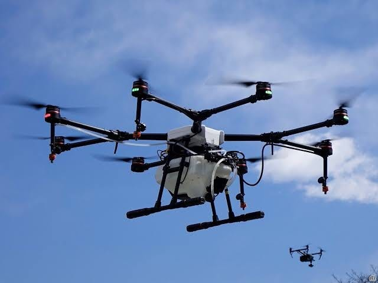
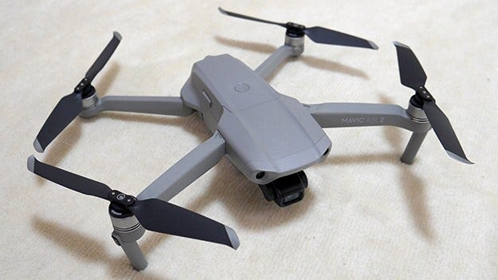
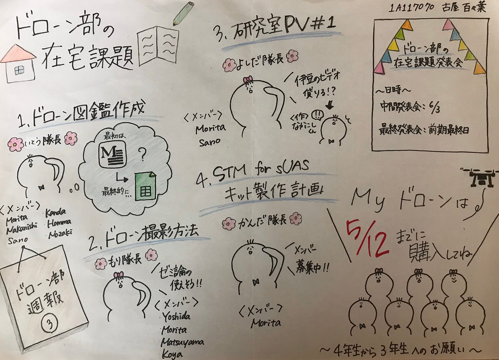

ドローン部週報➂

こんにちは！4年の古屋百々葉です！

今回のミーティングでは、

- To doの各班のリーダーと期限

- マイドローンの購入期限

この2つについて話し合いました。

> To doのリーダー

- ドローン図鑑作成:伊藤くん

- ドローン撮影方法:森さん

- 研究室PV#1:吉田さん

- STM for sUASキット製作計画:神田くん

> 期限

中間報告:6/3

最終報告：前期最終日

> Myドローンの購入

5/12までに購入

に決定しました！！！

さて、今回の週報では、

「コロナウイルス🦠×ドローン」についてお話ししたいと思います！！

- Antwork社×地方自治体・医療機関

[「ドローンによる医療物資の輸送プロジェクト」](https://www.youtube.com/watch?v=0KHaSK2qiIc&feature=emb_title)

→ 輸送物と人員の接触を減らし医療物資の二次汚染を防ぎながら、通常の道路での輸送に比べ効率を50％以上向上させる事に成功！

[Antwork社](https://www.antwork.link/build/pages/index.html)とは？

2015年:設立

2018年:都市に5つのドローン配送空港を配備し、配送ミニプログラムを使って、1万近くのフードデリバリーを行う

2019年以降:医療物資の流通分野に事業の重点を移す

ドローン配送の高い要件:

飛行安全性と安定性

ANTWORK社のドローンの累積距離は6万キロメートル以上で、都市内での最長運航距離は15キロメートル、最大荷重は5 kg。

2019年10月民間航空局によって発行された世界初の都市ドローン物流流通「ライセンス」を取得し、空域および関連する医療、健康部門から承認を得ている。さらに飛行データは監視装置を通じて規制当局に送信され、飛行コンプライアンスを確保している。

引用:[zuva](https://zuva.io/posts/25071)

出典:[36Kr](https://news.qimingpian.cn/qmp/53ed1dc451637b1ac3c1fe34141ecee8.html)

Antwork社以外にも、、、

[JD.com社](https://corporate.jd.com/)は、検疫され孤立した集落に物資を配送

そして、DJI社も農薬散布用大型ドローンで、消毒剤を散布

そんな[DJI社](https://www.dji.com/jp)からMAVIC AIR2の発売👏

飛行時間:34分

画素数:48MP

最大伝送距離:6km

使用アプリ:DJI Fly

古橋先生と森田くんによると、

DJI Flyを使うため、オートパイロット機能が使いにくいそうです、、

[Mavic AirとMavic Air2とMavic 2 Proのスペック比較](https://www.drone.jp/column/20200428112514.html)

してくださっている方がいたので、興味ある方見てみてください！！

最後に今週のグラレコです。

